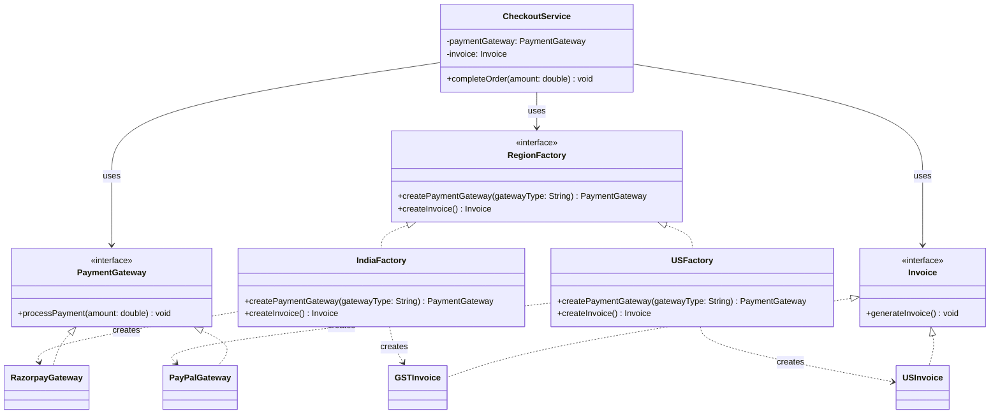

# Abstract Factory Pattern Guide

The **Abstract Factory Pattern** is a creational design pattern that provides an interface for creating **families of related or dependent objects** without specifying their concrete classes.

### 1. Concept & Analogy

Imagine building a Global Checkout Service. In India, you need a specific payment gateway (Razorpay) and a specific invoice format (GST). In the US, you need PayPal and a US-style invoice.

The Abstract Factory acts like a **Regional Manager**. You tell the system "I am in the US," and the US Manager (Factory) ensures you get the correct "family" of products that work together for that region.

---

### 2. Class Diagram

Based on your provided architecture, here is the structural relationship between the components:

---

### 3. When to Use

- **Cohesive Sets:** When multiple related objects must be created as part of a set (e.g., a payment gateway paired with its corresponding invoice generator).
- **Context Dependency:** When the type of objects to be instantiated depends on a specific context, such as country, theme, or platform.
- **Consistency:** When you must guarantee that a US payment gateway is never accidentally paired with an Indian GST invoice.
- **Independent Client Code:** When the client (like `CheckoutService`) should remain independent of concrete classes.

---

### 4. Key Benefits (SOLID Principles)

- **Decoupling:** Business logic is separated from object creation logic.
- **Open/Closed Principle:** You can add a `JapanFactory` or `EuropeFactory` by adding new classes without ever modifying the `CheckoutService`.
- **Dependency Inversion:** High-level services depend on abstractions (`RegionFactory`), not on concrete implementations (`IndiaFactory`).
- **Scalability:** Each factory can be tested and maintained independently.

---

### 5. Pros and Cons

| **Pros**                                                                     | **Cons**                                                                                                         |
| ---------------------------------------------------------------------------- | ---------------------------------------------------------------------------------------------------------------- |
| **Consistency:** Ensures related products are used together correctly.       | **Complexity:** Adds many interfaces and classes (potential overkill for simple apps).                           |
| **Encapsulation:** Centralizes instantiation logic in one place.             | **Boilerplate:** Requires writing more code initially compared to a simple constructor.                          |
| **Portability:** Abstracts away region-specific details from the core logic. | **Rigid Families:** Adding a _new_ product type (e.g., `createShippingLabel()`) requires updating every factory. |

---

### 6. Real-World Applications

- **Lombok's `@Builder`:** While a different pattern, it's a common tool you've used to reduce boilerplate.
- **Cross-Platform UI Toolkits:** Creating "Button" and "Checkbox" objects that look like Windows components on Windows and macOS components on Mac.
- **Database Drivers:** Providing a family of objects (Connection, Command, Reader) that work specifically for MySQL vs. PostgreSQL.
