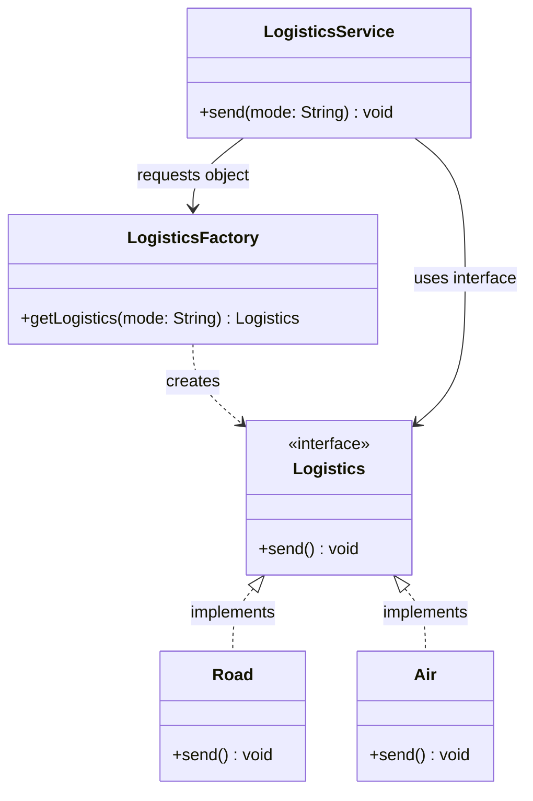

# Design Pattern: Factory Method (Creational)

## 1. Overview

The **Factory Pattern** is a creational design pattern that provides an interface for creating objects but allows subclasses or a dedicated factory class to alter the type of objects that will be created.

### In Simpler Terms

Rather than calling a `new` constructor directly in your business logic, you delegate the responsibility of "object creation" to a specialized **Factory**. This allows your service to remain independent of the specific classes it uses.

---

## 2. Class Diagram

The following diagram illustrates how the `LogisticsService` is decoupled from the concrete `Road` and `Air` classes through the `LogisticsFactory`.

---

## 3. The "Bad" Design: Tight Coupling

In the original version, the `LogisticsService` directly created instances using string comparisons.

### Identified Issues:

- **Tight Coupling:** `LogisticsService` depends directly on `Air` and `Road`.
- **Violation of OCP:** Adding a new mode (e.g., "Ship") requires modifying the `send` method.
- **Mixed Concerns:** Object creation logic and business logic are embedded together.
- **Testing Nightmare:** Hard to test independently because you cannot easily mock the logistics object.

---

## 4. The "Good" Design: Factory Implementation

By introducing the `LogisticsFactory`, we achieve several key benefits:

- **Loose Coupling:** The service is decoupled from specific logistics classes.
- **SRP (Single Responsibility Principle):** The responsibility of object creation is moved to a dedicated factory class.
- **Open/Closed Principle:** New modes can be added to the factory without modifying the service code.

---

## 5. Pros and Cons

| **Pros**                                                                     | **Cons**                                                                            |
| ---------------------------------------------------------------------------- | ----------------------------------------------------------------------------------- |
| **Loose Coupling:** Client works with interfaces, not concrete classes.      | **Complexity:** Introduces extra layers (interfaces/factories) for simple programs. |
| **Extensibility:** Easy to scale and add new types (e.g., Drone, Ship).      | **Boilerplate:** Requires more initial code overhead.                               |
| **Consistency:** Centralizes instantiation logic, avoiding code duplication. | **Runtime Decisions:** Can be slightly more complex to manage dynamic switching.    |

---

## 6. When to Use

- When the client code needs to work with **multiple types of objects**.
- When the decision of which class to instantiate must be made at **runtime**.
- When the instantiation process is **complex** or needs to be centrally controlled.

---

### Comparison with your other learned patterns:

- **Builder:** Used for step-by-step construction of a _single_ complex object (e.g., `BurgerMeal`).
- **Abstract Factory:** Used for creating _families_ of related objects (e.g., Payment + Invoice for a region).
- **Factory Method:** Used for creating a _single_ type of object from several possible implementations (e.g., a Logistics provider).
