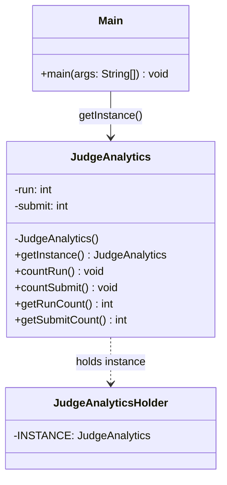

# Singleton Pattern Guide

The **Singleton Pattern** is a creational design pattern that ensures a class has **only one instance** and provides a global point of access to it.

### 1. Concept & Analogy

Imagine a **Judge Analytics** service that must count total "runs" and "submits" across the entire system. If every module creates its own `new JudgeAnalytics()`, each would have separate counters and there would be no single "total." The Singleton acts like a **single shared whiteboard**: everyone reads and updates the same instance, so the numbers are always consistent and global.

---

### 2. Class Diagram

---

### 3. When to Use

- **Single resource:** When exactly one instance of a class must exist (e.g. configuration, connection pool, logger, or global analytics).
- **Global access:** When that single instance must be reachable from many places without passing it through every constructor.
- **Shared state:** When the object holds state that must be consistent across the whole application (e.g. total run/submit counts).

---

### 4. Key Benefits (SOLID and Consistency)

- **Single source of truth:** One object holds the state; no duplicate or conflicting instances.
- **Controlled creation:** Private constructor prevents arbitrary `new` calls; creation is encapsulated in `getInstance()`.
- **Lazy initialization (optional):** With the static-holder idiom, the instance is created only when first requested.
- **Thread safety:** The holder-based implementation is thread-safe without explicit synchronization.

---

### 5. Pros and Cons

| **Pros**                                                                 | **Cons**                                                                 |
| ------------------------------------------------------------------------ | ------------------------------------------------------------------------ |
| **Single instance:** Guarantees one object for the whole application.    | **Global state:** Can make testing and reasoning about dependencies harder. |
| **Global access:** Easy to obtain the instance from anywhere.            | **Hidden coupling:** Many classes may depend on the singleton implicitly.  |
| **Lazy + thread-safe:** Possible with static holder; no extra locking.    | **Lifecycle:** Singleton lives for the whole process; not ideal for short-lived or scoped resources. |

---

### 6. Real-World Applications

- **Logging:** A single logger instance shared across the application.
- **Configuration:** One config object loaded once and reused.
- **Database connection pools:** One pool manager instance.
- **Caches:** A single in-memory cache for the process.
- **Analytics/metrics:** One object aggregating counts (e.g. runs, submits) system-wide.
