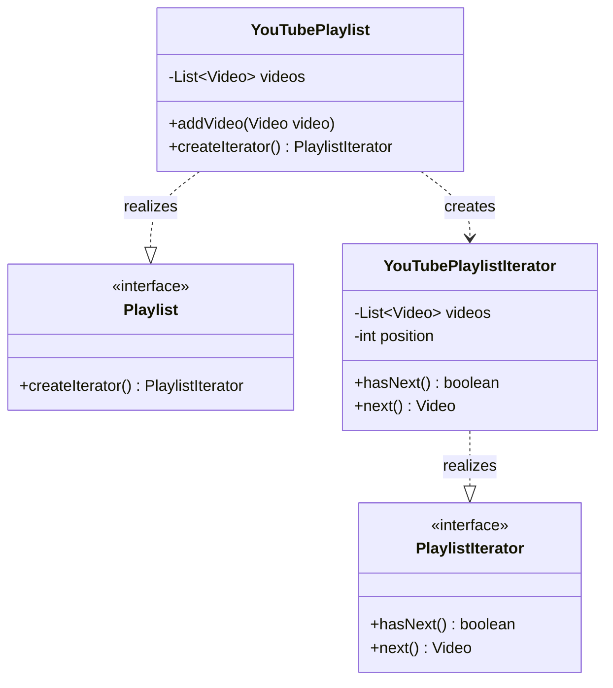

# Iterator Pattern: Sequential Access Without Exposure

**Behavioral design patterns** focus on how objects interact and communicate, defining the flow of control in a system. They simplify complex communication while promoting loose coupling. 

The **Iterator Pattern** is a foundational behavioral pattern that provides a way to access elements of a collection sequentially **without exposing its underlying representation**.

---

## 1. What is the Iterator Pattern?

The **Iterator Pattern** entrusts the traversal behavior of a collection to a separate design object. This allows you to traverse an array, list, tree, or custom structure in a consistent manner without worrying about internal data management.

### Real-Life Analogy: The Vending Machine
Think of a **vending machine**. You don’t need to know how snacks are arranged inside. You simply press a **"Next"** button to scroll through options one by one. The machine controls the order, acting as the iterator that hides the internal complexity.

---

## 2. The Problem: Tight Coupling & Leaky Abstraction

In a naive design, a collection like a `YouTubePlaylist` might expose its internal `ArrayList` directly.

* **Breaks Encapsulation**: Clients can access or modify the internal collection outside the owning class.
* **Tight Coupling**: External code becomes bound to specific collection types (e.g., `Vector`, `List`).
* **No Traversal Control**: You cannot enforce custom behaviors like "Shuffle Play" or "Reverse" without modifying external code.

---

## 3. Class Diagram & Structural Breakdown

The diagram below shows the refined approach where the collection itself provides the iterator, fully decoupling the client from the internal structure.

---

## 4. How the Iterator Pattern Solves the Problem

| Problem | How Iterator Pattern Solves It |
| :--- | :--- |
| **Direct structure access** | The collection hides its internal data; elements are accessed one-by-one via the iterator. |
| **No standard iteration** | All traversal uses a consistent interface (`hasNext()`/`next()`), ensuring uniformity. |
| **Scattered logic** | Iteration state (position/index) is encapsulated in the iterator class, keeping client code clean. |
| **Hard to customize** | Different strategies (reverse, skip, shuffle, filter) can be added as new iterator classes. |
| **Tight coupling** | Client interacts only with the iterator, not the specific data structure (array, list, etc.). |

---

## 5. Pros and Cons

### Advantages
* **Encapsulation**: Traverses a collection without knowing its internal build.
* **Unified Interface**: Use the same methods regardless of the collection type.
* **SRP & OCP Compliance**: Separates iteration logic (Single Responsibility) and allows adding new iterators without modifying existing code (Open/Closed).

### Disadvantages
* **Boilerplate**: Requires extra classes and interfaces for custom implementations.
* **Overkill**: Might be unnecessary for very simple, small data structures where a direct loop suffices.
* **Manual Management**: The client still has to manage the loop manually unless further abstracted.

---

## 6. Real-World Examples

1. **Java Collection Framework**: Classes like `ArrayList` and `HashSet` implement the `Iterable` interface, returning an `Iterator` via the `iterator()` method.
2. **Java Streams/Spliterator**: Internally uses `Spliterator` (Split + Iterator) to traverse elements efficiently, even supporting parallel processing for large datasets.
