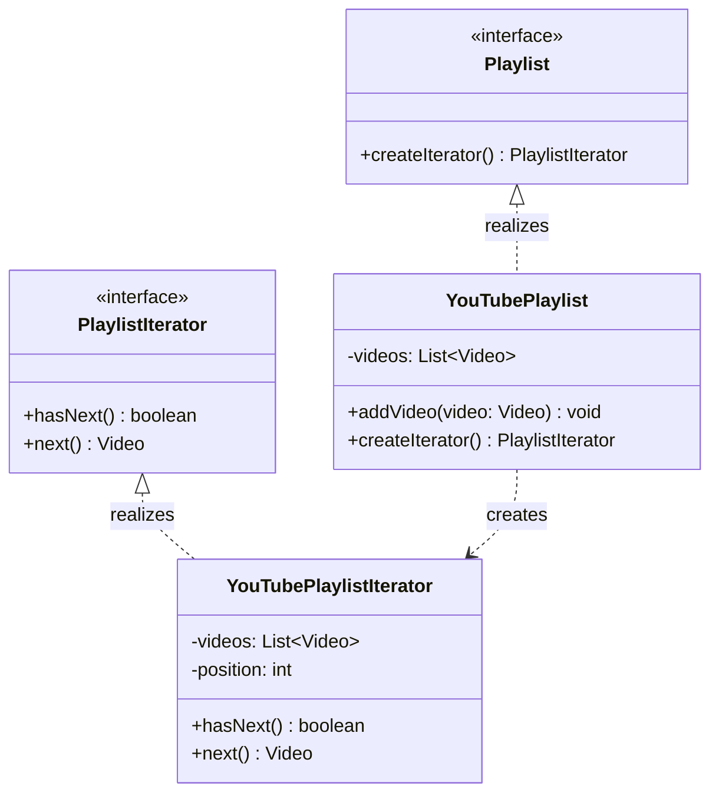

## Sequential Access Without Exposure

[cite_start]**Behavioral design patterns** focus on how objects interact and communicate, defining the flow of control in a system[cite: 1, 2]. [cite_start]They simplify complex communication while promoting loose coupling[cite: 2]. [cite_start]The **Iterator Pattern** is a foundational behavioral pattern that provides a way to access elements of a collection sequentially **without exposing its underlying representation**[cite: 5].

---

## 1. What is the Iterator Pattern?

[cite_start]The **Iterator Pattern** entrusts the traversal behavior of a collection to a separate design object[cite: 7]. [cite_start]This allows you to traverse an array, list, tree, or custom structure in a consistent manner without worrying about internal data management[cite: 8].

### Real-Life Analogy: The Vending Machine

[cite_start]Think of a **vending machine**[cite: 10]. [cite_start]You don’t need to know how snacks are arranged inside[cite: 10]. [cite_start]You simply press a **"Next"** button to scroll through options one by one[cite: 11]. [cite_start]The machine controls the order, acting as the iterator that hides the internal complexity[cite: 11, 12].

---

## 2. The Problem: Tight Coupling & Leaky Abstraction

[cite_start]In a typical "bad" design, a collection like a `YouTubePlaylist` might expose its internal `ArrayList` directly[cite: 15].

- [cite_start]**Breaks Encapsulation**: Clients can access or modify the internal collection outside the owning class[cite: 17, 18].
- [cite_start]**Tight Coupling**: External code becomes bound to specific collection types (e.g., `Vector`, `List`)[cite: 20].
- [cite_start]**No Traversal Control**: You cannot enforce custom behaviors like "Shuffle Play" or "Reverse" without modifying external code[cite: 23, 24].

---

## 3. Class Diagram

[cite_start]The diagram below shows the refined approach where the collection itself provides the iterator, fully decoupling the client from the internal structure[cite: 53].

---

## 4. How the Iterator Pattern Solves the Problem

| Problem                     | [cite_start]How Iterator Pattern Solves It [cite: 49]                                                                    |
| :-------------------------- | :----------------------------------------------------------------------------------------------------------------------- |
| **Direct structure access** | [cite_start]The collection hides its internal data; elements are accessed one-by-one via the iterator[cite: 49].         |
| **No standard iteration**   | [cite_start]All traversal uses a consistent interface (`hasNext()`/`next()`), ensuring uniformity[cite: 49].             |
| **Scattered logic**         | [cite_start]Iteration state (position/index) is encapsulated in the iterator class, keeping client code clean[cite: 49]. |
| **Hard to customize**       | [cite_start]Different strategies (reverse, skip, filter) can be added as new iterator classes[cite: 49].                 |
| **Tight coupling**          | [cite_start]Client interacts only with the iterator, not the specific data structure (array, list, etc.)[cite: 49].      |

---

## 5. Pros and Cons

### [cite_start]Advantages [cite: 74]

- [cite_start]**Encapsulation**: Traverses a collection without knowing its internal build[cite: 75].
- [cite_start]**Unified Interface**: Use the same methods regardless of the collection type[cite: 77].
- [cite_start]**SRP & OCP Compliance**: Separates iteration logic (Single Responsibility) and allows adding new iterators without modifying existing code (Open/Closed)[cite: 81, 82].

### [cite_start]Disadvantages [cite: 84]

- [cite_start]**Boilerplate**: Requires extra classes and interfaces for custom implementations[cite: 85].
- [cite_start]**Overkill**: Might be unnecessary for very simple, small data structures where a direct loop suffices[cite: 87].
- [cite_start]**Manual Management**: The client still has to manage the loop manually unless further abstracted[cite: 89].

---

## 6. Real-World Examples

1.  [cite_start]**Java Collection Framework**: Classes like `ArrayList` and `HashSet` implement the `Iterable` interface, returning an `Iterator` via the `iterator()` method[cite: 66, 67].
2.  [cite_start]**Java Streams/Spliterator**: Internally uses `Spliterator` (Split + Iterator) to traverse elements efficiently, even supporting parallel processing for large datasets[cite: 70, 71].
