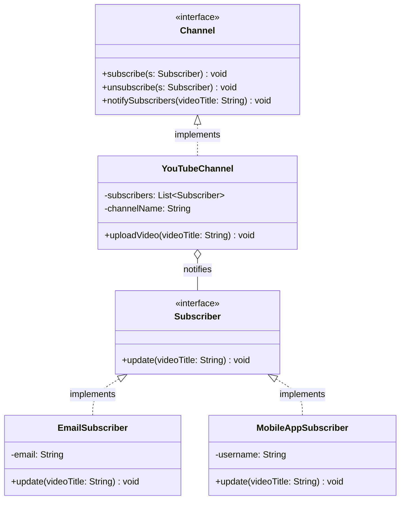

## Event-Driven Communication

**Behavioral design patterns** focus on how objects interact and communicate with each other, helping to define the flow of control in a system. These patterns simplify complex communication logic between objects while promoting **loose coupling**.

---

## 1. What is the Observer Pattern?
The **Observer Pattern** is a behavioral design pattern that defines a **one-to-many dependency** between objects. When one object (the **subject**) changes its state, all its dependents (called **observers**) are notified and updated automatically.

### Real-Life Analogy: YouTube Subscriptions
Think of subscribing to a YouTube channel. Once you hit the **Subscribe** button and turn on notifications, you don’t have to keep visiting the channel to check for new videos. As soon as a new video is uploaded, you get notified instantly.
* **The Channel**: The Subject.
* **The Subscribers**: The Observers.
* **The Notification**: The automatic update mechanism.

---

## 2. The Problem: Tight Coupling
In a naive design, a subject is hard-coded to notify specific recipients. This creates a "maintenance nightmare" because adding or removing a subscriber requires modifying the core logic of the subject. This violates both the **Single Responsibility Principle (SRP)** and the **Open/Closed Principle (OCP)**.

---

## 3. Class Diagram
The Observer Pattern uses interfaces to decouple the subject from its concrete observers. The subject only knows about the `Subscriber` interface, not the concrete implementations like `EmailSubscriber` or `MobileAppSubscriber`.

---

## 4. Pros and Cons

### Advantages
* **Loose Coupling**: Subjects and observers interact only through a common interface.
* **Open for Extension**: New observer types can be added without modifying the subject.
* **Dynamic Subscriptions**: Observers can be attached or detached at runtime.
* **Encourages Reusability**: Different observer implementations can be reused across different subjects.

### Disadvantages
* **Unpredictable Sequences**: The order of notifications is not guaranteed.
* **Performance Bottlenecks**: Synchronous notifications can degrade performance with a large number of observers.
* **Memory Leaks**: Failure to unsubscribe unused observers can cause lingering references.
* **Difficult Debugging**: Indirect interactions make tracing bugs more challenging.

---

## 5. Use Cases and Limitations

### Recommended Scenarios 
* **State Change Propagation**: When a change in one object must be reflected across many dependents.
* **Decoupling Core Components**: When the publisher should remain agnostic of its subscribers.
* **Dynamic Runtime Modules**: Useful for UI listeners, plugins, or notification modules.

### Limitations at Scale 
* **Excessive Load**: For millions of observers (e.g., a massive celebrity going live), use **pub-sub architectures** or event queues.
* **Timing Control**: If strict delivery timing is critical (e.g., financial systems), use **message brokers** like Kafka or RabbitMQ.

---

## 6. Real-World Examples 
1.  **UI Event Handling**: Button clicks or typing listeners in GUI frameworks.
2.  **Stock Market Tickers**: Updating charts and alerts when a stock price changes.
3.  **File System Watchers**: IDEs triggering compilers when a file is saved.
4.  **Social Media**: YouTube or Instagram notifying followers of new posts.
