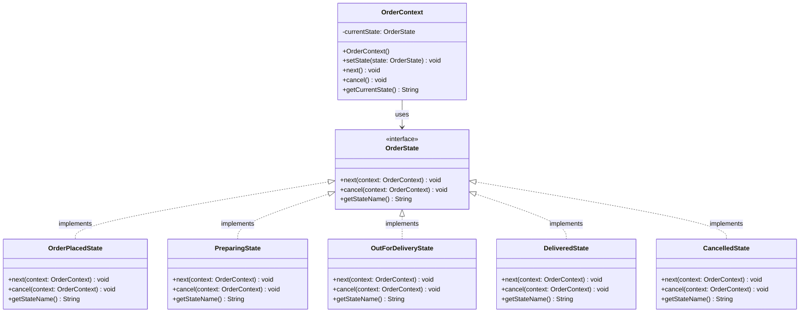

# Lifecycle Management & State Transitions

**Behavioral design patterns** are centered on how objects communicate and interact with each other, helping define the flow of control within a system. These patterns simplify the complex logic involved in communication while promoting loose coupling between objects.

Imagine a vending machine that changes its behavior based on the coins inserted — when you insert enough money, the machine gives you a snack and when you haven’t inserted enough, it asks for more. This dynamic change in behavior depending on the machine's state is what the State Pattern addresses.

---

## 1. What is the State Pattern?

The **State Pattern** is a behavioral design pattern that encapsulates state-specific behavior into separate classes and delegates the behavior to the appropriate state object. This allows the object to change its behavior without altering the underlying code.

### Formal Definition

The State Pattern is a behavioral design pattern that encapsulates state-specific behavior into separate classes and delegates the behavior to the appropriate state object. This allows the object to change its behavior when its internal state changes, appearing as if the object changed its class.

### Real-Life Analogy: Order Tracking Flow

Consider a food delivery app. As an order progresses, its state changes through multiple stages:

1. The order is placed.
2. The order is being prepared.
3. A delivery partner is assigned.
4. The order is picked up.
5. The order is out for delivery.
6. The order is delivered.

At each stage, the app behaves differently:

- In the **Order Placed** state, you can cancel the order.
- In the **Order Preparing** state, you can track the preparation status.
- In the **Delivery Partner Assigned** state, you can see the details of the assigned driver.

Each of these states represents a distinct phase, and the app's behavior changes based on which state the order is in. The State Pattern manages these transitions seamlessly, with each state class controlling the behavior for that phase. It also follows the **Open/Closed Principle (OCP)**, as fresh states can be added without modifying the existing context structure.

---

## 2. Understanding the Problem: Monolithic Conditionals

When an entity implements state variations through literal strings and local flag processing gates, managing multi-step transition flows becomes unmaintainable.

### Issues in the Naive Code

- **Rigid State Transition Management**: The state transitions are hardcoded inside the `nextState()` method using a switch statement. This approach becomes cumbersome if new states need to be added.
- **Lack of Encapsulation**: The state transition logic and cancel behavior are directly handled within the `Order` class. This violates the **Single Responsibility Principle (SRP)** by combining multiple responsibilities within a single class.
- **Code Duplication Risks**: The logic for the `cancelOrder()` and `nextState()` methods could lead to duplicate structural branches if more states and actions are added.
- **Missing Flexibility for Future Changes**: Adding new states or changing existing behaviors can be error-prone and cumbersome, as the core `Order` class needs to be updated each time.

---

## 3. Class Diagram & Structural Layout

The State Pattern replaces central conditional switches by decomposing status pipelines into standalone polymorphic subclasses linked directly to a master Context object.

| Component                                      | Responsibility                                                                                                           |
| ---------------------------------------------- | ------------------------------------------------------------------------------------------------------------------------ |
| **Context** (`OrderContext`)                   | Tracks the reference pointer to the active operational state and exposes execution endpoints to clients.                 |
| **State Interface** (`OrderState`)             | Dictates the common method contract covering every legal business operation in the lifecycle.                            |
| **Concrete States** (`OrderPlacedState`, etc.) | Encapsulate custom validation rules for individual lifecycle milestones and execute mutations against the context state. |

---

## 4. How the State Pattern Resolves the Issues

| Issue                              | Solution with State Pattern                                                                                                                                                                     |
| ---------------------------------- | ----------------------------------------------------------------------------------------------------------------------------------------------------------------------------------------------- |
| **State Transition Management**    | Transitions are handled by the respective state classes, making it easy to add new states or modify transitions without altering the `OrderContext` class. Each state handles its own behavior. |
| **Lack of Encapsulation**          | Each state is encapsulated in its own class, adhering to the **Single Responsibility Principle (SRP)** and ensuring better maintainability.                                                     |
| **Code Duplication**               | The behavior for each state is encapsulated in the corresponding class, avoiding duplicate logic for state transitions and cancellations across the main entity.                                |
| **Flexibility for Future Changes** | New states can be added easily by creating new classes implementing the `OrderState` interface, without modifying existing code. This follows the **Open/Closed Principle (OCP)**.              |

---

## 5. When to Use the State Pattern

- **Behavior Depends on State**: When an object needs to change its behavior dynamically based on its internal condition or current phase.
- **Finite State Configurations**: When the states and their transitions are clearly structured, well-defined, and limited in number.
- **Elimination of Structural Gating**: When you want to eliminate bulky conditional logic (`if-else` or `switch-case`) that shifts behaviors across status fields.
- **Isolated Operational Inversions**: When each state step demands its own distinct rules, constraints, and error messaging strategies.

---

## 6. Differences Between State and Strategy Pattern

Because both patterns swap objects polymorphically via composition interfaces, they share structural similarities but serve completely different architectural intents:

| Aspect                     | State Pattern                                                                                              | Strategy Pattern                                                                            |
| -------------------------- | ---------------------------------------------------------------------------------------------------------- | ------------------------------------------------------------------------------------------- |
| **Core Intent**            | Modifies behavior based on an object's internal state mutations over a chronological timeline.             | Interchanges standalone algorithms or behaviors at runtime based on context configurations. |
| **Awareness / Dependency** | Concrete states are typically aware of adjacent states and actively trigger transitions to the next phase. | Strategies are independent, isolated entities completely unaware of other variations.       |
| **Execution Profile**      | Tracks dynamic lifecycles where different actions produce changing results across phases.                  | Tracks explicit operational alternatives that eventually reach the same terminal objective. |
| **Primary Use Cases**      | Workflow models, transaction pipelines, and complex business lifecycle processors.                         | Dynamic sorting, payment gateway routing, and file compression engines.                     |

---

## 7. Trade-Off Analysis

### Pros

- **Clear Separation of State Behavior**: Encapsulating stages into dedicated classes makes it simple to manage and modify individual behaviors without affecting the rest of the system.
- **Extensible Addition of Milestones**: Integrating new target milestones requires minimal modifications to existing class blocks.
- **Strict OCP Alignment**: Code architectures remain safe from regression risks since new state behaviors are introduced by creating new files.
- **Improved Readability**: Cleans up the code layer by removing sprawling, hard-to-track multi-line switch statement configurations.

### Cons

- **Class Proliferation**: Introducing a distinct class container for every state value increases the project file count and overall architectural volume.
- **Slightly Complex Initial Setup**: Requires extra structural preparation around state contracts, interface setups, and context hooks compared to simple string checks.
- **Transition Complexity**: Transition rules can become scattered across multiple concrete states, meaning developers must track changes across files to visualize the complete flow map.

---

## 8. Real-World Applications

1. **Swiggy (Food Delivery App)**: The order lifecycle is a clear example of the State Pattern. As a customer places an order, it transitions sequentially through _Order Placed_, _Order Preparing_, _Out for Delivery_, and _Order Delivered_. When an order is in the "Placed" state, cancellation is valid. Once it transforms to "Out for Delivery", cancellation is blocked, and real-time navigation streams engage. Each milestone is governed by its own independent state class.
2. **Uber (Ride-Hailing Platform)**: Manages ride stages (_Ride Requested_, _Driver Assigned_, _Ride Accepted_, _In Progress_, _Completed_). The app's core tracking parameters and action filters adapt to match whichever state class is currently handling the active context profile.
3. **Automated Teller Machines (ATMs)**: The internal mechanics of an ATM adapt completely based on its current operational condition (_Idle_, _Card Inserted_, _PIN Entered_, _Transaction Processing_, _Out of Service_). The state pattern blocks users from running unauthorized processes out of turn, ensuring transactional security.
