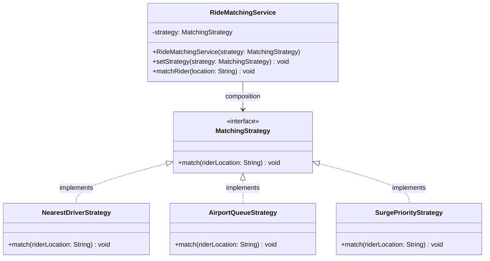

# Dynamic Runtime Interchangeability

**Behavioral design patterns** focus on how objects interact and communicate with each other, helping to define the flow of control in a system. These patterns make systems more flexible by allowing behavior to be selected or changed at runtime without altering the core logic.

Imagine a navigation app that can switch between driving, walking, or cycling routes. The algorithm used to calculate the path depends on the selected mode of travel. Instead of hardcoding all possible strategies inside one class, it is significantly better to define each strategy separately and choose them dynamically.

That’s exactly what the Strategy Pattern enables. It allows a class to choose its behavior at runtime by encapsulating related algorithms into interchangeable objects.

---

## 1. What is the Strategy Pattern?
The **Strategy Pattern** is a behavioral design pattern that defines a family of algorithms, encapsulates each one into a separate class, and makes them interchangeable at runtime depending on the context.

### Formal Definition
The Strategy Pattern enables selecting an algorithm's behavior at runtime by defining a set of strategies (algorithms), each encapsulated in its own class, and making them interchangeable via a common interface.

It is primarily focused on changing the behavior of an object dynamically without modifying its class. This promotes better organization of related algorithms and enhances code flexibility and scalability.

### Real-Life Analogy
Consider how a ride-hailing platform matches a rider with a driver. The underlying algorithm changes depending on variables like proximity, location, and demand:
* **The Context**: The `RideMatchingService` orchestration engine.
* **The Strategies**: Concrete routing variations like matching with the nearest available driver, prioritizing high-surge zones, or pulling from a first-in, first-out (FIFO) airport queue.
* **The Interface**: The common abstraction layer allowing the service to switch between these algorithms seamlessly depending on live conditions.

---

## 2. Understanding the Problem: Monolithic Conditionals
In a naive design, all algorithmic variations are shoved into a single method using an `if-else` or `switch` block. 

* **Violation of Open/Closed Principle (OCP)**: Adding a new strategy (e.g., VIP rider matching) requires modifying the core service class, creating high regression risks for pre-existing stable algorithms.
* **Conditional Code Bloat**: As more operational models are added, the number of nested branches grows, making the code messy and harder to maintain.
* **Difficult to Test or Reuse**: Individual matching strategies are not reusable or testable in isolation. You cannot target or verify one calculation matrix without driving execution through the entry point of the entire service block.
* **No Separation of Concerns**: The class handles both higher-level orchestration (routing the request) and low-level mechanics (the specific matching algorithm math), reducing flexibility.

---

## 3. Class Diagram & Structural Breakdown

The Strategy Pattern replaces rigid conditional gates with clean object composition and polymorphic delegation.

Component	Responsibility
Context (RideMatchingService)	Maintains an internal reference to a strategy object and delegates processing tasks to it.
Strategy Interface (MatchingStrategy)	Establishes the common unified signature shared by all algorithmic variations.
Concrete Strategies (NearestDriverStrategy, etc.)	Encapsulate the specialized operational mechanics of individual algorithms.
4. How Strategy Solves the Earlier Problems
Problem in Old Approach	How Strategy Pattern Solves It
Violation of Open/Closed Principle	New strategies can be introduced cleanly by implementing the interface, leaving stable execution paths untouched.
Messy Conditional Code	Collapses multiple if-else or switch branches by executing polymorphism instead.
Difficult to Test or Reuse	Each strategy class stands as an independent unit that can be fully verified in absolute isolation.
No Separation of Concerns	Context only coordinates when to run things; execution mathematics live entirely inside strategy boundaries.
5. Pros and Cons
Pros
• Supports the Open/Closed Principle (OCP): New strategies can be added without modifying existing code, keeping the system extensible.
• Easy to Add New Behaviors: Each behavior is encapsulated in its own class, making it simple to plug in new logic.
• Enables Runtime Behavior Changes: Behavior can be changed dynamically at runtime by swapping strategy objects via setter injection.
• Encourages Composition Over Inheritance: Promotes a highly flexible design by favoring runtime object composition over rigid, compile-time class hierarchies.
Cons
• May Lead to Too Many Small Classes: Each strategy is implemented in a separate class, which can increase overall code volume and project complexity.
• Requires Awareness of All Strategies: The client needs to know which strategies exist and understand their differences to select the correct one.
• Slight Overhead Due to Interfaces: Involves extra structure around interfaces, which may be unnecessary for simple or static business logic.
6. Suitable Scenarios for Strategy Pattern
• Multiple Interchangeable Algorithms: Variations in operational execution (e.g., different sorting algorithms, distinct billing tax rules, or multiple payment processors).
• Compliance with Open/Closed Principle (OCP): When new strategies need to be introduced over time without breaking existing code functionality.
• Elimination of Conditionals: When large blocks of conditional control state structures are used to route execution logic.
• Behavior-Specific Unit Testing: When you need distinct test boundaries to assert calculation matrices independently without faking the entire contextual service.

---
