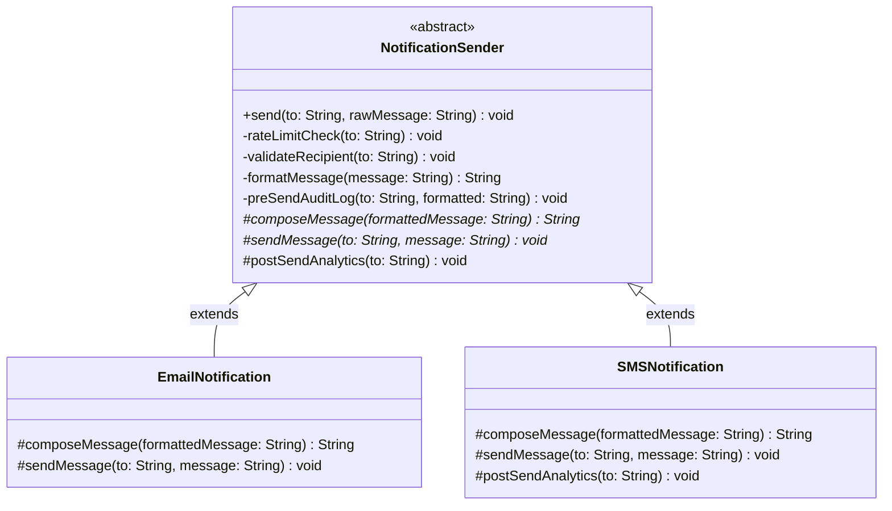

```markdown
# TemplateMethodDesignPatternGuide.md: Inverted Control & Structural Governance

**Behavioral design patterns** focus on how objects communicate and collaborate with each other to define the flow of control in a system. These patterns aim to simplify complex logic and improve the structure of interactions while promoting loose coupling between objects.

Imagine you are baking a cake using a predefined recipe. The recipe lays out the general steps you need to follow, like mixing ingredients, preheating the oven, and baking the cake. While the basic steps are fixed, the specific details (such as the ingredients or the flavor) can be varied. The Template Pattern helps to manage this by defining the basic structure of an algorithm while allowing certain steps to be implemented by subclasses.

---

## 1. What is the Template Pattern?

The **Template Method Pattern** is a behavioral design pattern that provides a blueprint for executing an algorithm. It defines the skeleton of an operation in a superclass but delegates the realization of specific variable steps to subclasses without altering the overarching structural timeline.

### Formal Definition
The Template Pattern is a behavioral design pattern that provides a blueprint for executing an algorithm. It allows subclasses to override specific steps of the algorithm, but the overall structure remains the same. This ensures that the invariant parts of the algorithm are not changed, while enabling customization in the variable parts.

### Real-Life Analogy
Imagine you are following a recipe to bake a cake. The overall process of baking a cake (preheat oven, mix ingredients, bake, and cool) is fixed, but the specific ingredients or flavors may vary (chocolate, vanilla, etc.).

The Template Pattern is like the recipe: it defines the basic structure of the process (steps), while allowing the specific ingredients (or steps) to be varied depending on the cake type.

---

## 2. Four Structural Components

The pattern achieves systemic balance by segregating its execution components into four distinct access blocks:

* **Template Method (`final` method in Base Class)**: This method defines the skeleton of the algorithm. It calls the various steps and determines their sequence. This method is final to prevent overriding in subclasses, ensuring that the algorithm’s structure stays consistent.
* **Primitive Operations (`abstract` methods)**: These are abstract methods that subclasses must implement. These methods represent the variable parts of the algorithm that may change based on the subclass’s specific requirements.
* **Concrete Operations (`final` or `private` concrete methods)**: These are methods that contain behavior common to all subclasses. They are defined in the base class and are shared by all subclasses.
* **Hooks (`protected` optional methods with default behavior)**: Hooks are optional methods in the base class that provide default behavior. Subclasses can override these methods to modify the behavior when needed, but they are not mandatory for all subclasses to implement.

---

## 3. Understanding the Problem: Parallel Pipeline Redundancy

When multiple channels share a common lifecycle workflow but are written as independent components, significant infrastructure duplication emerges.


### Issues in the Naive Code
* **Code Duplication**: Both `EmailNotification` and `SMSNotification` contain nearly identical logic for rate limit checking, message formatting, logging, and analytics. This violates the DRY (Don't Repeat Yourself) principle, making the code harder to maintain.
* **Hardcoded Behavior**: The behavior for sending emails and SMS is tightly coupled with the `send()` method. If we need to add a new notification type (e.g., Push Notification), we would need to duplicate the entire logic and modify each notification class.
* **Lack of Extensibility**: If we need to change the logic for rate limit checks, logging, or analytics, we will have to modify it across all notification classes, leading to potential errors and inconsistencies.
* **Maintenance Overhead**: With each new notification type, you are adding more classes with similar code, making the system increasingly difficult to manage as it grows.

---

## 4. Class Diagram & Structural Layout

The Template Pattern uses class inheritance to extract common steps into a superclass, keeping step execution strictly controlled while leaving precise tasks open for specialization.




---

## 5. How the Template Pattern Resolves the Issues

| Issue | Solution with Template Pattern |
| --- | --- |
| **Code Duplication** | The common steps (rate limit checks, recipient validation, logging, etc.) are now centralized in the base class, reducing duplication. |
| **Hardcoded Behavior** | The specific behaviors (email vs SMS) are handled by subclasses, making the code more flexible and extensible. |
| **Lack of Extensibility** | New types of notifications (e.g., PushNotification) can be added by subclassing `NotificationSender` and implementing the abstract methods. |
| **Maintenance Overhead** | Common logic is handled in one place (the base class), so updating behaviors (like rate limit checks or logging) only requires changes in the base class. |

---

## 6. Trade-Off Analysis

### Pros

* **Promotes Code Reusability**: Shares common steps across different classes, ensuring they follow the same algorithm without duplicating code.
* **Supports OCP (Open/Closed Principle)**: New behaviors (custom steps) can be added by extending the base class without modifying its existing code.
* **Enforces a Consistent Flow**: Assures a fixed sequence of steps, making the flow predictable and consistent across all subclasses.
* **Allows Optional Customization via Hooks**: The use of hooks allows subclasses to modify or extend behavior when needed without changing the base structure.

### Cons

* **Inheritance-Based Constraints**: Uses class inheritance, which can reduce flexibility as the behavior is tightly coupled with the base class structure.
* **Fragile Base Class Risks**: Any changes in the base class template layout may affect all subclasses, making it harder to modify or extend certain features independently.
* **Rigid Algorithm Layouts**: If the core steps of the algorithm vary significantly between use cases, the pattern breaks down, making the **Strategy Pattern** a better choice.
* **Subclass Proliferation**: If the number of steps to be customized grows, you might end up creating too many subclasses, making the codebase harder to maintain.

---

## 7. When to Use the Template Pattern

* **Algorithmic Uniformity**: When multiple classes follow the exact same sequential algorithm but differ in just a few concrete details.
* **Centralization of Boilerplate**: When you want to eliminate code duplication of cross-cutting steps across parallel implementations.
* **Strict Sequential Governance**: When you need to enforce a unalterable, fixed chronological order of operational phases.
* **Framework Design**: When providing plug-and-play scaffolding for a system where consumers can safely customize execution targets via protected hooks.

---

## 8. Real-World Implementations

1. **TUF+ Payment Flow**: In TUF+, the payment flow for both Indian and International transactions follows a predefined sequence. This sequence includes steps like validating the payment method, processing the payment, and updating the account. While these steps remain the same, the specifics (such as validating a UPI ID for Indian payments or a credit card for international payments) can vary between subclasses, providing flexibility and customization.
2. **Game Engines**: Game engines like Unity or Unreal Engine use the Template Pattern in their game loop and rendering process. The framework for rendering a frame is common (input handling, physics update, rendering), but specific actions (e.g., rendering techniques or AI decision-making) can be customized in different games through subclassing.
3. **Web Frameworks**: Frameworks like Spring or Django use the Template Pattern for request lifecycles. They define the rigid pipeline for handling HTTP requests (URL mapping, request parsing, filter chains, formatting) but allow developers to override specific hooks like validation or template engine rendering.

```

```
