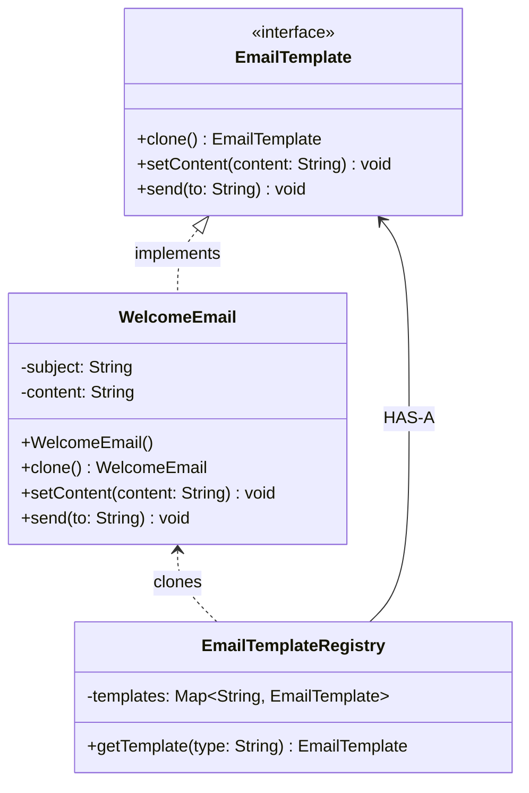

# Design Pattern: Prototype (Creational)

## 1. Overview

The **Prototype Pattern** is a creational design pattern used to **clone existing objects** instead of constructing them from scratch. It is most effective when the cost of creating a new object (via the `new` keyword) is more expensive than copying an existing one in memory.

### Formal Definition

> "Prototype pattern creates duplicate objects while keeping performance in mind. It provides a mechanism to copy the original object to a new one without making the code dependent on their classes."

### The Photocopy Analogy

Think of preparing ten offer letters. Instead of typing the same letter ten times, you write it once, **photocopy it**, and change just the name on each copy. This is the essence of the Prototype Pattern: start with a base object and produce modified copies with minimal overhead.

---

## 2. Class Diagram

The diagram below shows the relationship between the **Prototype Interface**, the **Concrete Prototype** that knows how to copy itself, and the **Registry** that manages the master copies.

---

## 3. Deep Cloning vs. Shallow Cloning

In Java, understanding how you copy an object is critical to avoiding bugs:

- **Shallow Cloning**: Copies the object's bit-field, but if the object contains references to other objects (like a `List`), both the original and the clone will point to the same list.
- **Deep Cloning**: Copies the object **and** all the objects it references. This is generally **preferred** in the Prototype Pattern because it ensures that changes to a clone (like adding a new attachment to an email) do not affect the original template.

---

## 4. Pros and Cons

| **Pros**                                                                                                                       | **Cons**                                                                                                 |
| ------------------------------------------------------------------------------------------------------------------------------ | -------------------------------------------------------------------------------------------------------- |
| **Faster Creation**: Skips expensive initialization logic or database hits.                                                    | **Complexity**: Implementing a true deep copy can be difficult for objects with many references.         |
| **Reduced Subclassing**: You don't need a `PremiumWelcomeEmail` class; you just clone a `WelcomeEmail` and change the content. | **Circular References**: Cloning objects that refer to each other can lead to infinite loops or crashes. |
| **Runtime Configuration**: Allows you to create and modify complex objects on the fly based on user state.                     | **Maintenance**: If the internal structure of the object changes, the `clone()` method must be updated.  |

---

## 5. Summary of Creational Patterns

Since you have now covered all major Creational Patterns, here is how they compare:

| Pattern              | Primary Purpose                | When to Use                                                                          |
| -------------------- | ------------------------------ | ------------------------------------------------------------------------------------ |
| **Factory**          | Which class to create?         | When you have one interface with many implementations (e.g., Logistics).             |
| **Abstract Factory** | Which family of classes?       | When you need related objects to work together (e.g., Region-based Payments).        |
| **Builder**          | How to build a complex object? | When an object has many optional parameters (e.g., BurgerMeal).                      |
| **Prototype**        | How to copy an object?         | When creation is expensive and you need many similar copies (e.g., Email Templates). |
