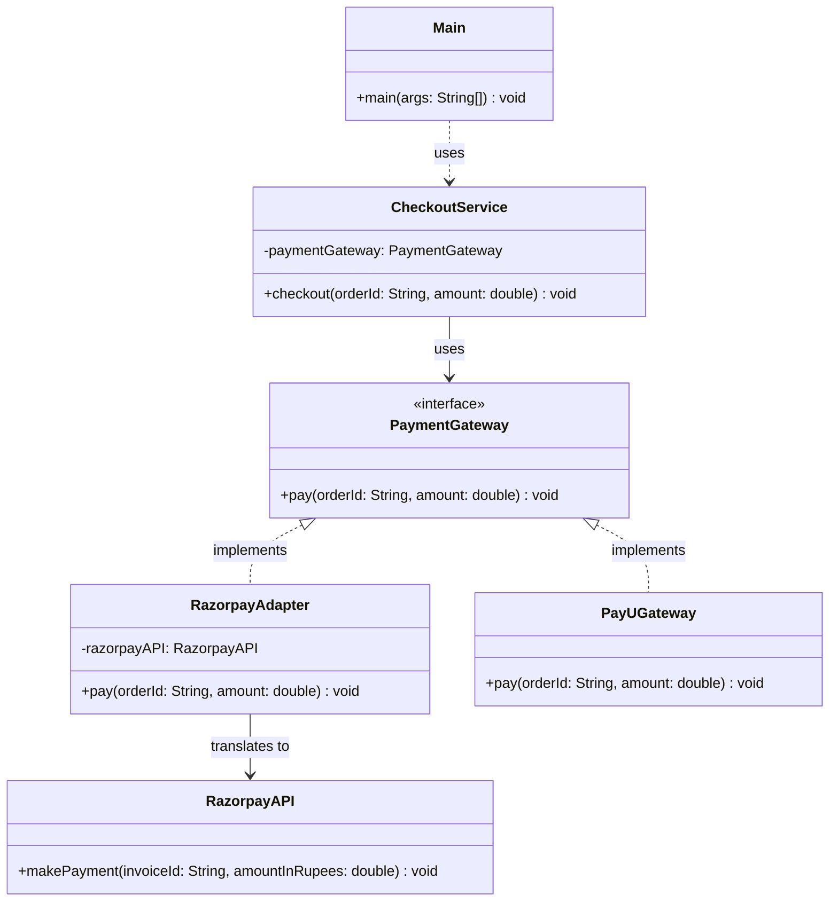

# Design Pattern: Adapter (Structural)

## 1. Introduction

**Structural design patterns** are concerned with the **composition of classes and objects**. They focus on how to assemble these components into larger structures while keeping the system flexible and efficient. The **Adapter Pattern** is a foundational structural pattern used to resolve interface incompatibilities.

---

## 2. The Adapter Pattern

The **Adapter Pattern** allows incompatible interfaces to work together by acting as a **translator** or **wrapper** around an existing class. It converts the interface of a class into another interface that a client expects.

It acts as a bridge between the **Target** interface (expected by the client) and the **Adaptee** (an existing class with a different interface). This structural wrapping enables seamless integration across diverse systems.

### Real-Life Analogy: The Travel Adapter

Imagine traveling from India to Europe. Your mobile charger (the **Adaptee**) has an Indian plug, but the wall socket (the **Target**) expects a European format. Instead of buying a new charger, you use a **Plug Adapter**. The adapter allows your Indian plug to fit the European socket, enabling charging without modifying either the socket or the charger.

---

## 3. Class Diagram

The following diagram illustrates the relationship between the `CheckoutService` (Client), the `PaymentGateway` (Target), and the `RazorpayAdapter` which bridges the gap to the `RazorpayAPI` (Adaptee).

---

## 4. Problem & Solution Summary

### The Problem

In your current system, the `CheckoutService` expects providers to implement the `PaymentGateway` interface. While `PayUGateway` fits this requirement, the `RazorpayAPI` uses a different method signature (`makePayment`) and does not implement your interface. This mismatch prevents direct collaboration.

### The Solution

The **Adapter Pattern** introduces the `RazorpayAdapter` class. This class implements your `PaymentGateway` interface but internally delegates the work to `RazorpayAPI`. It translates the standard `pay()` call into the specific `makePayment()` call required by the third-party library.

---

## 5. Pros and Cons

| **Pros**                                                                                                         | **Cons**                                                                                                 |
| ---------------------------------------------------------------------------------------------------------------- | -------------------------------------------------------------------------------------------------------- |
| **Code Reusability**: Reuse existing classes (like legacy or 3rd party APIs) without changing their source code. | **Increased Complexity**: Adds an extra layer of abstraction and more classes to the codebase.           |
| **Open/Closed Principle**: You can introduce new adapters without breaking existing client code.                 | **Potential Performance Overhead**: The extra call through the adapter can introduce a very minor delay. |
| **Single Responsibility**: The translation logic is isolated in its own class.                                   | **Obscured Design**: Overuse can make the system architecture harder to follow.                          |

---

## 6. Real-World Use Cases

1. **Payment Gateways**: Unifying diverse APIs (Stripe, PayPal, Razorpay) under one internal checkout interface.
2. **Logging Frameworks**: Creating a wrapper so your app can switch between `Log4j`, `SLF4J`, or `java.util.logging` without changing log calls.
3. **Cloud SDKs**: Abstracting operations so you can switch between AWS S3 and Google Cloud Storage using a common interface.

---

### Comparison with Creational Patterns

While you previously used **Factory** to _create_ objects and **Builder** to _construct_ them, the **Adapter** pattern is used when the objects already exist but **don't speak the same language**.
