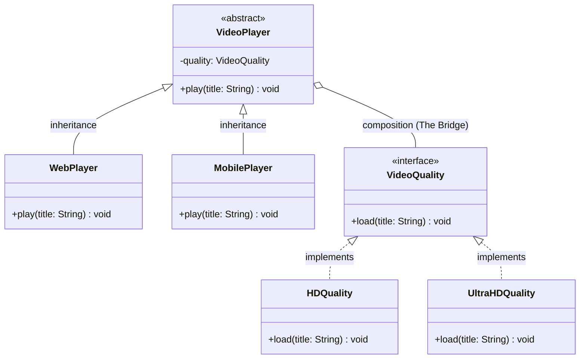

## Bridging the Gap Between Abstraction and Implementation

**Structural design patterns** are concerned with the **composition of classes and objects**. They focus on how to assemble classes and objects into larger structures while keeping these structures flexible and efficient. The **Bridge Pattern** is one of the most critical structural patterns for managing complex hierarchies with multiple dimensions of change.

---

## 1. What is the Bridge Pattern?

The **Bridge Pattern** is a structural design pattern used to **decouple an abstraction from its implementation** so that the two can vary independently.

### Real-Life Analogy: Remote and TV

Think of a **TV Remote** and a **TV**:

- **The Remote (Abstraction):** The interface you interact with (buttons like Power, Volume, Channel).
- **The TV (Implementation):** The actual hardware that displays the picture and produces sound.

You can have different types of remotes (Basic, Smart) and different brands of TVs (Sony, Samsung). The Bridge Pattern allows any remote to work with any TV without creating a separate class for every possible combination (e.g., `SonySmartRemote`, `SamsungBasicRemote`).

---

## 2. The Problem: Class Explosion

When you have **multiple dimensions of variability** (e.g., different platforms and different video qualities), using standard inheritance leads to a "combinatorial explosion."

If you have 5 platforms and 5 quality types, you end up with **25 distinct classes** (5 $\times$ 5). This makes the system:

- **Tightly Coupled:** Platforms are locked into specific qualities.
- **Hard to Scale:** Adding one new quality requires adding a new class for _every_ platform.
- **Redundant:** Most classes share very similar, duplicated code.

---

## 3. Class Diagram

The diagram below shows how we split the single, rigid hierarchy into two independent ones: the **Abstraction** (VideoPlayer) and the **Implementor** (VideoQuality).

---

## 4. How the Bridge Pattern Solves the Issue

1.  **Separation of Concerns:** `VideoPlayer` handles **platform logic**, while `VideoQuality` handles **streaming logic**.
2.  **Flexible Combinations:** You can "plug" any quality into any player at runtime using composition.
3.  **Linear Growth ($M + N$):** Adding a new platform (`SmartTVPlayer`) only requires one new class, which automatically works with all existing qualities.
4.  **Single Responsibility:** Each class has one job, adhering to the SOLID principles and the Open/Closed Principle.

---

## 5. Pros and Cons

### Advantages

- **Decoupling:** Changes in the rendering logic (Implementation) do not break the platform logic (Abstraction).
- **Avoids Explosion:** No need for $M \times N$ classes.
- **Runtime Flexibility:** You can switch the implementation object dynamically (e.g., switching from 4K to SD if the internet is slow).
- **Clean Code:** Eliminates "Shotgun Surgery" where one change requires edits in many classes.

### Disadvantages

- **Increased Complexity:** Might be overkill for very simple systems with only one dimension of change.
- **Confusion:** Can be easily confused with the **Strategy** or **Adapter** patterns due to structural similarities.

---

## 6. When to Use

Use the **Bridge Pattern** when:

- You want to avoid a permanent binding between an abstraction and its implementation.
- Both the abstractions and their implementations should be extensible by subclassing.
- Changes in the implementation should have no impact on the client.
- You have a "Cross-Platform" requirement where features are shared across different OS/Environments.
