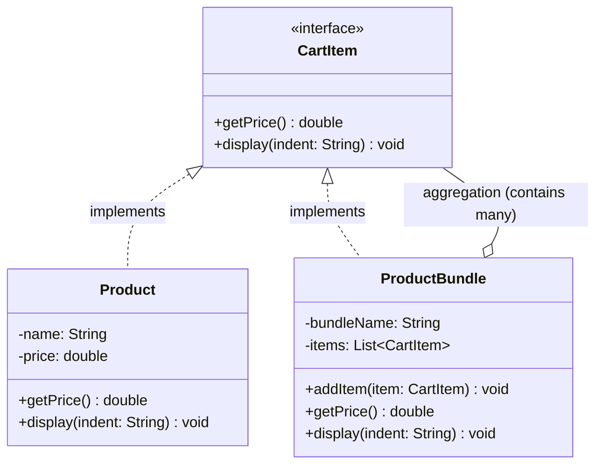

# Design Pattern: Composite (Structural)

## 1. Introduction
The **Composite Pattern** is a structural design pattern that allows you to **compose objects into tree structures** to represent part-whole hierarchies. It enables clients to treat individual objects and compositions of objects uniformly, effectively turning a collection into a "single" object in the eyes of the user.

---

## 2. Problem It Solves
When building an e-commerce checkout service, you often deal with a hierarchy (e.g., Products inside Bundles). Without this pattern, the client code must manually differentiate between a single item and a collection:
* **Class Explosion**: You end up with separate types that lack a shared interface.
* **Polymorphism Breakage**: You are forced to use `instanceof` repeatedly to check types before performing actions.
* **Rigid Structure**: A `ProductBundle` typically cannot contain another `ProductBundle`, preventing recursive nesting (e.g., a combo pack inside a larger gift box).

---

## 3. Class Diagram
The following diagram illustrates the relationship between the **Leaf** (Product) and the **Composite** (ProductBundle), both unified by the `CartItem` interface.

---

## 4. Leaf vs. Composite

### Leaf (The Atomic Object)
* **Definition**: A simple object that does not contain any child components.
* **Role**: In your system, `Product` is the Leaf. It represents individual items (Books, Phones) and provides the actual price logic.

### Composite (The Container)
* **Definition**: A complex object that can hold multiple `CartItem` objects, including both Leaves and other Composites.
* **Role**: `ProductBundle` acts as the Composite. It **delegates** actions like `getPrice()` and `display()` to its children, summing the results.

---

## 5. Advantages and Disadvantages

| **Advantages** | **Disadvantages** |
| :--- | :--- |
| **Uniformity**: Treats individual and composite objects identically. | **Over-Generalization**: Can hide important distinctions between types if not careful. |
| **Open/Closed Principle**: You can add new item types without modifying existing code. | **Complexity**: Might be overkill for simple, flat structures. |
| **Recursive Depth**: Supports deeply nested structures (combos inside kits inside boxes). | **SRP Violation**: On a large scale, components manage both business logic and hierarchy management. |

---

## 6. Real-World Use Cases
1. **File Systems**: Folders (Composites) containing Files (Leaves) and other Sub-folders.
2. **UI Toolkits**: A `Panel` (Composite) containing `Buttons` (Leaves) and other `Panels`.
3. **E-commerce**: Product Bundles and Kits as demonstrated in your refactored code.

---

### Key Takeaway: The "Part-Whole" Hierarchy
The Composite Pattern is your go-to solution when you need to build a **Tree Structure**. By making the "Whole" (Bundle) implement the same interface as the "Part" (Product), you eliminate type-checking logic and create a truly scalable system.
