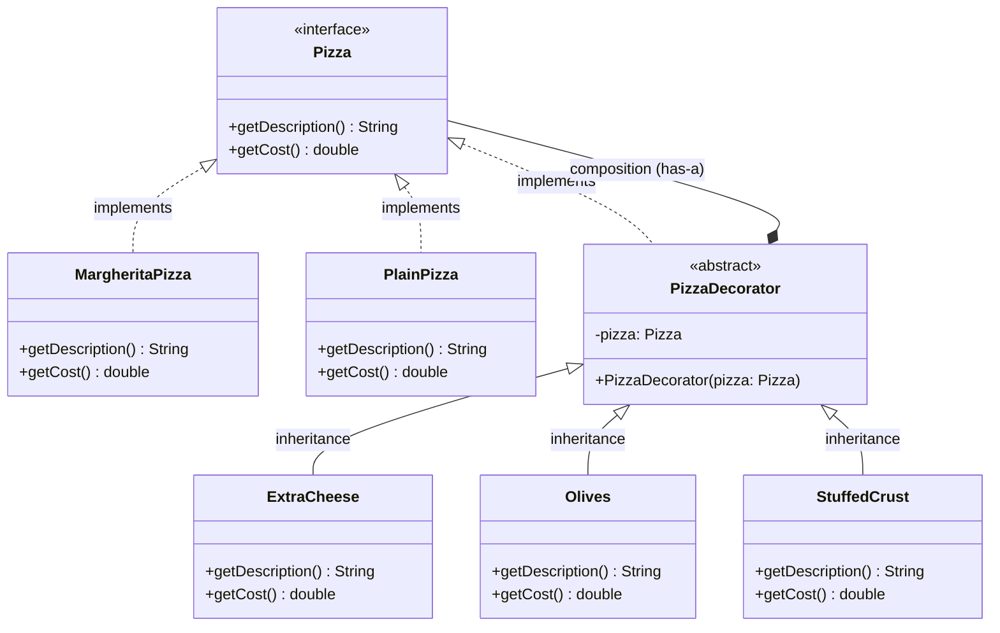

# Design Pattern: Decorator (Structural)

## 1. Introduction

**Structural design patterns** focus on the composition of classes and objects to form larger, flexible structures. The **Decorator Pattern** is one of the most vital structural patterns, specifically designed to add responsibilities to objects dynamically without the rigidity of inheritance.

---

## 2. The Decorator Pattern

The **Decorator Pattern** allows behavior to be added to individual objects at runtime without affecting other objects of the same class. It "wraps" an object inside a decorator object that provides the new behavior while keeping the original interface intact.

### Real-Life Analogy: The Coffee Shop

Think of ordering a coffee:

1. You start with a **Simple Coffee**.
2. You can add **Milk**, **Sugar**, or **Whipped Cream**.
3. You don't need a new "CoffeeWithMilkAndSugar" class; you just "wrap" your base coffee with the additions you want.

---

## 3. Class Diagram

The following diagram illustrates how the `PizzaDecorator` acts as a middle layer, allowing concrete toppings to wrap the base `MargheritaPizza` or `PlainPizza`.

---

## 4. Problem & Solution Summary

### The Problem: Class Explosion

If you use inheritance to handle every combination of pizza toppings, you end up with an unmanageable number of classes (e.g., `CheesePizza`, `OlivePizza`, `CheeseAndOlivePizza`, etc.). This is known as **Class Explosion**.

### The Solution: Composition over Inheritance

The Decorator Pattern solves this by using **layers**. Each decorator acts like a gift wrap around the pizza. You can stack as many layers as you want at runtime, and each layer adds its own description and cost to the total.

---

## 5. Pros and Cons

| **Pros**                                                                                                  | **Cons**                                                                                                  |
| --------------------------------------------------------------------------------------------------------- | --------------------------------------------------------------------------------------------------------- |
| **Open/Closed Principle**: You can add new toppings (decorators) without changing existing pizza classes. | **Many Small Classes**: Each new feature requires its own decorator class, which can clutter the project. |
| **Runtime Flexibility**: Behaviors can be added or removed dynamically while the app is running.          | **Complex Debugging**: Layered decorators can make stack traces harder to follow during troubleshooting.  |
| **Avoids Subclass Explosion**: Eliminates the need for $2^N$ classes to support combinations.             | **Learning Curve**: Developers must understand the "chaining" logic of how decorators call each other.    |

---

## 6. Real-World Use Cases

1. **Food Delivery Apps (Swiggy/Zomato)**: Dynamically adding toppings, sauces, or sides to a base food item.
2. **Word Processors (Google Docs)**: Applying text styles like **Bold**, *Italic*, or Underline in any combination.
3. **Java I/O Streams**: Using `BufferedReader(new FileReader("file.txt"))` is a classic implementation of the Decorator Pattern in the Java standard library.

---

### Key Takeaway: The Call Stack Analogy

The Decorator Pattern functions like a **Call Stack**. When you call `getCost()` on the outermost decorator, it calls `getCost()` on the one inside it, which calls the one inside that, until it reaches the base pizza. The values then bubble back up, accumulating the total cost step-by-step.