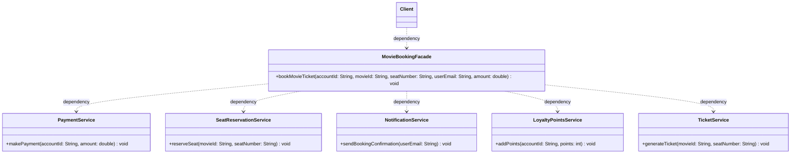

# Design Pattern: Facade (Structural)

## 1. Introduction

**Structural design patterns** are concerned with the **composition of classes and objects**. They help in forming large object structures while keeping them manageable, decoupled, and easy to work with. One such pattern is the **Facade Pattern**, which simplifies complex systems by providing a unified interface.

---

## 2. Facade Pattern

The **Facade Pattern** is a structural design pattern that provides a simplified, unified interface to a complex subsystem or group of classes. It acts as a **single entry point** for clients to interact with the system, hiding the underlying complexity and making the system easier to use.

### Real-Life Analogy: Manual vs. Automatic Car

- **Complex Subsystem (Manual Car):** Driving a manual car requires intricate knowledge of multiple components (clutch, gear shifter, accelerator) and their precise coordination. It is complex and requires the driver to manage many interactions.
- **Facade (Automatic Car):** An automatic car acts as a facade. It provides a simplified interface (e.g., "Drive," "Reverse," "Park") to the complex underlying mechanics of gear shifting. The driver (client) no longer needs to manually coordinate the clutch and gears; the automatic transmission handles these complexities internally.

> In short, the manual car exposes the complexity, while the automatic car (the facade) simplifies it for the user.

---

## 3. Class Diagram

The following diagram illustrates how the `MovieBookingFacade` acts as a unified entry point, coordinating several independent service dependencies behind a single method call.

---

## 4. Problem It Solves

It solves the problem of **dealing with complex subsystems** by hiding the complexities behind a single, unified interface.

Imagine a movie ticket booking system where a client must manually interact with:

- `PaymentService`
- `SeatReservationService`
- `NotificationService`
- `LoyaltyPointsService`
- `TicketService`

Instead of making the client interact with all of these directly, the Facade Pattern provides a **single class** like `MovieBookingFacade`, which internally coordinates all the services.

---

## 5. Pros and Cons

| **Advantages**                                                                                              | **Disadvantages**                                                                                      |
| ----------------------------------------------------------------------------------------------------------- | ------------------------------------------------------------------------------------------------------ |
| **Lightweight coupling**: Reduces dependencies between client and subsystem.                                | **Fragile coupling**: Frequent changes to the facade can still ripple to client code.                  |
| **Flexibility**: Subsystems can evolve without impacting client code.                                       | **Hidden complexity**: Underlying complexity still exists, which can make deep debugging harder.       |
| **Simplifies client design**: Clients interact with a single interface instead of multiple complex objects. | **Violation of SRP**: A facade might orchestrate too many diverse operations, becoming a "god object". |
| **Promotes layered architecture**: Organizes the system into distinct, modular layers.                      | **Difficult to trace**: Adds another layer of indirection, making flow tracing more challenging.       |

---

## 6. When to Use

You should use the **Facade Pattern** when:

1. **Subsystems are complex:** Too many classes and dependencies exist within the system.
2. **Simplified API needed:** You want to provide a simplified entry point for the outer world.
3. **Reduce coupling:** You want to make client code less dependent on individual components of the subsystem.
4. **Clean layering:** You want to organize the system into distinct layers for better modularity.

---
