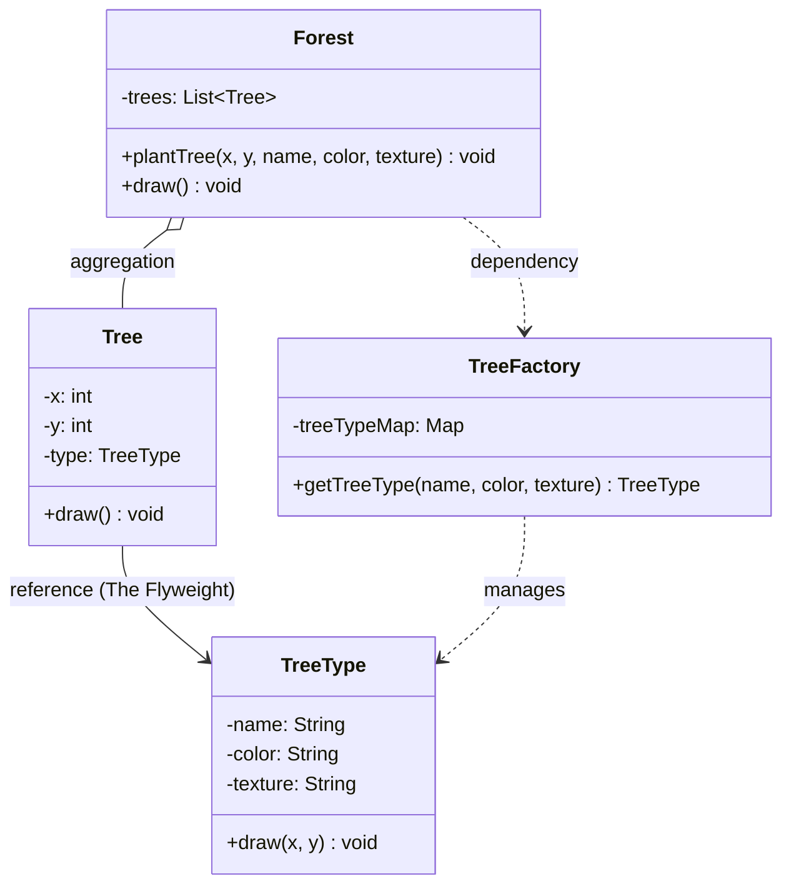

## Memory Optimization through Sharing

**Structural design patterns** focus on how to assemble classes and objects into larger, more efficient structures. The **Flyweight Pattern** is a specialized structural pattern designed to **minimize memory usage** by sharing as much data as possible among similar objects.

---

## 1. What is the Flyweight Pattern?
The **Flyweight Pattern** is used when an application needs to create a massive number of objects that share many identical properties. Instead of each object carrying its own copy of that data, the data is stored once in a "Flyweight" object and shared across all instances.

### The Core Concept: State Separation
To implement this, we split an object's data into two categories:
* **Intrinsic State (The "What"):** Constant, immutable data that is identical across many objects (e.g., a tree's name, color, and texture). This is stored **inside** the Flyweight.
* **Extrinsic State (The "Where"):** Context-specific data that changes for every instance (e.g., a tree's $x, y$ coordinates). This is stored **outside** the Flyweight and passed in when needed.

---

## 2. Real-Life Analogy: Trees in a Video Game
Imagine an open-world game with a massive forest:
* **Shared Model:** Every "Oak" tree uses the same 3D model and leaf texture. Loading this model 10,000 times would crash the game. This is the **Flyweight**.
* **Unique Data:** Every tree has a different position on the map and a slightly different scale. This is the **Extrinsic State**.

The game engine renders the single "Oak" model 10,000 times at different coordinates, saving gigabytes of RAM.

---

## 3. Class Diagram
The diagram below illustrates how the `TreeFactory` manages the shared `TreeType` objects, while the `Tree` class acts as a lightweight container for coordinates.

---

## 4. Real-World Applications

1.  **Google Maps:** Represents millions of trees or landmarks by sharing "type" data (Oak, Pine) and only varying the GPS coordinates.
2.  **Uber App:** Renders dozens of nearby car icons. Since many cars use the same icon, the app reuses a shared flyweight object and simply updates the car's $x, y$ position.
3.  **Web Browsers:** When rendering a page with thousands of identical buttons or icons, browsers reuse a single **shared style object** (CSS rules) instead of allocating unique memory for every element's style.

---

## 5. Pros and Cons

### Advantages
* **Massive Memory Savings:** Reduces RAM usage by orders of magnitude in object-heavy systems.
* **Performance Boost:** Decreases Garbage Collection (GC) overhead since there are fewer heavy objects to track.
* **Faster Initialization:** Reusing existing objects is faster than instantiating new ones from scratch.

### Disadvantages
* **Increased Complexity:** Requires a Factory and a clear split between intrinsic and extrinsic states.
* **Execution Time:** There is a tiny runtime cost to pass extrinsic state into the flyweight's methods during each call.

---

## 6. When to Use
Use the **Flyweight Pattern** when:
* Your application uses a **large number of objects** (thousands or millions).
* Storage costs are high because of the quantity of objects.
* Most object state can be made **intrinsic** (shared).
* The application does not depend on object identity (since shared objects are technically the same instance).
