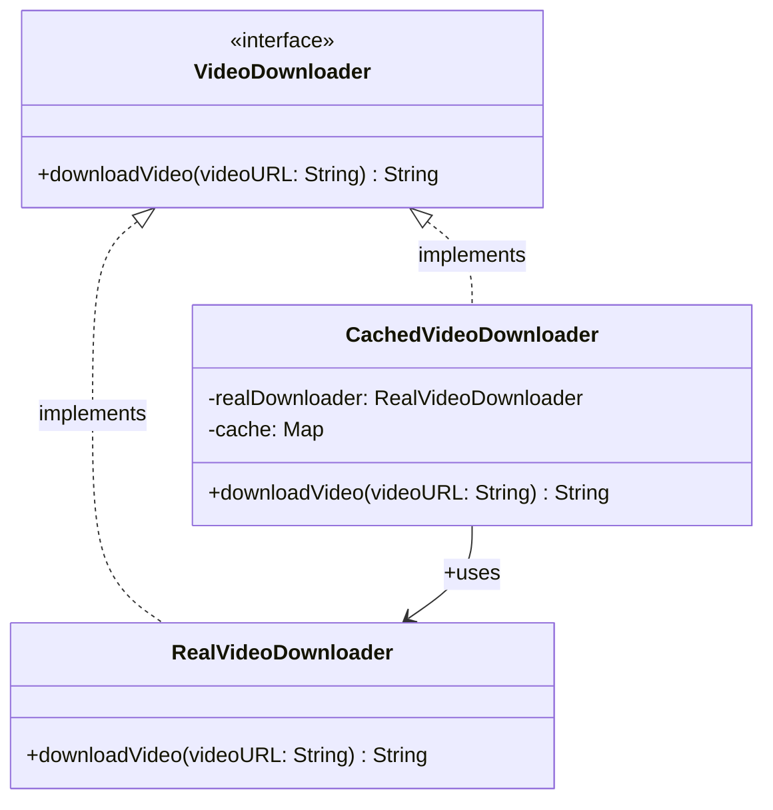

### The Surrogate for Controlled Access

**Structural design patterns** focus on the **composition of classes and objects**. They help manage relationships between objects to make systems more efficient, secure, and scalable. One such pattern is the **Proxy Pattern**, which acts as a placeholder or surrogate for another object to control access to it.

---

## 1. Proxy Pattern
The **Proxy Pattern** is a **structural design pattern** that provides a surrogate or placeholder for another object to control access to it. A proxy acts as an intermediary that implements the same interface as the original object, allowing it to intercept and manage requests to the real object.

### Real-Life Analogy: The Personal Assistant
Think of a busy CEO who does not respond to everyone directly. Instead, an **assistant** (the proxy) takes calls, filters emails, and only involves the CEO (the real resource) when necessary. The assistant controls and optimizes access while still providing essential services to others.

### Problem It Solves
It solves the problem of **uncontrolled or expensive access** to an object.
* **Lazy Loading**: Delaying the creation of a heavy object (like a video player) until it is actually needed.
* **Remote Access**: Managing network communication for an object residing on a remote server.
* **Governance**: Adding layers for logging, caching, or security without modifying the original object.

---

## 2. Class Diagram
The following diagram illustrates the relationship between the `VideoDownloader` interface, the `RealVideoDownloader`, and the `CachedVideoDownloader` proxy.

---

## 3. Real-World Coding Example: Video Streaming
Imagine a streaming app like YouTube or Netflix. If multiple users (or the same user) request the same video, downloading it from the internet every time leads to **unnecessary network calls**, **longer wait times**, and **wasted bandwidth**.

### Understanding the Issues (Without Proxy)
* **No Caching**: The same video is downloaded repeatedly even if available.
* **No Access Control**: Any URL is downloaded without restriction or filtering.
* **Tight Coupling**: The client directly depends on `RealVideoDownloader`, making it impossible to intercept or log behavior without changing core logic.
* **Redundant Resource Usage**: Leads to multiple object creations and wasted computation.

### How Proxy Pattern Solves the Issue
The **proxy (`CachedVideoDownloader` class)** implements **caching logic** to check if a video was already downloaded.
* If found, it returns the **cached result**, saving time and resources.
* The **real object is accessed only when absolutely necessary**, resulting in faster response times and optimized performance.

---

## 4. Types of Proxy
| Type | Purpose | Example |
| :--- | :--- | :--- |
| **Virtual Proxy** | Controls access to a resource that is expensive to create (Lazy Initialization). | A video app that only loads data when the user hits "Play". |
| **Protection Proxy** | Controls access based on user permissions or roles. | A document editor where only "Editors" can modify content, but "Viewers" can only read. |
| **Remote Proxy** | Controls access to an object located on a remote server. | An API wrapper that abstracts network communication (e.g., Java RMI). |
| **Smart Proxy** | Adds additional behavior like logging or reference counting. | Automatically logging every time a sensitive file is accessed. |

---

## 5. Pros and Cons

### Advantages
* **Performance Optimization**: Significantly reduces resource consumption through caching or lazy initialization.
* **Access Control**: Acts as a gatekeeper to ensure only authorized users access sensitive resources.
* **Added Functionality**: Adds behaviors like logging or security checks without modifying the original object.

### Disadvantages
* **Increased Complexity**: Adds more components to the system, making the design harder to maintain.
* **Potential Delays**: Logic like permission checks or data fetching in the proxy may introduce minor delays.
* **Maintenance Overhead**: Maintaining proxies alongside real objects increases development effort.

---
