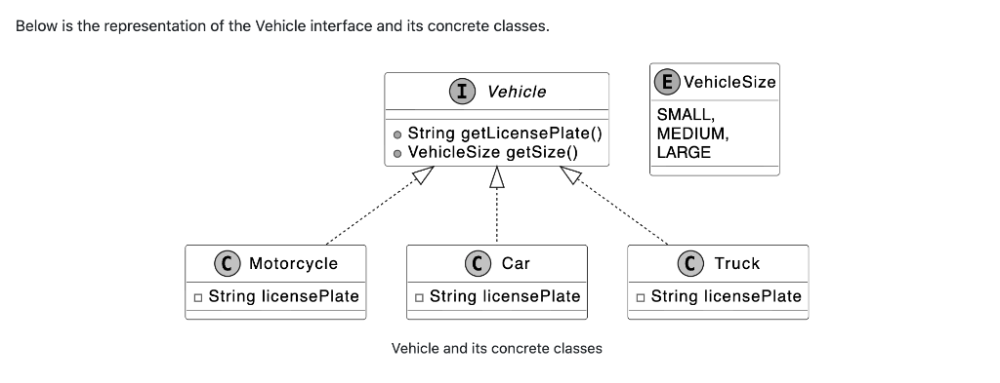
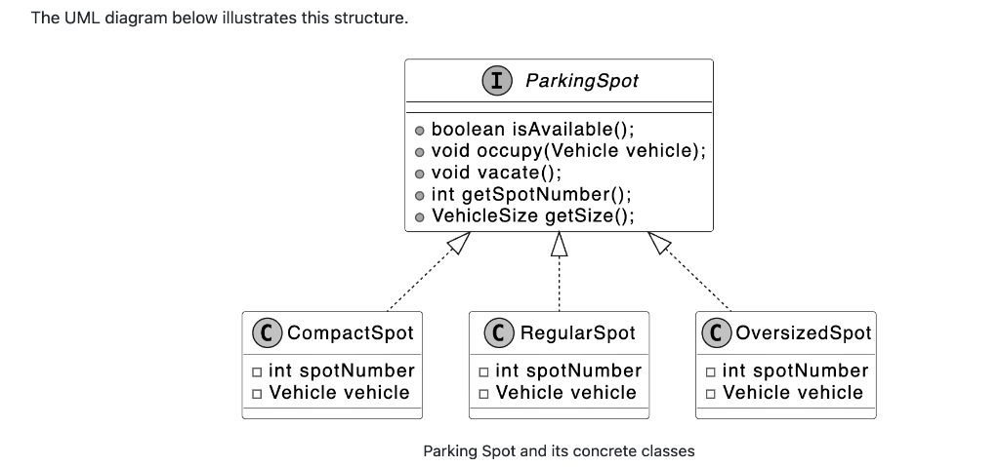
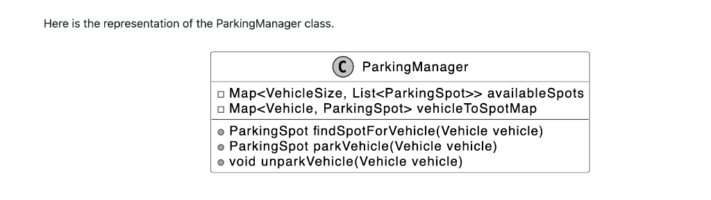
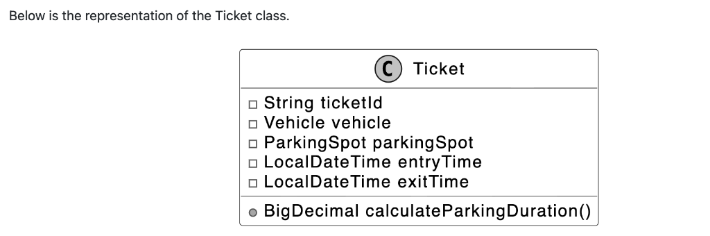
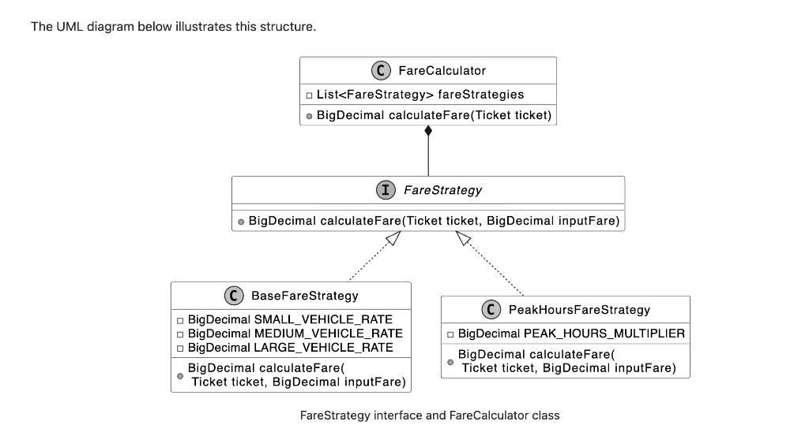
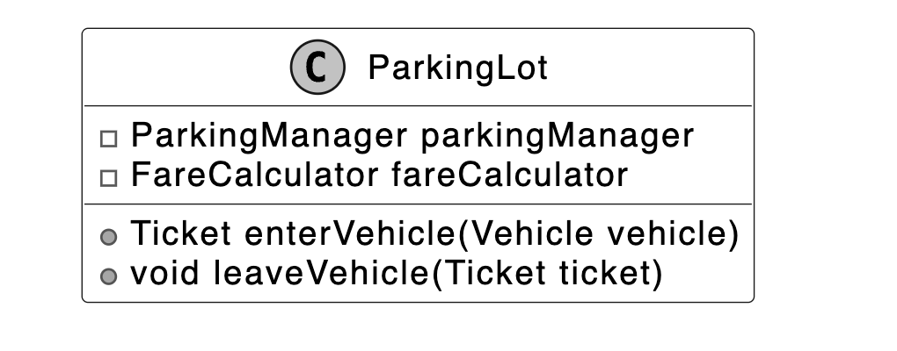
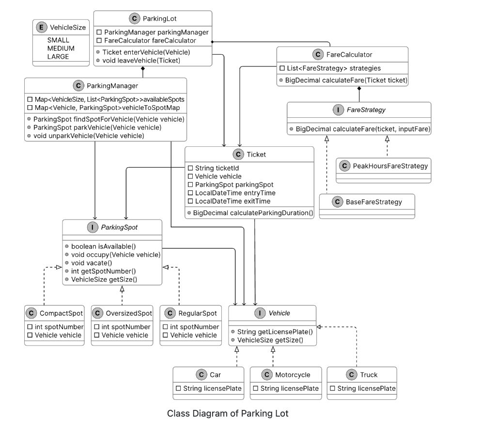

# Parking Lot System Design

## Requirements Gathering

Imagine you’re arriving at a busy parking lot, eager to park your car. At the entrance, you’re issued a ticket. You then drive in, find a spot suited to your vehicle’s size, and park. Later, when you prepare to leave, you present your ticket at the exit, the system calculates your fee, and the spot is freed up for the next vehicle. Behind the scenes, the parking lot is assigning spots based on vehicle size, recording entry and exit times, and updating availability for new arrivals. Now, let’s design a parking lot system that handles all this.

## Requirements Clarification

**Candidate:** What types of vehicles are supported by the parking lot?  
**Interviewer:** Three types of vehicles should be supported: motorcycles, cars, and trucks.

**Candidate:** What parking spot types are available in the parking lot?  
**Interviewer:** The parking lot supports three types of parking spots: compact, regular spots, and oversized.

**Candidate:** How does the system determine which spot a vehicle should park in?  
**Interviewer:** The system assigns spots based on the size of the vehicle, ensuring an appropriate fit.

**Candidate:** Are parking tickets issued to vehicles upon entry and charged at the exit?  
**Interviewer:** Yes, a ticket is issued with vehicle details and entry time when a vehicle enters. On exit, the system calculates the fee based on duration and vehicle size, then marks the spot as vacant.

**Candidate:** How are parking fees calculated?  
**Interviewer:** Fees are based on parking duration and vehicle size, with rates varying depending on the time of day.

## Requirements

Here are the key functional requirements we’ve identified:
- The parking lot has multiple parking spots, including compact, regular, and oversized spots.
- The parking lot supports parking for motorcycles, cars, and trucks.
- Customers can park their vehicles in spots assigned based on vehicle size.
- Customers receive a parking ticket with vehicle details and entry time at the entry point and pay a fee based on duration, vehicle size, and time of day at the exit point.

Below are the non-functional requirements:
- The system must scale to support large parking lots with many spots and vehicles.
- The system must reliably track spot assignments and ticket details to ensure accurate operations.

## Identify Core Objects

- **Vehicle**: This object represents a vehicle that needs a spot. It encapsulates details like the license plate and size (small for motorcycles, medium for cars, large for trucks), serving as the foundation for spot assignment and fee calculation.
- **ParkingSpot**: This object models an individual parking spot in the parking lot. It’s the physical space where a `Vehicle` parks, ensuring only appropriately sized vehicles can park based on its capacity.
- **Ticket**: This object represents a parking ticket issued when a `Vehicle` enters the parking lot. It stores critical details, including the ticket ID, the associated `Vehicle`, the assigned `ParkingSpot`, and entry time, which are later used to calculate fees and free up spots upon exit.
- **ParkingManager**: This object oversees the parking lot’s spot allocation, managing the assignment, lookup, and release of `ParkingSpot` instances. It ensures a `Vehicle` gets the right spot by checking availability based on size, and updates the system when vehicles leave, keeping parking operations smooth and efficient.
- **ParkingLot**: This acts as a facade, providing a central interface to manage the system’s key functionalities: vehicle entry, spot assignment, ticketing, and fee calculation. It keeps its logic lightweight by delegating tasks such as spot allocation to the `ParkingManager`, fee computation to a `FareCalculator` class, and coordinating the flow of vehicles in and out without handling the details.

*Design choice:* We chose these five objects to separate concerns. `Vehicle` and `ParkingSpot` define the core physical entities, `Ticket` tracks sessions, `ParkingManager` handles allocation, and `ParkingLot` coordinates as a facade.

## Design Class Diagram

We have modeled the `Vehicle` as an interface to set a standard for all vehicle types. It defines two key methods:
- `getLicensePlate()`: Returns the vehicle’s license plate number.
- `getSize()`: Returns a `VehicleSize` enum (`SMALL`, `MEDIUM`, `LARGE`), indicating the space it occupies.

Concrete classes like `Motorcycle`, `Car`, and `Truck` implement the `Vehicle` interface, each defining its size:
- **Motorcycle**: Small-sized.
- **Car**: Medium-sized.
- **Truck**: Large-sized.

### ParkingSpot

The `ParkingSpot` interface represents a parking spot in the parking lot system. It captures spot-specific details, such as whether it’s occupied and its size. Concrete parking spot types (`CompactSpot`, `RegularSpot`, and `OversizedSpot`) are implemented as classes that adhere to the `ParkingSpot` interface. These classes bring the interface to life, defining spots for small, medium, and large vehicles, respectively.

The UML diagram below illustrates this structure.

### ParkingManager

The `ParkingManager` is responsible for managing the allocation and tracking of parking spots within the parking lot system. Its primary functions include identifying available parking spaces, assigning the most suitable spot for each vehicle, and maintaining a record of parked vehicles and their locations. These tasks are accomplished through two key methods:

- `parkVehicle(Vehicle vehicle)`: Assigns a spot that matches the vehicle’s size when it arrives.
- `unparkVehicle(Vehicle vehicle)`: Frees up the spot when the vehicle leaves, ensuring the system stays up-to-date.

Here is the representation of the `ParkingManager` class.

### Ticket

The `Ticket` class represents a parking ticket generated when a vehicle enters the parking lot. It keeps track of when a vehicle arrives and leaves, using these times to calculate duration, and links the vehicle to its assigned spot.

Below is the representation of the `Ticket` class.

### FareStrategy and FareCalculator

We design the `FareStrategy` interface to establish a standard method for modifying the parking fee, allowing various pricing rules to fit into the system. Its concrete classes handle specific pricing rules:

- `BaseFareStrategy` establishes the base fee using the ticket’s duration and vehicle size.
- `PeakHoursFareStrategy` modifies it based on the time of day.

Since a parking session often involves multiple pricing rules, like duration, size, and time, we design a `FareCalculator` class to coordinate these changes and calculate the final fee. It is designed to determine the cost for each ticket by combining the effects of all applicable strategies (`BaseFareStrategy`, `PeakHoursFareStrategy`), ensuring the system applies the right fee based on how long the vehicle stays, its size, and when it is parked.

This association between `FareStrategy` and `FareCalculator` maintains a structured pricing process, with `FareStrategy` defining the rules and `FareCalculator` pulling them together.

The pricing logic relies on the Strategy Pattern, which enables the system to dynamically select and swap between different rules for calculating parking fees.

The UML diagram below illustrates this structure.

### ParkingLot

We design the `ParkingLot` class as the core component of the system to act as a facade, providing a simple interface for managing the parking lot’s key operations. It manages vehicle entry and exit by generating tickets for arrivals, assigning spots through the `ParkingManager`, and calculating fares with the `FareCalculator` when vehicles leave, tying the system’s main functions together.

Below is the representation of this class.

## Adding a New Parking Spot Type

The parking lot system is designed to support multiple parking spot types (e.g., `CompactSpot`, `RegularSpot`, `OversizedSpot`). However, there may be a need to introduce a new type, such as a handicapped parking spot, to accommodate specific requirements like accessibility. The challenge is to extend the system efficiently without modifying existing classes, adhering to the Open-Closed Principle (open for extension, closed for modification).

To achieve this, we can introduce a new `HandicappedSpot` class that implements the existing `ParkingSpot` interface. This approach ensures smooth integration with the system’s spot allocation and management logic, as `ParkingManager` already relies on the `ParkingSpot` interface for handling spots.

## Code Implementation Details

The implementation follows the principles outlined in our design, focusing on modularity and extensibility. Here are the responsibilities and data flow details for the key components:

### Vehicle

We define the `Vehicle` interface, along with its supporting `VehicleSize` enum and concrete classes `Motorcycle`, `Car`, and `Truck`, to set up how vehicles are identified and sized in the parking lot system.

This interface ensures every vehicle provides two key attributes: a license plate for tracking and a size for managing parking spaces. This design ensures that every vehicle provides consistent, type-safe attributes critical for tracking, parking spot allocation, and fee calculation.

*Implementation choice:* The `VehicleSize` enum (`SMALL`, `MEDIUM`, `LARGE`) standardizes vehicle and parking spot sizes, ensuring type-safe, error-free size comparisons for efficient spot allocation and fee calculation.

*Alternatives and trade-offs:*
- **Strings:** Prone to typos and slower comparisons (O(n)), requiring validation. Rejected for fragility and performance issues.
- **Integers:** Ambiguous and error-prone, lacking type safety. Rejected for reduced clarity and reliability.

### ParkingSpot

We define the `ParkingSpot` interface to represent individual parking spots in the parking lot system, along with its concrete classes `CompactSpot`, `RegularSpot`, `OversizedSpot`, and `HandicappedSpot`.

The `ParkingSpot` interface defines these core methods:
- `isAvailable()`: Checks if the spot is free. Helps `ParkingManager` decide if the spot can be assigned.
- `occupy(Vehicle vehicle)`: Assigns a vehicle to the spot if it’s available, setting vehicle to the provided instance.
- `vacate()`: Clears the spot by setting the vehicle to null, making the spot free for reuse. Allows `ParkingManager` to reassign it to another vehicle.
- `getSize()`: Returns the spot’s fixed `VehicleSize` (e.g., `SMALL` for `CompactSpot`). Guides `ParkingManager` in matching vehicle sizes to parking spot capacities.

Concrete implementations structure size logic:
- `CompactSpot`: Returns `VehicleSize.SMALL`.
- `RegularSpot`: Returns `VehicleSize.MEDIUM`, suitable for medium-sized vehicles like cars.
- `OversizedSpot`: Returns `VehicleSize.LARGE`, designed for large vehicles like trucks.

This implementation keeps `ParkingSpot` lean and focused, managing its state while delegating allocation logic to `ParkingManager`.

### ParkingManager

The `ParkingManager` class manages the allocation and tracking of parking spots in the parking lot system. It searches and assigns spots to vehicles, freeing them when vehicles leave and keeping an accurate record of which vehicles occupy which parking spots.

- `findSpotForVehicle(Vehicle vehicle)`: Searches for an available parking spot that fits the vehicle’s size.
- `parkVehicle(Vehicle vehicle)`: Assigns a parking spot to the vehicle by calling `findSpotForVehicle()` and then marks it as occupied via `occupy()`. Records the vehicle-spot pair and removes the spot from the available pool, ensuring accurate tracking and availability updates.
- `unparkVehicle(Vehicle vehicle)`: Retrieves the parking spot for the given vehicle, frees the spot via `vacate()`, and adds it back to the available pool. Removes the vehicle-spot mapping, keeping the system’s state current for future allocations.

*Implementation choice:* We used two HashMaps:
1. **availableSpots**: Maintains a list of parking spots ready for use, organized by `VehicleSize`. It ensures that vehicles land in the best-fit parking spot. For instance, motorcycles fit into small spots like `CompactSpot`, while cars use medium spots like `RegularSpot`. This organization allows `ParkingManager` to quickly find the smallest, most suitable size available.
2. **vehicleToSpotMap**: Records which parking spot each vehicle occupies. It allows `ParkingManager` to locate and free up a parking spot when a vehicle leaves, keeping the system’s state up to date.

*Here’s why these choices matter:*
- **Performance:** Using HashMaps provides O(1) time complexity for accessing parking spots by size or finding a vehicle’s parking spot. However, checking availability within a specific size requires additional steps.
- **Best Fit:** Organizing parking spots by `VehicleSize` ensures vehicles park in the smallest spot that fits them, optimizing space usage.

### Ticket

The `Ticket` class acts as a record of a parking event, linking a vehicle to its parking spot and tracking the time spent in the parking lot.

### FareStrategy and FareCalculator

We implement the `FareStrategy` interface and its concrete classes, `BaseFareStrategy` and `PeakHoursFareStrategy`, along with the `FareCalculator` class. These components manage the parking fee calculation process in the parking lot system. Together, they determine the cost of each parking session.

*Implementation choice:* We define `FareStrategy` as an interface to support a flexible and extensible approach to pricing rules, allowing new strategies (e.g., a WeekendDiscountStrategy) to integrate without altering existing code.

The concrete class `BaseFareStrategy` implements this interface:
- `calculateFare(Ticket ticket, BigDecimal inputFare)`: Provides the foundational cost for the parking session, reflecting size-based pricing.

The concrete class `PeakHoursFareStrategy` implements this interface:
- `calculateFare(Ticket ticket, BigDecimal inputFare)`: Multiplies the input fare by 1.5 if the entry time falls within peak hours. Otherwise, it leaves it unchanged. Adjusts the fare for high-demand periods, increasing costs during busy times.
- `isPeakHours(LocalDateTime time)`: Checks if the given time’s hour is within peak ranges.

The `FareCalculator` class uses these strategies:
- `FareCalculator(List<FareStrategy> fareStrategies)`: Initializes with a list of strategies, setting up the rules to apply during fare calculation.
- `calculateFare(Ticket ticket)`: Starts with a zero fare, iterates through each strategy in the list, and applies their rules in sequence to build the final fare.

*Implementation choice:* We implement `FareCalculator` using a `List<FareStrategy>` to hold strategies, enabling the sequential application of multiple rules (e.g., base fare followed by peak adjustment). We choose List over an array or Set because it preserves order. Strategies like `BaseFareStrategy` must be applied before `PeakHoursFareStrategy` for correct fare calculation. A Set can prevent duplicates but loses order, while an array maintains a fixed size, limiting flexibility.

### ParkingLot Code

The `ParkingLot` class acts as a facade, providing a simple interface for clients to interact with the parking lot system while delegating complex tasks to `ParkingManager` and `FareCalculator`. It relies on `ParkingManager` for spot allocation and `FareCalculator` for pricing, managing the flow of vehicles through entry and exit operations.

- `enterVehicle(Vehicle vehicle)`: Coordinates vehicle entry by requesting a parking spot from `ParkingManager`. It then generates a `Ticket` with a unique ID, vehicle, parking spot, and current entry time.
- `leaveVehicle(Ticket ticket)`: Manages vehicle exit by setting the exit time, frees the parking spot via `ParkingManager`, and calculates the fare with `FareCalculator`.

## Complete Class Diagram

