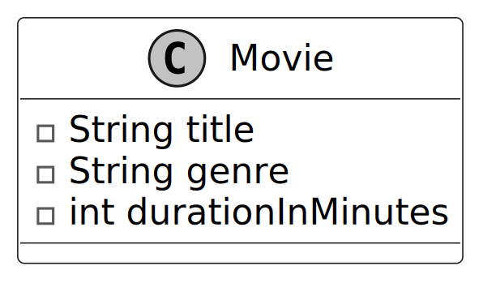
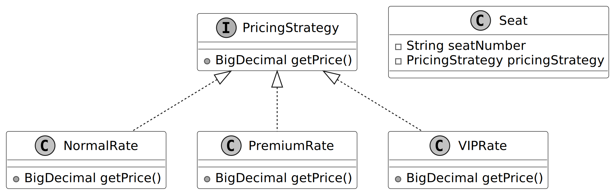
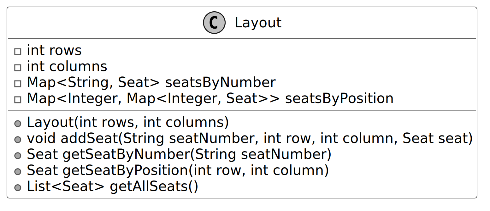
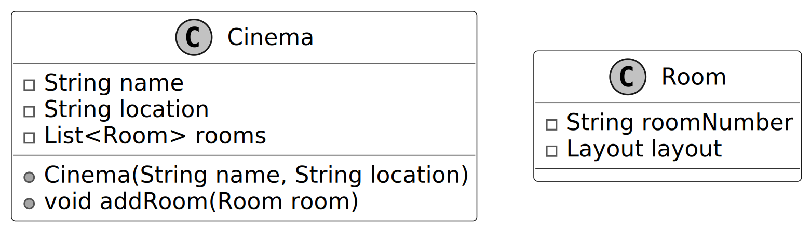
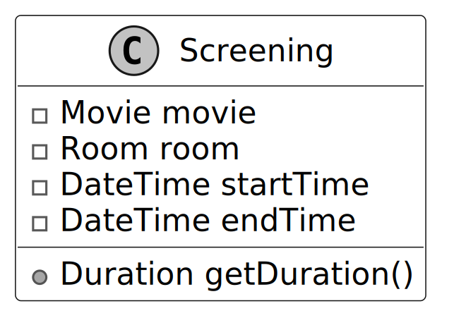
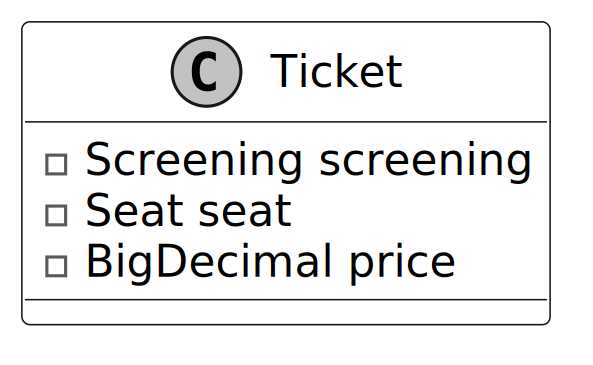
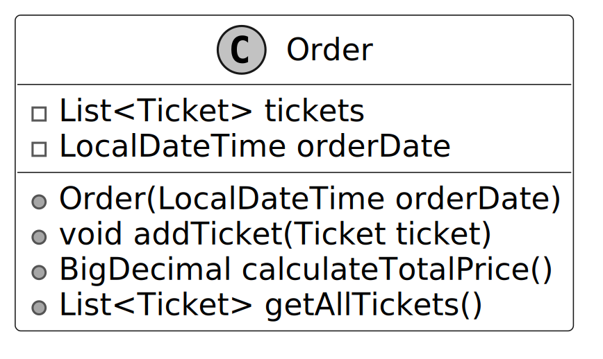
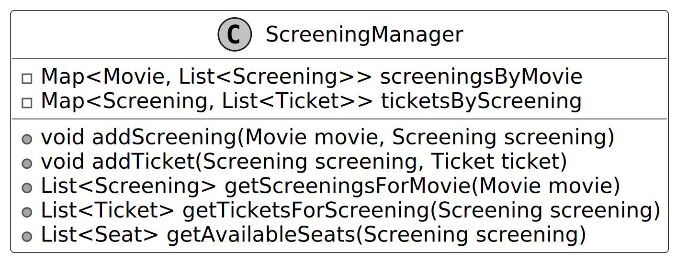
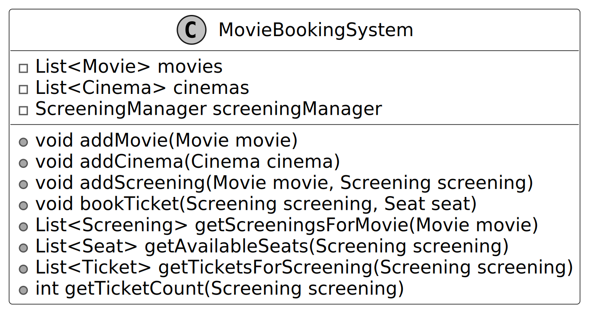
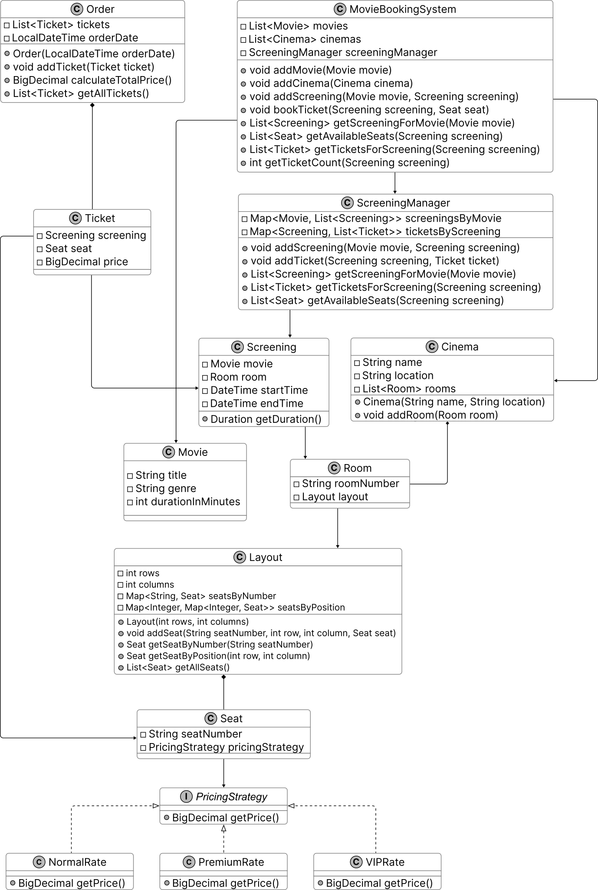

# Movie Ticket Booking System Design

## Requirements Gathering

Here is an example of how a conversation between a candidate and an interviewer might unfold:

**Candidate:** Does the system support finding and booking tickets across different cinemas and rooms?  
**Interviewer:** Yes, users can search for available tickets across multiple cinemas, each containing multiple rooms.

**Candidate:** Does the system allow scheduling multiple screenings of the same movie across different rooms and times?  
**Interviewer:** Yes, each movie can have different screenings scheduled across various rooms and times in the same cinema or different cinemas.

**Candidate:** Does the system support different pricing tiers for seats within the same screening?  
**Interviewer:** Yes, each seat can have its pricing strategy, such as normal, premium, or VIP, affecting the ticket price.

**Candidate:** Can a user book multiple tickets in a single order, and how does the system calculate the total cost?  
**Interviewer:** Yes, users can combine multiple tickets into one order for a specific screening. The system calculates the total cost by summing the prices of all selected seats based on their rate classes.

**Candidate:** Does the system need to handle payment processing as part of the booking process?  
**Interviewer:** For this design, we can ignore payment processing and focus on browsing, scheduling, seat selection, and booking tickets.

**Candidate:** What happens when a user books a ticket for a specific seat?  
**Interviewer:** The system should create a ticket with the screening, seat, and price based on the seat’s pricing strategy, then add it to the screening’s ticket list, marking the seat as booked.

## Requirements

Based on the questions and answers, the following functional requirements can be identified:

### Movie and screening management

- Each cinema is located at a specific location and contains multiple rooms.
- Movies can have multiple screenings scheduled across different rooms, cinemas, and time slots.

### Seat management and pricing

- Each room has a grid of seats available for booking.
- Seats within a room can have varying pricing strategies (e.g., normal, premium, VIP) that affect ticket prices.

### User search and book flow

- Users can find and book available tickets.
- A ticket represents a specific seat to watch a movie in a room at a particular time.
- A user can book multiple tickets within the same order.
- The total cost for an order is computed by summing the prices of all selected seats, based on their pricing tiers.

Below are the non-functional requirements:

- Fast searches for screenings for a smooth user experience.
- Basic error handling should prevent booking conflicts, such as double-booking the same seat.

With these requirements in hand, the next step is to identify the core objects that will form the backbone of our system.

## Identify Core Objects

To build a modular and maintainable system, we’ll define objects that represent distinct entities with clear responsibilities. Here are the core objects:

- **Movie**: Represents a specific movie shown in cinemas, capturing its essential details like title and duration.
  - **Design choice:** We separate `Movie` from `Screening` to distinguish fixed movie data from dynamic screening schedules, improving reusability and clarity.
- **Cinema**: Models a physical location where movies are screened, containing multiple rooms.
- **Room**: Defines a screening space within a cinema, tied to a unique layout of seats.
  - **Design choice:** Separating `Room` from `Layout` allows rooms to share or customize seating arrangements, enhancing flexibility.
- **Layout**: Organizes the seating arrangement in a room as a grid, managing seat positions.
- **Seat**: Represents an individual seat in a room linked to a pricing strategy.
- **Screening**: Combines a movie, a room, and a time slot to define when and where a movie is shown.
- **Ticket**: Captures a customer’s choice of a specific seat for a screening, including its price.
- **Order**: Groups multiple tickets purchased together into a single transaction, tracking the total cost.

**Alternative approach:** We could merge `Room` and `Layout` into one class, but this limits flexibility if rooms need varied layouts. Another option is adding a `Customer` class, but since the focus is on booking mechanics, we prioritize ticket-related entities.

**Interview Tip:** When presenting objects in an interview, explain why you chose them and how they meet the requirements. Mention alternatives (e.g., combining classes) to show you’ve considered different options and their trade-offs.

## Design Class Diagram

Now that we know the core objects and their roles, the next step is to create classes and methods to build the movie ticket booking system.

### Movie

The `Movie` class captures essential details about a specific movie in the system. It focuses on static information, title, genre, and duration, data that remains constant across all screenings of that film. It stands apart from a `Screening`, which ties a movie to a room and time slot for a particular showing.

Below is the UML diagram for the `Movie` class.



**Design choice:** We designed the `Movie` class to be a standalone entity, independent of cinema-specific or scheduling contexts. This isolation allows the same `Movie` to be reused across multiple cinemas and screenings without data duplication.

### Seat

The `Seat` class holds key details about an individual seat, including its unique number. It uses the strategy pattern, implemented through the `PricingStrategy` interface with concrete classes like `NormalRate`, `PremiumRate`, and `VIPRate`, to manage price calculation flexibly.

The strategy pattern benefits the system in two key ways:
- It promotes extensibility, making it easy to add new rate classes.
- It reduces code redundancy by using a single `Seat` class for all pricing variations.

The UML diagram below illustrates this structure.



**Alternate approach:** We could embed pricing logic directly in `Seat`, but this reduces flexibility if pricing rules change. The strategy pattern, while more complex, supports future extensions.

The `Seat` class relies on a `Layout` to define its position in a room’s seating grid, focusing solely on seat-specific data like its number and pricing strategy.

### Layout

The `Layout` class acts as a bridge between individual seats and cinema rooms. It organizes seats into a grid structure defined by rows and columns. It uses a nested map (`Map<Integer, Map<Integer, Seat>>`) for efficient seat lookup, where the outer map’s key is the row number, the inner map’s key is the column number within that row, and the value is the `Seat` object at that position (row → column → seat).

It also maintains an index (`Map<String, Seat>`) to locate seats by their seat numbers quickly. This design simplifies managing seats across multiple theater rooms, ensuring easy access to seat data for booking purposes.

The UML diagram below illustrates this structure.



**Alternative approach:** In `Layout`, we use a nested map (`Map<Integer, Map<Integer, Seat>>`) for seat arrangement instead of a 2D array. This allows dynamic row creation with `computeIfAbsent` and supports variable row sizes. A 2D array for `Layout` could work for fixed-size rooms but lacks flexibility for irregular layouts or dynamic additions.

**Interview Tip:** When coding, explain why you chose a data structure (e.g., map vs. array) and how it supports your design goals.

### Cinema and Room

The `Cinema` and `Room` classes structure the cinema system by leveraging the seat and layout framework. A `Cinema` contains multiple `Room` instances, exemplifying composition where one class holds another as an attribute. Each `Room`, in turn, includes a `Layout` to define its seat arrangement.

Together, these classes form a model of a cinema, with `Cinema` managing locations and rooms, and `Room` organizing seat layouts. Their composition ensures a clear hierarchy for managing theater spaces.

Below are the representations of these classes.



**Design choice:** We structured the `Cinema` and `Room` with a compositional relationship to simulate a real-world cinema with multiple screening rooms. This design allows each `Room` to operate independently with its layout and schedule, while the `Cinema` provides a unified context.

### Screening

With the cinema structure in place, the `Screening` class defines a specific showing of a movie in a particular room at a scheduled time. It combines a `Movie`, a `Room`, and time details into a single entity.



**Design choice:** The `Screening` class centralizes scheduling details, making it easier to manage showtimes across cinemas. It ensures a clear separation of concerns and simplifies schedule management.

### Ticket

The `Ticket` class represents a purchased seat for a specific `Screening`, combining a `Screening` and a `Seat`.

It includes a price attribute, capturing the seat’s cost at the time of purchase. This design, despite the `Seat` class using a strategy pattern for pricing, ensures the ticket price remains fixed, independent of any future changes to the seat’s pricing strategy.



### Order

The `Order` class groups multiple tickets into a single transaction, capturing all tickets purchased together at a specific time. It tracks the order’s timestamp and provides the total cost of the tickets.



### ScreeningManager

Modeling classes like `Movie`, `Seat`, and `Ticket` alone does not create a complete system. To address this, we design a `ScreeningManager` class that manages key operations, such as searching for screenings of specific movies, identifying available seats, and storing purchased tickets.

The following UML diagram shows the `ScreeningManager` structure.



**Design choice:** The `ScreeningManager` class serves as a central coordinator for screening and ticket-related operations. An alternative could be to embed these operations in the `Cinema` class, with each cinema managing its screenings and tickets. However, this would couple the static cinema attributes (e.g., location and rooms) with the logic for scheduling and booking, reducing the system's modularity and maintainability.

### MovieBookingSystem

The `MovieBookingSystem` class is the final piece that brings all components together. It integrates the list of movies, cinema locations, and an instance of `ScreeningManager` into a cohesive system. It acts as a facade, streamlining user interactions by delegating tasks to underlying classes like `ScreeningManager`, `Movie`, and `Cinema`.

Through `MovieBookingSystem`, key operations, such as adding movies or cinemas, finding screenings for a movie, checking available seats, and booking tickets, are centralized. This design enhances usability by offering a single entry point for these functions while preserving modularity, as each task remains handled by its respective class.

Here is the representation of this class.



**Alternate approach:** We designed the `MovieBookingSystem` class as a facade to provide a simplified interface for client code. An alternative could be to allow client code to directly interact with classes like `ScreeningManager` or `Cinema`. However, this would increase coupling between clients and internal components, potentially leading to fragile and error-prone interactions. The facade pattern enhances maintainability and simplifies system interactions.

## Complete Class Diagram

Below is the class diagram of our movie ticket booking system.



## Code - Movie Ticket Booking System

In this section, we’ll implement the core functionalities of the movie ticket booking system, focusing on key areas such as handling cinema and movie listings, scheduling screenings, managing seat selection and availability, and processing ticket bookings through an order system.

### System Data Flow

The end-to-end data flow for booking a movie ticket revolves around searching for a movie, selecting a seat, and placing an order:

1. **Movie & Cinema Setup**: 
   - A `Movie` is added to the system along with a `Cinema` and its `Room`.
   - The `Room` generates a `Layout` which automatically populates a grid of `Seat` objects based on rows and columns.
2. **Screening Scheduling**: 
   - A `Screening` is scheduled connecting the `Movie` and the `Room` for a specific start and end time.
   - The `Screening` is registered via the `ScreeningManager.addScreening()`.
3. **Seat Selection & Ticket Booking**: 
   - A customer retrieves the list of available seats from `ScreeningManager.getAvailableSeats(Screening)`.
   - The customer selects a `Seat`. The cost is dynamically pulled using the seat's `PricingStrategy` (e.g. `NormalRate`, `VIPRate`).
   - `MovieBookingSystem.bookTicket()` generates a `Ticket` locking in the seat, screening, and calculated price.
4. **Order Processing**:
   - The generated `Ticket` is added to an `Order`. 
   - `Order.calculateTotalPrice()` sums up the prices of all tickets in the cart.

### Movie

The `Movie` class represents the static details of a film, such as its title, genre, and duration, which remain consistent across all screenings. The class is designed to be immutable, as it does not include setter methods, ensuring that movie details cannot be altered once the object is created. This immutability guarantees data integrity and reflects the static nature of a movie’s attributes.

Below is the code implementation of this class:

```java
public class Movie {
    private final String title;
    private final String genre;
    private final int durationInMinutes;

    public Movie(String title, String genre, int durationInMinutes) {
        this.title = title;
        this.genre = genre;
        this.durationInMinutes = durationInMinutes;
    }

    public Duration getDuration() {
        return Duration.ofMinutes(durationInMinutes);
    }

    // getter methods are omitted for brevity
}
```

The `getDuration` method converts the stored `durationInMinutes` value into a `Duration` object, offering a standardized and convenient way to represent and utilize the movie's length for tasks such as scheduling screenings or calculating screening durations.

### Cinema

The `Cinema` class represents a cinema with attributes such as its name, location, and collection of `Room` objects. The rooms attribute is implemented as a dynamic `List`, allowing the addition of rooms at runtime using the `addRoom` method. This design provides flexibility, as cinemas can have varying numbers of rooms.

```java
public class Cinema {
    private final String name;
    private final String location;
    private final List<Room> rooms;

    public Cinema(String name, String location) {
        this.name = name;
        this.location = location;
        this.rooms = new ArrayList<>();
    }

    public void addRoom(Room room) {
        rooms.add(room);
    }
    // getter and setter methods are omitted for brevity
}
```

### Room

The `Room` class represents a theater room within a cinema, with attributes such as its unique room number and a `Layout` object that defines its seating arrangement.

```java
public class Room {
    private final String roomNumber;
    private final Layout layout;

    public Room(String roomNumber, Layout layout) {
        this.roomNumber = roomNumber;
        this.layout = layout;
    }
    // getter and setter methods are omitted for brevity
}
```

### Layout

The `Layout` class defines the seating arrangement of a cinema room, tracking its rows and columns to form a grid. It uses a nested map (`Map<Integer, Map<Integer, Seat>>`) for locating seats by row and column positions, and a separate map (`Map<String, Seat>`) for quick lookup by unique seat numbers.

Below is the implementation of this class.

```java
// Represents the seating layout of a cinema room.
public class Layout {
    private final int rows;
    private final int columns;

    // Maps seat numbers (e.g., "0-0") to Seat objects for direct access
    private final Map<String, Seat> seatsByNumber;

    // Nested map for position-based access (row → column → seat)
    private final Map<Integer, Map<Integer, Seat>> seatsByPosition;

    public Layout(int rows, int columns) {
        this.rows = rows;
        this.columns = columns;
        this.seatsByNumber = new HashMap<>();
        this.seatsByPosition = new HashMap<>();
        initializeLayout();
    }

    // Creates seats for all positions with default null pricing
    private void initializeLayout() {
        for (int i = 0; i < rows; i++) {
            for (int j = 0; j < columns; j++) {
                String seatNumber = i + "-" + j;
                addSeat(seatNumber, i, j, new Seat(seatNumber, null));
            }
        }
    }

    public void addSeat(String seatNumber, int row, int column, Seat seat) {
        // Store seat in number-based lookup map
        seatsByNumber.put(seatNumber, seat);
        // Store seat in position-based lookup map
        seatsByPosition.computeIfAbsent(row, k -> new HashMap<>()).put(column, seat);
    }

    public Seat getSeatByNumber(String seatNumber) {
        return seatsByNumber.get(seatNumber);
    }

    // Gets a seat by its row and column position
    public Seat getSeatByPosition(int row, int column) {
        Map<Integer, Seat> rowSeats = seatsByPosition.get(row);
        return (rowSeats != null) ? rowSeats.get(column) : null;
    }

    public List<Seat> getAllSeats() {
        return List.copyOf(seatsByNumber.values());
    }
}
```

- The `addSeat` method employs the `computeIfAbsent` technique to dynamically create rows in the nested map as needed, streamlining the addition of seats without requiring pre-initialization of the entire grid.
- The `getSeatByNumber` method retrieves a seat based on its unique string identifier, enhancing lookup efficiency.
- The `getSeatByPosition` method accesses a seat using its row and column coordinates, supporting precise seat selection.
- The `getAllSeats` method returns an unmodifiable list of all seats, ensuring safe access to the seating data.

`Layout` integrates with the `Room` class to provide the seating structure, working alongside `Seat` objects to support the ticket booking process, such as availability and pricing.

**Implementation choice:** We used a nested `Map<Integer, Map<Integer, Seat>>` for the seat grid and a `Map<String, Seat>` for seat number lookup in the `Layout` class, as these structures provide efficient O(1) access by row-column or seat number. The nested map supports dynamic row creation via `computeIfAbsent`. An alternative could be a 2D array (`Seat[][]`) for the grid, which is simpler for fixed-size layouts and offers direct index-based access. However, arrays lack flexibility for irregular layouts (e.g., missing seats) and require pre-allocation.

### Seat

The `Seat` class represents an individual seat in a cinema room with attributes such as its unique `seatNumber` and associated `PricingStrategy`. The `PricingStrategy` provides dynamic pricing for each seat, enabling the system to assign different pricing logic (e.g., normal, premium, VIP) without modifying the `Seat` class itself.

```java
public class Seat {
    private final String seatNumber;
    private PricingStrategy pricingStrategy;

    public Seat(String seatNumber, PricingStrategy pricingStrategy) {
        this.seatNumber = seatNumber;
        this.pricingStrategy = pricingStrategy;
    }
    // getter and setter methods are omitted for brevity
}
```

**Alternate Approach:** We implemented the `Seat` class with a `PricingStrategy` interface reference, delegating pricing logic to the strategy pattern. An alternative could be to store the price info directly in `Seat`, with an enum for seat type (e.g., `NORMAL`, `PREMIUM`). However, this would embed pricing logic in `Seat`, making it harder to modify and extend pricing rules without changing the class.

### PricingStrategy

The `PricingStrategy` interface establishes a contract requiring the implementation of a `getPrice()` method to provide a seat’s price. Concrete classes, like `NormalRate`, `PremiumRate`, and `VIPRate`, encapsulate fixed price values for different seat types, reflecting their respective pricing tiers.

By associating a `PricingStrategy` with each seat, the system achieves flexibility and extensibility in pricing, adhering to the **Open-Closed Principle**: new pricing strategies can be added without modifying existing code.

Here is the implementation of this interface and its concrete classes.

```java
public interface PricingStrategy {
    BigDecimal getPrice();
}

public class NormalRate implements PricingStrategy {
    private final BigDecimal price;

    public NormalRate(BigDecimal price) {
        this.price = price;
    }

    @Override
    public BigDecimal getPrice() {
        return price;
    }
}

public class PremiumRate implements PricingStrategy {
    private final BigDecimal price;

    public PremiumRate(BigDecimal price) {
        this.price = price;
    }

    @Override
    public BigDecimal getPrice() {
        return price;
    }
}

public class VIPRate implements PricingStrategy {
    private final BigDecimal price;

    public VIPRate(BigDecimal price) {
        this.price = price;
    }

    @Override
    public BigDecimal getPrice() {
        return price;
    }
}
```

### Screening

The `Screening` class combines a `Movie` with a specific room, time, and duration, representing a scheduled instance of that movie being played in a particular cinema room. While the `Movie` class captures attributes intrinsic to the film itself, the `Screening` class incorporates contextual details about when and where the movie is being presented, making it specific to a time slot and location.

```java
// Represents a scheduled screening of a movie in a specific cinema room.
public class Screening {
    private final Movie movie;
    private final Room room;
    private final LocalDateTime startTime;
    private final LocalDateTime endTime;

    public Screening(Movie movie, Room room, LocalDateTime startTime, LocalDateTime endTime) {
        this.movie = movie;
        this.room = room;
        this.startTime = startTime;
        this.endTime = endTime;
    }

    public Duration getDuration() {
        return Duration.between(startTime, endTime);
    } // getter and setter methods are omitted for brevity
}
```

The class provides a `getDuration()` method to calculate the duration of the screening based on its start and end times.

### Ticket

The `Ticket` class represents a single unit of purchase in the ticket booking system. It connects a `Screening` (scheduled movie instance) with a specific `Seat` and assigns a price at the time of booking. This design ensures that the ticket encapsulates all necessary details for a single booking, making it central to the ticketing process.

```java
public class Ticket {
    private final Screening screening;
    private final Seat seat;
    private final BigDecimal price;

    public Ticket(Screening screening, Seat seat, BigDecimal price) {
        this.screening = screening;
        this.seat = seat;
        this.price = price;
    }

    // getter and setter methods are omitted for brevity
}
```

### Order

The `Order` class represents a single transaction in the movie ticket booking system. It encapsulates a collection of `Ticket` objects purchased together and records the date and time of the order (`orderDate`). This design ensures that all tickets associated with a single booking are grouped and tracked cohesively.

```java
public class Order {
    private final List<Ticket> tickets;
    private final LocalDateTime orderDate;

    public Order(LocalDateTime orderDate) {
        this.tickets = new ArrayList<>();
        this.orderDate = orderDate;
    }

    public void addTicket(Ticket ticket) {
        tickets.add(ticket);
    }

    // Calculates the total price of all tickets in the order
    public BigDecimal calculateTotalPrice() {
        return tickets.stream().map(Ticket::getPrice).reduce(BigDecimal.ZERO, BigDecimal::add);
    }

    // getter and setter methods are omitted for brevity
}
```

### ScreeningManager

The `ScreeningManager` class serves as a centralized manager for showtimes and tickets within the movie ticket booking system. It maintains mappings between `Movie` objects and their corresponding `Screening` instances, as well as between `Screening` objects and their associated `Ticket` objects. This design ensures that the system can dynamically manage showtimes and ticket bookings while maintaining clear relationships between components.

Here is the implementation of this class.

```java
// Manages the relationships between movies, screenings, and tickets in the booking system
public class ScreeningManager {
    // Maps movies to their scheduled screenings
    private final Map<Movie, List<Screening>> screeningsByMovie;
    // Maps screenings to tickets sold for that screening
    private final Map<Screening, List<Ticket>> ticketsByScreening;

    public ScreeningManager() {
        this.screeningsByMovie = new HashMap<>();
        this.ticketsByScreening = new HashMap<>();
    }

    public void addScreening(Movie movie, Screening screening) {
        screeningsByMovie.computeIfAbsent(movie, k -> new ArrayList<>()).add(screening);
    }

    // Returns all screenings for a specific movie
    public List<Screening> getScreeningsForMovie(Movie movie) {
        return screeningsByMovie.getOrDefault(movie, new ArrayList<>());
    }

    public void addTicket(Screening screening, Ticket ticket) {
        ticketsByScreening.computeIfAbsent(screening, k -> new ArrayList<>()).add(ticket);
    }

    // Returns all tickets sold for a specific screening
    public List<Ticket> getTicketsForScreening(Screening screening) {
        return ticketsByScreening.getOrDefault(screening, new ArrayList<>());
    }

    // Calculates which seats are still available for a screening
    public List<Seat> getAvailableSeats(Screening screening) {
        List<Seat> allSeats = screening.getRoom().getLayout().getAllSeats();
        List<Ticket> bookedTickets = getTicketsForScreening(screening);

        List<Seat> availableSeats = new ArrayList<>(allSeats);
        for (Ticket ticket : bookedTickets) {
            availableSeats.remove(ticket.getSeat());
        }
        return availableSeats;
    }
}
```

- The `addScreening` and `addTicket` methods use `computeIfAbsent` to dynamically initialize the lists for a movie’s screenings or a screening’s tickets if they do not already exist.
- The `getAvailableSeats` method determines which seats are available for a given screening. It retrieves all seats from the room's `Layout` and removes seats that are already associated with tickets for the screening. This logic ensures accurate seat availability by dynamically reflecting the current booking status.

**Implementation choice**: We used a `Map<Movie, List<Screening>>` for movie-to-screening mappings and a `Map<Screening, List<Ticket>>` for screening-to-ticket mappings. These maps provide O(1) lookup, optimizing search and booking operations. An alternative could be a `List<Screening>` and `List<Ticket>` with manual filtering to find relevant entries, but this would result in O(n) search times. The map-based approach is more efficient and scalable for managing large numbers of screenings and tickets.

### MovieBookingSystem

The `MovieBookingSystem` class serves as a facade for the movie ticket booking system, providing a simplified interface for managing the core data and operations. It abstracts away the complexities of interacting with underlying components, such as `ScreeningManager`, while maintaining seamless integration with `Movie`, `Cinema`, `Screening`, and `Seat`.

Below is the code implementation of this class:

```java
// Manages the complete movie booking system operations
public class MovieBookingSystem {

    private final List<Movie> movies;
    private final List<Cinema> cinemas;
    private final ScreeningManager screeningManager;

    public MovieBookingSystem() {
        this.movies = new ArrayList<>();
        this.cinemas = new ArrayList<>();
        this.screeningManager = new ScreeningManager();
    }

    public void addMovie(Movie movie) {
        movies.add(movie);
    }

    public void addCinema(Cinema cinema) {
        cinemas.add(cinema);
    }

    public void addScreening(Movie movie, Screening screening) {
        screeningManager.addScreening(movie, screening);
    }

    // Books a ticket for a specific seat at a screening
    public void bookTicket(Screening screening, Seat seat) {
        BigDecimal price = seat.getPricingStrategy().getPrice();
        Ticket ticket = new Ticket(screening, seat, price);
        screeningManager.addTicket(screening, ticket);
    }

    // Returns all screenings for a specific movie
    public List<Screening> getScreeningsForMovie(Movie movie) {
        return screeningManager.getScreeningsForMovie(movie);
    }

    // Returns all available seats for a screening
    public List<Seat> getAvailableSeats(Screening screening) {
        return screeningManager.getAvailableSeats(screening);
    }

    // Returns the number of tickets sold for a screening
    public int getTicketCount(Screening screening) {
        return screeningManager.getTicketsForScreening(screening).size();
    }

    // Returns the list of tickets for a screening
    public List<Ticket> getTicketsForScreening(Screening screening) {
        return screeningManager.getTicketsForScreening(screening);
    } // getter and setter methods are omitted for brevity
}
```

Key functionalities include adding movies and cinemas, retrieving available seats for a specific screening, finding screenings for a given movie, and booking tickets.

The `bookTicket` method dynamically calculates the price of a ticket using the associated seat’s `PricingStrategy`. It then creates a new `Ticket` instance, associating it with the specified screening and seat, and stores it in the `ScreeningManager`.

## Deep Dive Topics

Now that the basic design is complete, the interviewer might ask you to enhance the movie ticket system’s functionality or accommodate more complex use cases.

### Handling concurrent bookings

In OOD interviews, concurrency is often discussed for systems like movie ticket booking, where multiple users interact simultaneously. Concurrency adds complexity and requires understanding basic threading concepts. During an interview, ask the interviewer if concurrency needs to be handled in the system.

#### Problem: Race condition

A race condition occurs when two users attempt to book the same seat at the same time, potentially leading to both receiving confirmation, causing a double-booking. This undermines the system’s reliability and user experience.

#### Solution: Pessimistic and Optimistic locking

To prevent race conditions, we can use locking mechanisms to ensure only one user books a seat at a time, turning parallel actions into sequential ones. There are two common approaches: pessimistic locking and optimistic locking, each with distinct trade-offs.

**Pessimistic Locking**: This strategy acquires an exclusive lock on a seat at the start of a user's booking process, preventing concurrent access by other users until the lock is released. The lock is held throughout the transaction, spanning seat selection, booking confirmation, or cancellation, ensuring sole access to the seat. For instance, when a user selects a seat, the system locks it until the booking is finalized or abandoned. To mitigate the risk of indefinite locks due to system failures, a timeout mechanism (e.g., 30 seconds) automatically releases the lock if the transaction remains incomplete. Pessimistic locking is well-suited for scenarios with high contention, where multiple users frequently attempt to book the same seat, as it guarantees exclusive access. Its drawback is increased latency due to lock acquisition and release overhead, which can impact system performance under heavy load.

**Optimistic Locking**: This strategy avoids locking seats during the booking process, instead verifying seat availability at the transaction's final stage. If another user has booked the seat in the interim, the transaction fails, requiring the user to retry. Optimistic locking is lightweight and efficient in low-contention scenarios, where simultaneous booking attempts for the same seat are rare, minimizing the need for retries. However, in high-contention environments, frequent conflicts can lead to multiple retries, degrading user experience, and increasing system load. This approach relies on atomic checks (e.g., using synchronized blocks or database transactions) to ensure consistency during the final validation.

We provide implementation for both locking strategies below.

#### Implementation: Pessimistic locking

To implement pessimistic locking, we introduce a `SeatLockManager` class that uses Java’s concurrency features to manage temporary seat locks. It uses a `ConcurrentHashMap` for thread-safe access and synchronizes critical methods to prevent race conditions during lock creation and cleanup. Each lock has a timeout to prevent permanent holds if a process fails.

```java
public class SeatLockManager {
    private final Map<String, SeatLock> lockedSeats = new ConcurrentHashMap<>();
    private final Duration lockDuration;

    public SeatLockManager(Duration lockDuration) {
        this.lockDuration = lockDuration;
    }

    public synchronized boolean lockSeat(Screening screening, Seat seat, String userId) {
        String lockKey = generateLockKey(screening, seat);

        // Clean up lock if expired (on-demand cleanup when another process attempts to lock)
        cleanupLockIfExpired(lockKey);
        // Check if a seat is already locked
        if (isLocked(screening, seat)) {
            return false;
        }

        // Create a new lock with expiration time
        SeatLock lock = new SeatLock(userId, LocalDateTime.now().plus(lockDuration));
        lockedSeats.put(lockKey, lock);
        return true;
    }

    public synchronized boolean isLocked(Screening screening, Seat seat) {
        String lockKey = generateLockKey(screening, seat);

        // Clean up lock if expired (on-demand cleanup)
        cleanupLockIfExpired(lockKey);

        // If we reach here, either no lock exists or it's valid
        return lockedSeats.containsKey(lockKey);
    }

    private void cleanupLockIfExpired(String lockKey) {
        SeatLock lock = lockedSeats.get(lockKey);
        if (lock != null && lock.isExpired()) {
            lockedSeats.remove(lockKey);
        }
    }

    private String generateLockKey(Screening screening, Seat seat) {
        return screening.getId() + "-" + seat.getSeatNumber();
    }

    // SeatLock inner class
    private static class SeatLock {
        private final String userId;
        private final LocalDateTime expirationTime;

        public SeatLock(String userId, LocalDateTime expirationTime) {
            this.userId = userId;
            this.expirationTime = expirationTime;
        }

        public boolean isExpired() {
            return LocalDateTime.now().isAfter(expirationTime);
        }

        public String getUserId() {
            return userId;
        }
    }
}
```

- **`lockSeat(Screening, Seat, String)`**: Synchronously attempts to lock a seat for a user by generating a unique lock key, cleaning up any expired locks, and checking if the seat is currently locked. If the seat is available, it creates and stores a new lock with an expiration timestamp to ensure the lock is temporary.
- **`isLocked(Screening, Seat)`**: Checks if a valid lock exists after cleaning up expired locks.
- **`cleanupLockIfExpired(String)`**: Removes expired locks from `lockedSeats` to free the seat.

#### Implementation: Optimistic locking

In the optimistic locking approach, the `ScreeningManager` class is updated to verify seat availability just before finalizing a booking, without acquiring a persistent lock beforehand. The `synchronized` keyword is used to ensure that the availability check and the booking operation execute atomically, preventing race conditions that could lead to double-booking.

```java
// Simplified optimistic locking in ScreeningManager
public synchronized Ticket bookSeatOptimistically(Screening screening, Seat seat) {
    // First check if a seat is available (optimistic)
    if (isSeatBooked(screening, seat)) {
        throw new IllegalStateException("Seat is already booked");
    }

    // Create ticket - at this point, we're optimistically assuming
    // the seat is still available
    BigDecimal price = seat.getPricingStrategy().getPrice();
    Ticket ticket = new Ticket(screening, seat, price);

    // Add to booking system - this effectively "reserves" the seat
    ticketsByScreening.computeIfAbsent(screening, k -> new ArrayList<>()).add(ticket);

    return ticket;
}

// Helper method to check if a seat is already booked
private boolean isSeatBooked(Screening screening, Seat seat) {
    List<Ticket> tickets = getTicketsForScreening(screening);
    return tickets.stream().anyMatch(ticket -> ticket.getSeat().equals(seat));
}
```

**`bookSeatOptimistically(Screening, Seat)`**: Checks if the seat is booked, creates a `Ticket`, and atomically adds it to the screening’s ticket list.

This implementation is lightweight and suitable when race conditions are infrequent, but it may require users to retry if a booking fails due to a conflict.

#### Design Choice: Why are Optimistic and Pessimistic Locking logic separated?

You might wonder why **Optimistic Locking** is baked directly into the `ScreeningManager` class, while **Pessimistic Locking** gets its own dedicated `SeatLockManager` class. This is a deliberate design choice rooted in **SOLID principles**, specifically the **Single Responsibility Principle (SRP)**:

1. **Different Lifecycles**: 
   - **Optimistic Locking** happens at the *exact moment of purchase*. The `ScreeningManager` is already responsible for saving finalized tickets, so a quick *"is it already booked?"* check right before saving naturally belongs there.
   - **Pessimistic Locking** happens *before* a purchase (when a seat is added to a cart). It involves managing temporary state—tracking users, managing 5-minute countdown timers, and cleaning up expired locks.

2. **Single Responsibility Principle (SRP)**: 
   If we put all the pessimistic locking logic (timers, user IDs, concurrent hash maps, expiration cleanup loops) inside the `ScreeningManager`, the class would become bloated. `ScreeningManager` should only care about *managing finalized screenings and tickets*, not babysitting temporary shopping carts and timers.

3. **Scalability & Extensibility (Open-Closed Principle)**: 
   In a massive real-world system (like BookMyShow), pessimistic locks aren't kept in Java memory; they are stored in a distributed cache like **Redis** so that multiple servers can share the locks. By keeping `SeatLockManager` in its own separate class, we can easily rewrite it later to connect to a Redis database *without ever having to touch or break the core `ScreeningManager` code*.

## Wrap Up

In this chapter, we gathered requirements for the Movie Ticket Booking System through a series of thoughtful questions and answers. We then identified the core objects involved, designed the class structure, and implemented the key components of the system.

A key takeaway from this design is the significance of modularity and adherence to the single responsibility principle. Each component, such as the `Movie`, `ScreeningManager`, `Seat`, and `Order` classes, handles a distinct responsibility, ensuring the system remains maintainable and adaptable for future enhancements.

Our design choices, such as separating `Movie` and `Screening` or using a strategy pattern for pricing, prioritize flexibility and scalability. An alternative, like merging `Screening` and `Ticket`, might simplify the model but could complicate individual seat management. In an interview, revisiting these decisions and explaining their rationale showcases your critical thinking ability.
