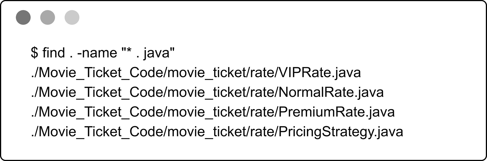
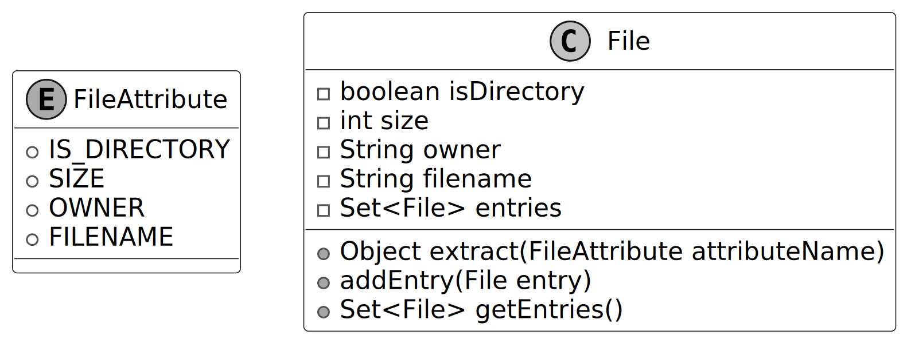
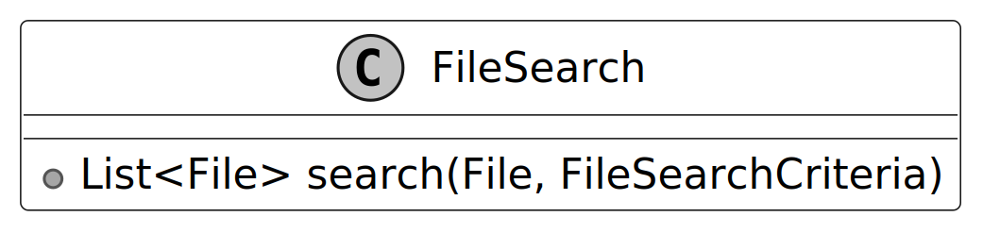
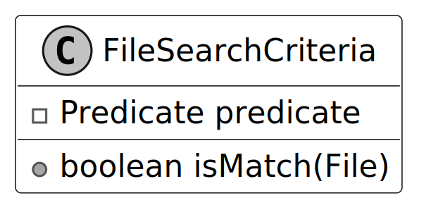
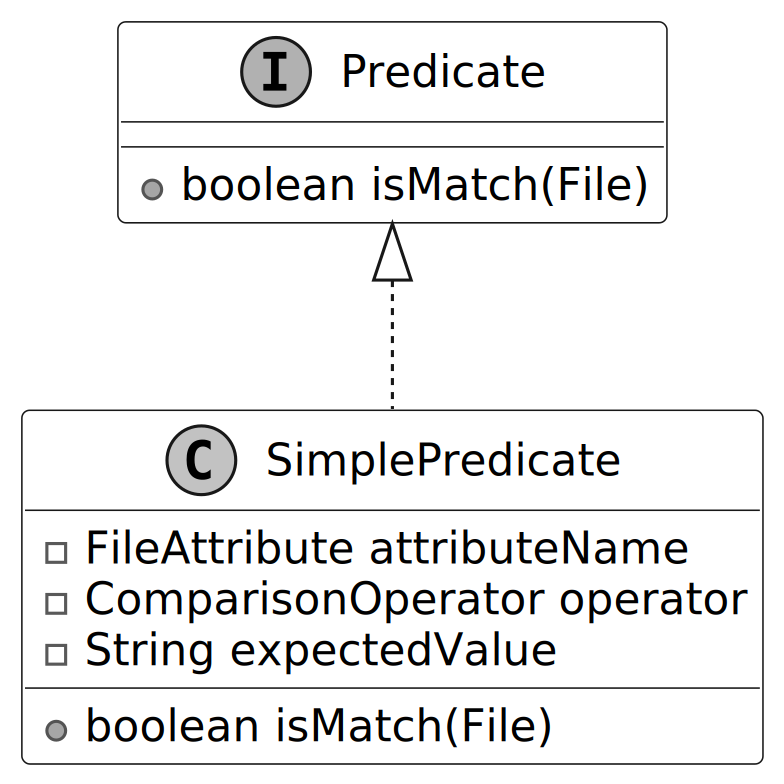
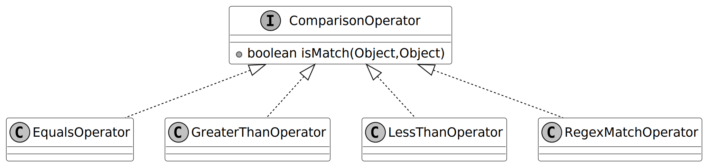
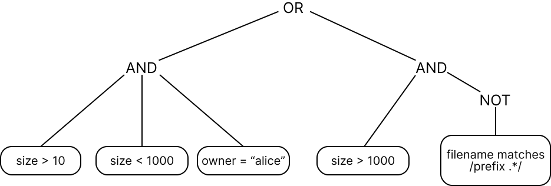
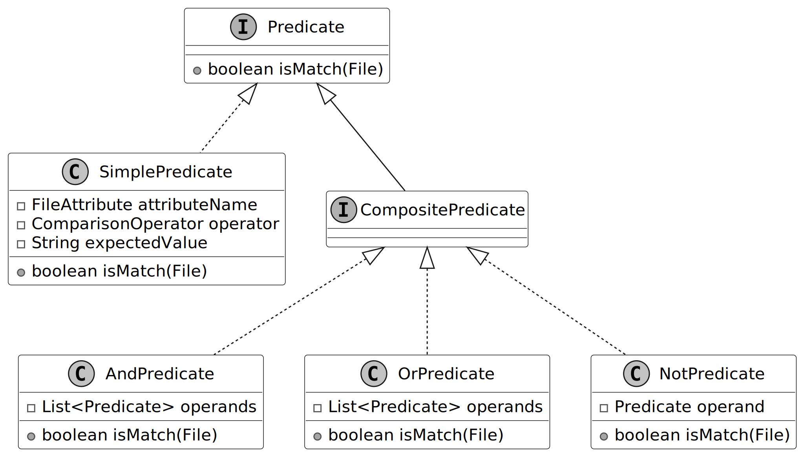
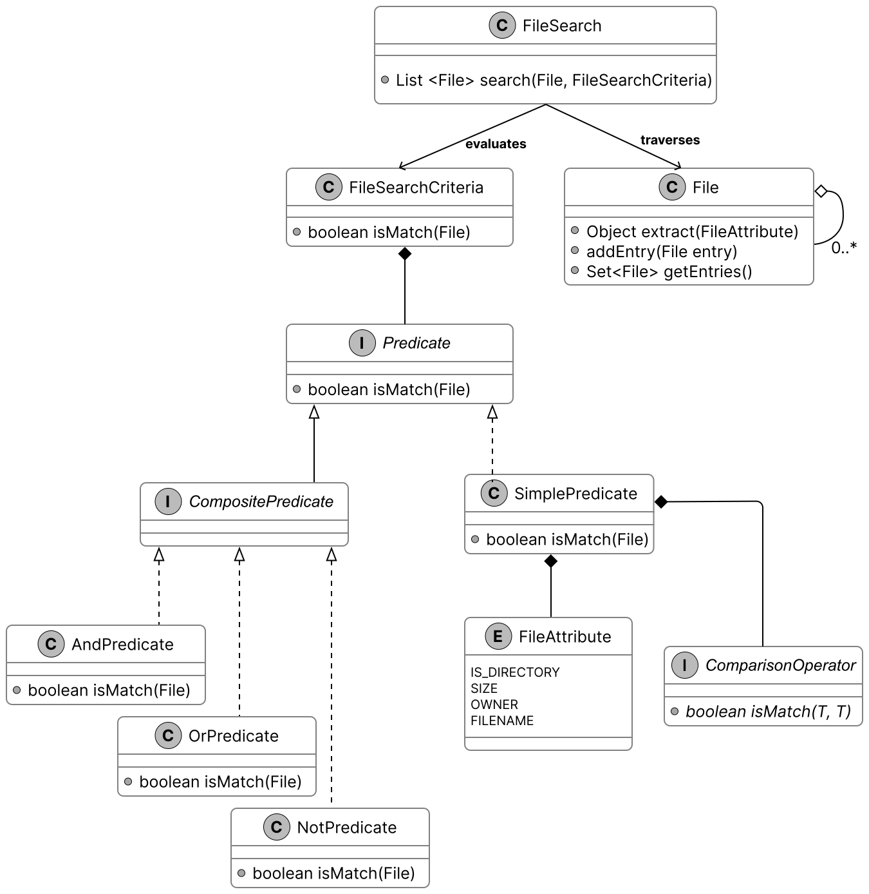
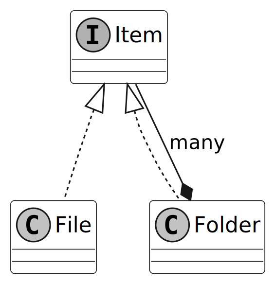

# Unix File Search

In this chapter, we will explore the design of a Unix File Search system. The goal is to design classes that represent abstractions of the key entities in a file search system, such as directories, files, and filter criteria. We’ll aim to create a clear and functional structure that captures the essential interactions between these components, ensuring the search system is intuitive and scalable.

Let’s gather the specific requirements through a simulated interview scenario.

## Requirements Gathering

Here is an example of a typical prompt an interviewer might give:

> “Imagine you’re a developer trying to find specific files on a Unix system, like files owned by a user, or text files matching a pattern, buried deep in a directory structure. You run a search command, specify your criteria, and the system returns matching files quickly. Behind the scenes, it’s recursively traversing directories, evaluating file attributes, and applying your filters efficiently. Let’s design a Unix File Search system that handles this process.”

### Requirements clarification

Here is an example of how a conversation between a candidate and an interviewer might unfold:

**Candidate:** What attributes does the find command use to search for files?
**Interviewer:** It could be based on criteria like size, file type, filename, and owner.

**Candidate:** Does it need to handle directories?
**Interviewer:** Yes, directories are considered as files too, with a distinct file type.

**Candidate:** What types of comparisons does the command support?
**Interviewer:** That depends on the type of attribute. For strings, we support ‘equals’ and ‘regex match’. For numbers, we support ‘greater than’, ‘equals’, and ‘less than’.

**Candidate:** Can we combine multiple criteria, even on the same attribute?
**Interviewer:** Yes, with multiple criteria, using ‘and’, ‘or’, and ‘not’ conditions.

**Candidate:** I assume we’re designing a system to search a directory and its sub-directories, returning files that match the given conditions.
**Interviewer:** Yes, that's a fair assumption.

### Constructing concrete examples

With the requirements for our Unix File Search system in hand, let’s see them in action through some real-world command-line searches. These examples will show what the system needs to handle and set the stage for designing our classes:

- **Start with a Simple Search:** Find files recursively within `/` where size > 10.
- **Scale Up to a Complex Search:** Find files recursively within `/` where `((size > 10 and size < 1000 and owner = "alice") or (size > 1000 and !(filename matches /prefix.*/)))`.

### Requirements

Based on the questions and answers, the following functional requirements can be identified:

- The search system can search for files based on attributes such as size, type, filename, and owner.
- The search system supports comparison types depending on the attribute: ‘equals’ and ‘regex match’ for strings, and ‘greater than’, ‘equals’, and ‘less than’ for numbers.
- The system can combine multiple search criteria using logical operators (and, or, not).
- The file search system can perform recursive searches within directories.
- The search system can apply search criteria to directories as well as files.

Below are the non-functional requirements:

- **Scalability:** Efficiently handle large directory trees with thousands or millions of files using resource-efficient traversal strategies.
- **Extensibility:** Support adding new attributes (e.g., modification time) and comparison operators without altering core traversal or filtering logic.
- **Separation of concerns:** Keep traversal logic separate from filtering logic for a modular and maintainable design.

With these requirements established, let’s move on to identifying the core objects that will bring this system to life.

## Identify Core Objects

Now that we’ve seen how Unix file searches work, it’s time to design a system that can handle them. Let’s break it down into core objects, each with a clear role, to create a file search system that’s both modular and easy to maintain. Here’s what we’ll need:

- **FileSearch:** The central entity managing the search process, serving as the entry point into our application logic. It recursively traverses the filesystem from a starting `File` (directory) and returns matches based on a `FileSearchCriteria` object.
- **File:** Models a file or directory in the filesystem, storing attributes like size, type, filename, and owner. It supports a hierarchical structure with entries for subdirectories or files.

> **Design Choice:** The `File` object represents files and directories as a single entity. This enables `FileSearch` to perform consistent traversal and evaluation. This design aligns with the Unix principle that treats everything as a file for uniform handling.

- **FileSearchCriteria:** Encapsulates a search condition and determines whether a given `File` matches it by delegating to a `Predicate`. This wrapper class decouples the search execution logic (`FileSearch`) from the condition evaluation logic (`Predicate`), promoting separation of concerns and greater flexibility.
- **Predicate:** An interface defining the contract for evaluating whether a `File` matches a condition, enabling both simple checks (e.g., "size > 10") and composite conditions (e.g., AND, OR, NOT). We separate `Predicate` from `FileSearchCriteria` to isolate comparisons and logical combinations from how `FileSearch` uses the criteria. This keeps `FileSearchCriteria` a lightweight wrapper, while `Predicate` manages the complex logic.
- **SimplePredicate:** Implements `Predicate` to compare one file attribute (e.g., "size > 10") against a value with an operator (e.g., equals, greater than).
- **CompositePredicate:** Extends `Predicate` for combining conditions (e.g., AND, OR, NOT) with implementations like `AndPredicate`, `OrPredicate`, and `NotPredicate`. It supports complex queries, such as "size > 10 AND owner = 'bob'".
- **ComparisonOperator:** An interface defining how attribute values are compared, with implementations like `EqualsOperator`, `RegexMatchOperator`, `GreaterThanOperator`, and `LessThanOperator`.

> **Alternative approach:** We could merge `FileSearchCriteria` and `Predicate` into a single class, embedding the matching logic directly in `FileSearch`. This simplifies the design by removing one layer but reduces modularity, as the search logic would be tightly coupled to condition evaluation, making it harder to swap criteria. For instance, switching the condition from "size > 10" to "owner = 'bob'" would require updating `FileSearch`.

## Design Class Diagram

We’ve mapped out the core objects, such as `File` and `FileSearch`, for our Unix File Search system. Now, let’s define their classes, pinning down their roles and methods to keep everything clear and modular.

### File

To model a filesystem for searching, we need a way to represent files and directories. Rather than relying on a standard library like Java’s `java.io.File`, we define a custom `File` class as the core entity, capturing key attributes and supporting hierarchical traversal. It’s paired with a `FileAttribute` enum for attributes used in search conditions.

Below is the representation of this class and the enum.

> **Design Choice:** We define `FileAttribute` as an enum to provide a fixed, type-safe set of attributes (e.g., size, owner) for search conditions. This ensures that only valid, predefined attributes are used when evaluating files, preventing runtime errors from invalid attribute names. It also supports scalability: adding a new attribute, such as modification time, requires simply extending the enum, keeping the system extensible without altering existing logic.

### FileSearch

The `FileSearch` class is responsible for traversing the file system from a given `File`, using a `FileSearchCriteria` object to select matching files and return them. By separating traversal from filtering logic, the design remains modular, maintainable, and easy to extend. The UML diagram below illustrates this structure.

### FileSearchCriteria

The `FileSearchCriteria` class decides which files match our search by connecting `FileSearch` to `Predicate`. It tells `FileSearch` what qualifies as a match, using `Predicate` to check each `File` against the conditions.

Here is the representation of this class.

> **Design Choice:** We designed `FileSearchCriteria` to work alongside `Predicate`, allowing it to evaluate whether a file meets the search conditions without handling all the logic itself. This keeps responsibilities clean and modular. For example, `FileSearchCriteria` delegates to a `Predicate` to check if a file’s size is greater than 10 or if the owner is “bob.” This delegation enables flexibility. We can change or combine filtering logic (like checking different attributes or using complex conditions) without modifying either `FileSearch` or `FileSearchCriteria`. By decoupling the search traversal from condition evaluation, we preserve the separation of concerns and make the system easier to extend and maintain.

### Predicate and SimplePredicate

A key part of our design is the ability to define conditions that determine whether a file should be included in the search results. These conditions can range from simple to complex. For example, we might want files whose names follow a regular expression like `report.*`, or files with sizes exceeding 10 bytes. To manage this, we introduce the `Predicate` interface as the foundation for evaluating files. It defines a single method that takes a `File` object and returns a boolean: true if the file satisfies the condition, false otherwise.

For straightforward conditions, we implement the `SimplePredicate` class. This concrete class evaluates a single file attribute, such as size or owner, against a specified value using a comparison operator (like greater than or equal). For instance, it can check "is the size bigger than 10?" or "is the owner 'bob'?" by leveraging the `FileAttribute` enum and a `ComparisonOperator` instance. The UML diagram below illustrates how these pieces fit together.

### ComparisonOperator

The `ComparisonOperator` interface defines a contract for comparing a file’s attribute value (like size or name) to an expected value, answering questions like "is the size greater than 10?" or "does the filename match the pattern `log.*`?" It declares a method that takes two values (the attribute’s actual value and the target value), and returns a boolean indicating whether the comparison holds. We implement this interface with concrete classes, such as:

- `EqualsOperator` confirms if two attribute values are the same, like "is the owner 'bob'?"
- `GreaterThanOperator` verifies if one attribute value is larger, like "is the size over 10?"
- `LessThanOperator` ensures one attribute value is smaller, like "is the size under 5?"
- `RegexMatchOperator` evaluates whether a string attribute value satisfies a regular expression pattern, such as checking if the filename matches `log.*` (e.g., `log.txt` or `logger` would return true).

This interface-based design allows `SimplePredicate` to delegate comparisons to specialized classes like `EqualsOperator` or `RegexMatchOperator`, each optimized for its operation, enabling precise and efficient file filtering in `FileSearchCriteria`.

The UML diagram below shows how this structure comes together.

> **Alternative approaches:** We could represent operations with strings such as "equals" or ">". This simplifies initial implementation but shifts validation to runtime. Each string must be parsed and mapped to a comparison function, which increases execution time and risks runtime exceptions if an invalid operator (e.g., "equals") is left unchecked.
>
> Another option is to use enums like `EQUALS` or `GREATER_THAN` to represent comparison operations. This makes the code safer and faster because the operations are checked at compile time, not at runtime. However, if you want to add a new operation, like case-insensitive equality for owner names, you would need to change the enum itself. In contrast, with the interface-based approach, you can just create a new class for the new operation without touching existing code.

### Composite Predicate

With `SimplePredicate` and its `ComparisonOperator` implementations in place, we can already test files against single conditions like `size > 10` or `owner = 'alice'`. But real-world searches often demand more, combining multiple conditions with logical operators. To tackle this, we use the Composite design pattern, enabling us to build complex predicates from simpler ones.

> **Note:** To learn more about the Composite Pattern and its common use cases, refer to the Further Reading section at the end of this chapter.

Consider a search like this:

Find files where `((size > 10 and size < 1000 and owner = "alice") or (size > 1000 and !(filename matches /prefix.*/)))`.

If we label each simple condition:

- A for "size > 10"
- B for "size < 1000"
- C for "owner = 'alice'"
- D for "size > 1000"
- E for "filename matches 'prefix.\*'"

It becomes: `((A and B and C) or (D and !(E)))`

This structure uses "and," "or," and "not" operators, with brackets indicating the order of nested evaluations. This tree-like hierarchy needs a systematic way to evaluate files.

To handle this, we define the `CompositePredicate` interface, extending `Predicate`, with concrete implementations: `AndPredicate`, `OrPredicate`, and `NotPredicate`. These classes compose multiple predicates into a single unit, evaluated recursively:

- `AndPredicate` takes a list of predicates (e.g., A, B, C) and returns true only if all succeed for a given file.
- `OrPredicate` takes a list (e.g., the `AndPredicate` result and another group) and returns true if at least one succeeds.
- `NotPredicate` wraps a single predicate (e.g., E) and inverts its result.

In our example:

- `AndPredicate` combines "size > 10", "size < 1000", and "owner = 'alice'" into one check.
- Another `AndPredicate` pairs "size > 1000" with a `NotPredicate` that negates "filename matches 'prefix.\*'".
- `OrPredicate` links these two groups, returning true if either holds.

This structure, rooted in `CompositePredicate`, delivers a boolean result to `FileSearchCriteria` efficiently by distributing evaluation across the tree, avoiding redundant checks.

The UML diagram below illustrates this recursive composition.

With all classes defined, let’s review how they fit together in the complete class diagram.

### Complete Class Diagram

Having built our classes, from the hierarchical `File` structure to the intricate predicate logic, we’re ready to see the complete system in a UML class diagram below. The detailed methods and attributes are skipped to make the diagram more readable.

## Code - Unix File Search

_(Implementation details to be provided in the Java files)_

## Deep Dive Topic

Now that the basic design is complete, the interviewer might ask you some deep dive questions. Let’s check out some of these.

### File search test

After implementing our classes, it’s a good idea to verify the end-to-end logic. The UNIX file search problem is abstract, so we create a test case to demonstrate how it works.

_(Test implementation details to be provided in the Java files)_

## Wrap Up

With the UNIX file search system fully implemented and tested, it’s time to step back and consider what we’ve achieved. This chapter began by gathering requirements through a structured dialogue, then progressed to defining core objects, crafting their class structure, and coding the essential components.

The system's maintainability and extensibility are ensured by the clear division of responsibilities among the classes: `File`, `FileSearch`, `FileSearchCriteria`, and `Predicate`, which respectively represent files, traverse directories, evaluate conditions, and define match logic. Our choices, such as separating `FileSearch` from `FileSearchCriteria` and using generics in `ComparisonOperator`, improve scalability and maintain type safety throughout processes. We could have merged `FileSearchCriteria` with `Predicate` into one class for a tighter initial design, but this would blur their distinct roles, making it harder to update or swap condition logic without affecting traversal.

Congratulations on getting this far! Now give yourself a pat on the back. Good job!

## Further Reading: Composite Design Pattern

This section gives a quick overview of the design patterns used in this chapter. It’s helpful if you’re new to these patterns or need a refresher to better understand the design choices.

### Composite design pattern

Composite is a structural pattern that lets you organize objects into tree structures and then handle these structures as if they were individual objects.

**Problem**
Imagine you have two types of objects: `Files` and `Folders`. A `Folder` can contain several `Files` as well as many smaller `Folders` and so on. Say you decide to create a search system that uses these classes. Searches could involve simple `Files` on their own, as well as `Folders` packed with `Files`, and other `Folders`. How would you find all items matching a specific condition, like "size > 10," across this structure?

**Solution**
The Composite pattern suggests that we work with `Files` and `Folders` through a common interface that declares a method for checking conditions.

Here’s how this method works:

- **For a File:** It checks if the `File` matches the condition, like "size > 10," and gives a yes or no answer.
- **For a Folder:**
  - It examines each item within, testing whether it meets the condition.
  - It recursively applies this process to any nested folders, traversing the entire tree until all items are evaluated.
  - It can also enforce its constraint, such as "not a directory," to refine the result.

Here’s a simple diagram showing the Composite pattern for Files and Folders:

`Item` is the common interface that both `File` and `Folder` use. The advantage is that we can treat all objects, `File` or nested `Folder`, the same through the common interface, letting them pass the check down the tree without knowing their types.

**When to use**
The Composite design pattern is useful in scenarios where:

- You need to build a tree-like object structure.
- When you want the client code to handle both simple and complex elements uniformly.
