# Design a Vending Machine

In this chapter, we will explore the design of a vending machine system that allows users to select and purchase products, dispense items, manage inventory, and process payments. Although real-world vending machines involve hardware components, like coin dispensers, card readers, and touchscreens, we’ll focus on modeling the system’s states, data, and core functionality.

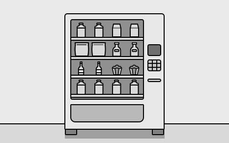

## Requirements Gathering

Here is an example of a typical prompt an interviewer might give:

> “Imagine you’re at a vending machine, craving a snack. You insert some cash, select your favorite item, and within seconds, it drops into the tray. The machine also gives you the right change if needed. Behind the scenes, the system is working smoothly to track inventory, handle payments, and make sure everything runs efficiently. Now, let’s design a vending machine that does all this.”

### Requirements clarification

Here is an example of how a conversation between a candidate and an interviewer might unfold:

**Candidate:** Does the vending machine support different types of products?
**Interviewer:** Yes, the vending machine supports a variety of products, such as snacks, beverages, and other items.

**Candidate:** How are products organized within the vending machine? Are they placed in specific racks or arranged differently? Also, I assume each product needs a unique identifier, like a product code, along with attributes such as its price.
**Interviewer:** Yes, products are placed in specific racks, with each rack holding only one type of product at a time. Each product also has a unique product code and a price tag.

**Candidate:** How will payments be processed in the vending machine?
**Interviewer:** The vending machine should only accept cash payments and calculate change if needed.

**Candidate:** How does the vending machine handle cases where a user selects a product that is out of stock or unavailable?
**Interviewer:** In such cases, the system should be able to check if a product is available. If not, it should display an error message to the user.

**Candidate:** If a user inserts money less than the product’s full price, can they add more incrementally?
**Interviewer:** For this design, let’s assume users insert the full amount in one step. If the inserted amount is insufficient, the vending machine should return the money and display an error.

**Candidate:** Are there any restrictions on who can access the vending machine?
**Interviewer:** Access to the vending machine is available to users and admins, with different privileges. Users should be able to select and purchase products by specifying the product code. Admins, however, are responsible for adding or removing products from the machine.

**Candidate:** Are there any security or inventory tracking requirements for the vending machine?
**Interviewer:** Yes. The vending machine should track inventory, and only the admin can add or remove products.

### Requirements

Here are the functional requirements based on the conversation:

- **Product selection:** Users should be able to select from a set of products. Each product has a unique product code, description, and price tag. While description is not talked about, it is a common-sense attribute to make the product model more realistic.
- **Inventory management:** Products are stored in specific racks within the vending machine. The system keeps track of the inventory level for each product in its respective rack.
- **Payment processing:** The system only accepts cash payments and can calculate change when needed.

Below are the non-functional requirements:

- The user interface must be intuitive, allowing users to complete a purchase (insert money, select product, receive product, and change) with minimal instructions, and error messages should be clear and concise to guide users effectively.
- The system must protect against unauthorized access to the vending machine, ensuring only admins can add, remove, or update products, and securely handle cash transactions to prevent tampering or fraud.

## Use Case Diagram

A use case diagram illustrates how actors (users or the system) interact with the vending machine system to achieve specific goals. This diagram helps clarify key actions, such as inserting money, selecting a product, dispensing items, and managing inventory.

Below is the use case diagram of the vending machine system.

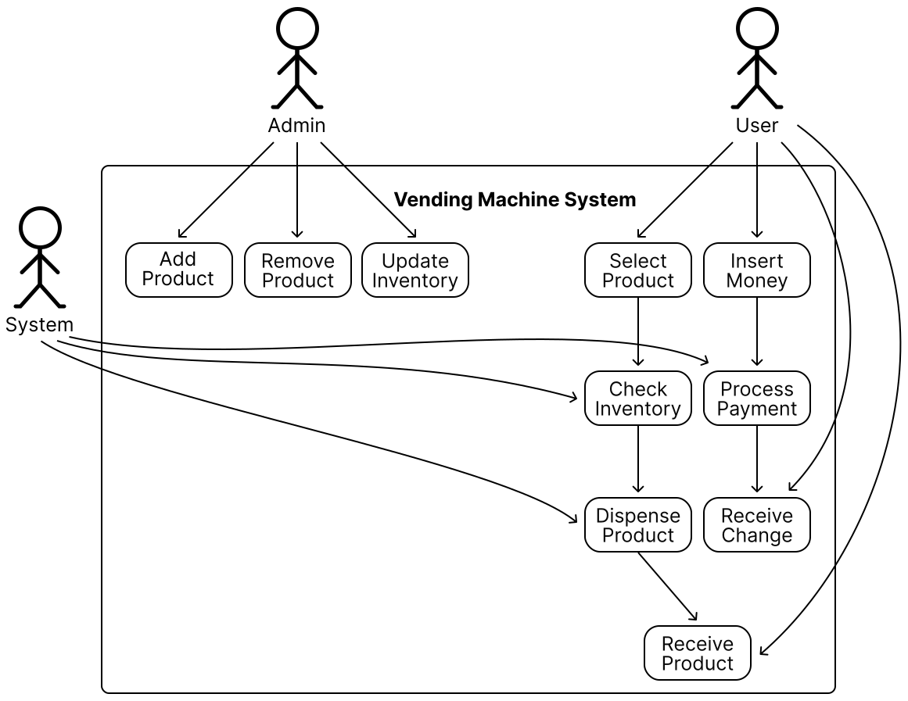

The use cases for the **User** actor are as follows:

- **Insert Money:** The user inserts cash to initiate a purchase.
- **Select Product:** The user chooses a product by entering its unique product code.
- **Receive Product:** The user collects the dispensed product from the vending machine.
- **Receive Change:** The user receives any change if the inserted amount exceeds the product’s price.

The use cases for the **Admin** actor are as follows:

- **Add Product:** The admin adds new products to the vending machine’s inventory.
- **Remove Product:** The admin removes products from the vending machine’s inventory.
- **Update Inventory:** The admin updates the stock levels of existing products in the racks.

The use cases for the **System** actor are as follows:

- **Process Payment:** The system validates the inserted cash and calculates change if necessary.
- **Dispense Product:** The system releases the selected product from the appropriate rack.
- **Check Inventory:** The system verifies the availability of a product before dispensing.
- **Display Message:** The system shows messages or errors to guide the user (e.g., “Insert money to proceed,” “Product out of stock,” or “Insufficient funds”).

## Identify Core Objects

Before diving into the design, it’s important to enumerate the core objects and give them appropriate names. These objects will form the foundation of the vending machine’s structure and functionality.

- **VendingMachine:** This is the central entity that coordinates the vending machine’s operations and serves as the main entry point for user interactions. We will ensure this entity does not become a god object (antipattern) by appropriately delegating responsibilities to other components. The Facade design pattern is very helpful in this case, as it allows a single class to orchestrate end-to-end functionality.
- **Product:** Represents the items stored in the vending machine. Each product has attributes like an identifier, a price, and a description. Products are also linked to the racks where they are stored.
- **Rack:** Represents a designated slot in the vending machine that holds a single product type and stores multiple units of that product. It also includes the dispenser hardware to release one unit of a product at a time upon selection.

> **Design Choice:** Products are linked to racks because racks represent the physical storage locations, and products are associated with racks since they are static entities that don’t manage their storage. This aligns with the single responsibility principle. Alternatively, racks could be linked to products, but this would violate the single responsibility principle, as racks need to manage product details.

- **InventoryManager:** Keeps track of the inventory level within the vending machine.
- **PaymentProcessor:** Interacts with coin dispensers to process payment. It also keeps track of the vending machine balance and calculates change when needed.

## Design Class Diagram

Now that we know the core objects and their roles, the next step is to create classes and methods to build the vending machine system.

### Product

The first component in our class diagram is the `Product` class, which represents a basic product within the vending machine. It includes attributes such as product code, description, and the price of the product.

While additional attributes could be added for completeness, we skip them for this exercise. During the interview, it’s a good idea to acknowledge these other attributes but focus on the essential attributes to save time and stay aligned with requirements.

Below is the representation of this class.

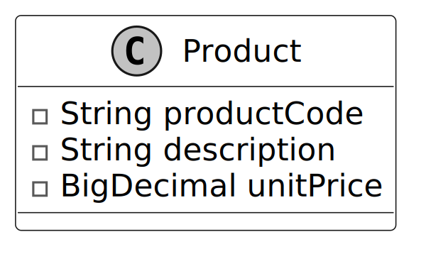

> **Design Choice:** One thing to note is that we have not modeled the inventory quantity within the product class. The product class encapsulates innate properties like its code, description, and price. The stock level of our vending machine racks is constantly changing. Recognizing this distinction supports cleaner object decomposition and adherence to the single responsibility principle. We introduce a separate `InventoryManager` class to manage stock levels.

### Rack

Next, we will look at the `Rack` class, which models a single rack space within the vending machine. Each rack is associated with a single product and can hold multiple units of that product.

We will put multiple racks together via the composition technique to represent the inventory spaces within the vending machine.

Here is the representation of this class.

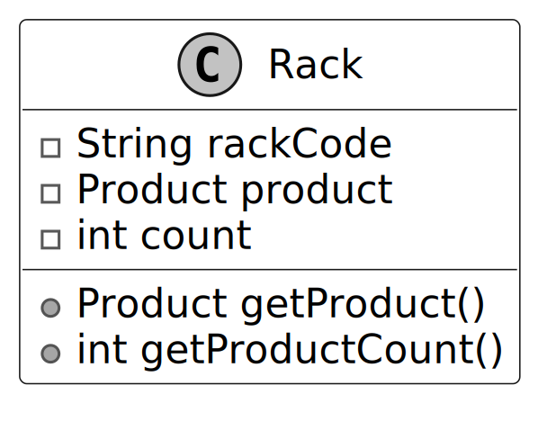

> **Design Choice:** We chose not to have the `Rack` class include methods like `dispenseProductFromRack`. Instead, we kept the `Rack` class focused on managing inventory count and product information, delegating actions like dispensing to a higher-level class, such as `InventoryManager`, which aligns with the single responsibility principle.

### InventoryManager

Building on the `Rack` class, the `InventoryManager` class handles the tracking and storage of products in the vending machine. It supports operations such as adding, removing, and dispensing products during user interactions. It will interface with hardware mechanisms that dispense items from the rack.

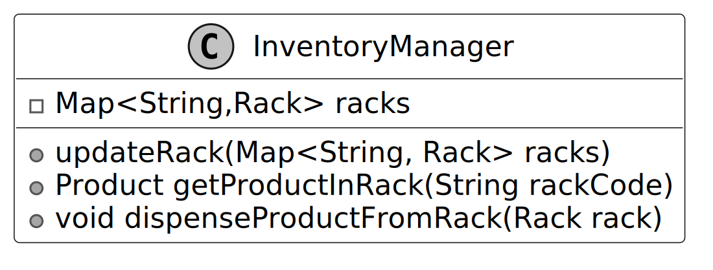

**Key method:** The `dispenseProductFromRack` method executes the action of dispensing product from the rack and decrements the inventory level. Pay attention to the naming of `dispenseProductFromRack` and `getProductInRack`. To avoid ambiguity, we should follow conventions and reserve the “get” prefix for getters that return attributes.

The `updateRack` method allows for editing product offerings or inventory levels. This allows an admin to edit the state of the rack.

> **Design Choice:** When managing collections like racks in `InventoryManager`, we must decide whether to expose the collection directly, a copy, or specific methods. The choice should balance flexibility and control. Here, we use `updateRack(Map racks)` to allow administrative components to replace the entire rack structure in one operation, suitable for bulk updates. For most cases, we prefer granular methods like `addRack(Rack rack)` and `removeRack(Rack rack)` to limit modifications to individual racks, reducing the risk of unintended changes. These methods are used for read access, aligning with the vending machine’s needs. To enhance safety, consider immutable collections or defensive copying to prevent unintended modifications and ensure thread safety in multi-threaded environments.

### PaymentProcessor

With inventory management addressed, we now turn to the `PaymentProcessor` class. This class manages payment acceptance, including tracking the current balance and returning change. This will interface with a coin receptacle or a credit card processing unit if supported.

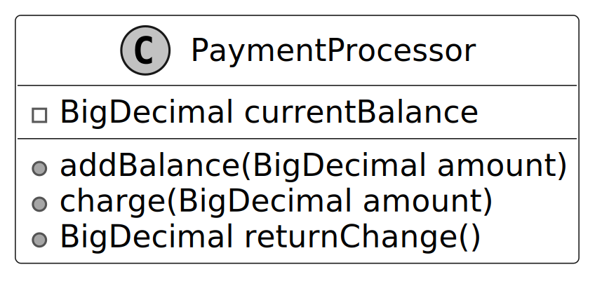

### Transaction

In a vending machine system, purchases involve multiple steps, including product selection, payment processing, and confirmation. While components like `PaymentProcessor` handle payments and `InventoryManager` manage stock, the `Transaction` class acts as a data structure that tracks the current state of a purchase.

This design provides several benefits:

- It encapsulates key details such as the selected product, the rack it belongs to, and the total cost required for the purchase.
- By maintaining a structured record, the vending machine can track an in-progress transaction before finalizing or canceling it.
- The `Transaction` class improves coordination between different components. While `PaymentProcessor` is responsible for deducting the required amount, and `InventoryManager` ensures the selected product is available and dispenses it, the `Transaction` object ensures that the vending machine keeps all necessary purchase details in one place so that the system can reference them throughout the transaction process.

Below is the representation of this class.

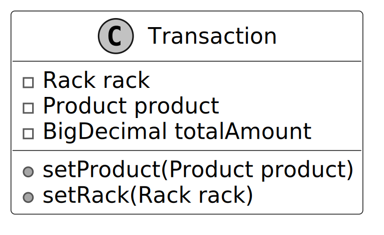

### VendingMachine

This class serves as the core component of the system. Here is the representation of the class:

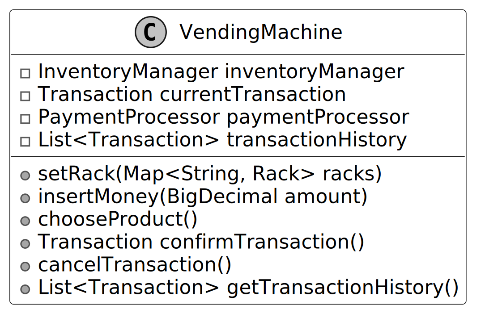

The `VendingMachine` class models a vending machine's behavior, processes payments, and manages inventory.

> **Design pattern:** The Vending Machine uses the Facade pattern to provide a single interface to the clients of the Vending Machine. The term client refers to the software or hardware interfaces of the vending machine rather than any individual users.
>
> _Note: To learn more about the Facade pattern and its common use cases, refer to the Parking Lot chapter of this chapter._

> **Design Choice:** To prevent the `VendingMachine` class from becoming a “god object” (a class with too many responsibilities), facades should remain lightweight and delegate tasks to other classes that adhere to the single responsibility principle. For example, the vending machine delegates product management to the `InventoryManager` and payment handling to the `PaymentProcessor`.

### Complete Class Diagram

Below is the complete class diagram of our vending machine system:

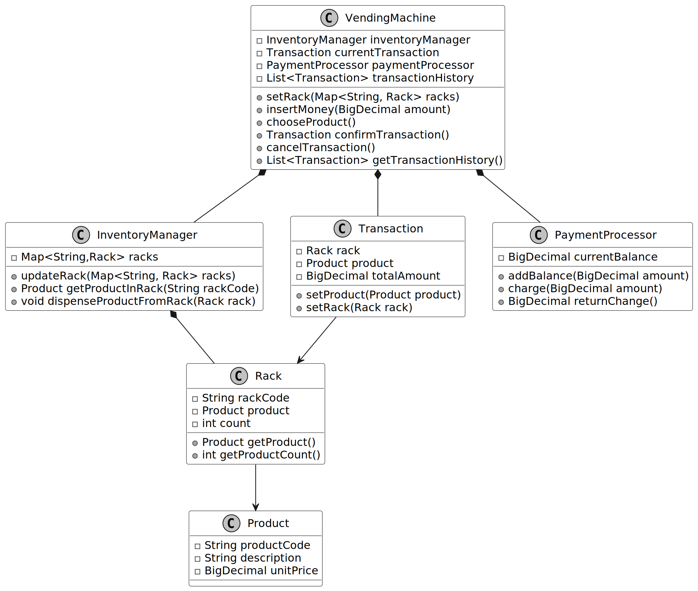

## Code - Vending Machine

In this section, we implement the core functionalities of the vending machine system. 

### System Data Flow

The end-to-end data flow for a Vending Machine transaction is orchestrated by the `VendingMachine` facade class, which delegates specific responsibilities to its subsystems. The process enforces a strict sequence of tasks through the State Pattern:

1. **Initialization (`NoMoneyInsertedState`):**
   - The `VendingMachine` starts in the `NoMoneyInsertedState`.
   - The admin configures the machine by supplying a `Map<String, Rack>`, which the `InventoryManager` stores. Each `Rack` tracks a `Product` and its inventory `count`.
   
2. **Payment Insertion (`MoneyInsertedState`):**
   - The user calls `insertMoneyState(amount)`.
   - The current state transitions the machine to `MoneyInsertedState` and delegates the monetary value to the `PaymentProcessor`.
   - The `PaymentProcessor` increments its `currentBalance`.

3. **Product Selection (`DispenseState`):**
   - The user calls `selectProductState(rackId)`.
   - The `VendingMachine` delegates to the `InventoryManager` to retrieve the `Product` and `Rack` associated with the `rackId`.
   - A `Transaction` object is populated with the selected `Product` and `Rack`.
   - The state transitions to `DispenseState`.

4. **Validation and Dispensing (Confirming Transaction):**
   - The user (or system) triggers `dispenseProductState()`, which invokes `confirmTransaction()`.
   - **Validation:** The system checks if a product was selected, if the rack has inventory (`productCount > 0`), and if the `PaymentProcessor` balance is sufficient. If any check fails, an `InvalidTransactionException` is thrown.
   - **Charge:** `PaymentProcessor.charge(unitPrice)` deducts the cost from the balance.
   - **Dispense:** `InventoryManager.dispenseProductFromRack(rack)` reduces the inventory count by 1.
   - **Change:** `PaymentProcessor.returnChange()` zeroes out the balance and returns the remaining amount, which is logged into the `Transaction.totalAmount`.
   
5. **Completion:**
   - The completed `Transaction` is stored in the `transactionHistory`.
   - The `VendingMachine` resets its `currentTransaction` and transitions back to `NoMoneyInsertedState`, ready for the next customer.

_(Implementation details are available in the Java files in the `src/vending` directory)_

## Deep Dive Topics

Now that the basic design is complete, the interviewer might ask you to enhance the vending machine’s functionality or accommodate more complex use cases.

### Enforcing task sequences

What if the interviewer asks: “How would you ensure that users insert money before selecting a product?” This is a common requirement in vending machines to prevent invalid actions, such as selecting a product without committing to payment.

To address this, we need to enforce a strict sequence of actions:

1. Users must insert money first.
2. The system checks if the inserted amount is enough for a purchase.
3. If the amount is sufficient, the user can select a product.
4. Finally, the machine dispenses the product.

Additionally, the vending machine should provide feedback at each stage to guide the user. For instance, it might display messages like “Insert money to proceed,” “Select a product,” or “Please collect your change.” How would you go about implementing this?

To handle these requirements, we can introduce the **State Pattern**. This pattern allows us to model the vending machine’s behavior as a set of well-defined states. Let’s break it down.

> _Note: To learn more about the State Pattern and its common use cases, refer to the Further Reading section at the end of this chapter._

### Design changes

To enforce task sequences and display state-dependent messages, we will define three distinct states:

**NoMoneyInsertedState:**

- Represents the initial state where no money has been inserted.
- Displays prompts like “Insert money to proceed.”
- Users are only allowed to insert money. If a user attempts to select a product without inserting money, it raises an exception.
- Transitions to `MoneyInsertedState` upon successful money insertion.

**MoneyInsertedState:**

- Represents the state where money has been inserted.
- Displays prompts like “Select a product.”
- Enables product selection while preventing additional money insertion to avoid overpayment.
- Validates if the selected product is available and the inserted amount covers the product's cost.
- Transitions to `DispenseState` upon successful product selection.

**DispenseState:**

- Represents the state where the vending machine is prepared to dispense the selected product.
- Displays prompts like “Dispensing product…” or “Please collect your change.”
- Handles product dispensing and resets the machine to the initial state after completion.
- Prevents further actions (e.g., inserting money or selecting another product) until the process is complete.

**Why does this work?**

The State Pattern explicitly defines the transitions between states, ensuring that actions follow the required order. Here’s how it works:

- In `NoMoneyInsertedState`, users can only insert money. If they try to select a product, the system raises an error.
- In `MoneyInsertedState`, users must select a product before the system dispenses anything.
- In `DispenseState`, the vending machine completes the transaction and prevents further actions until it resets.

This approach guarantees the sequence: Insert Money → Select Product → Dispense Product.

Each state provides user feedback based on its context:

- `NoMoneyInsertedState`: “Insert money to proceed.”
- `MoneyInsertedState`: “Select a product.”
- `DispenseState`: “Dispensing product…” or “Please collect your change.”

We now define a `VendingMachineState` interface that serves as a blueprint for the three states (`NoMoneyInsertedState`, `MoneyInsertedState`, and `DispenseState`).

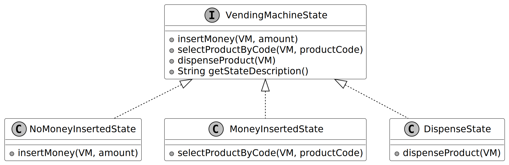

### Code changes

_(Implementation details to be provided in the Java files)_

## Wrap Up

In this chapter, we have designed and implemented a Vending Machine system. The most important takeaway from this chapter is how we divided responsibilities across classes, such as `Product`, `Rack`, `InventoryManager`, and `PaymentProcessor`, while unifying them under a facade for a clear and simple-to-access API. This approach not only simplified the system’s external interface but also adhered to the Single Responsibility Principle, ensuring each component focused on a specific responsibility. For instance, the `InventoryManager` managed stock levels, while the `PaymentProcessor` handled cash payments and calculated change.

In the deep dive section, we explored state-based control using the State Pattern to enforce a strict sequence of actions and prevent invalid behaviors like dispensing without payment.

In interviews, remember to emphasize validation and error handling after implementing core functionality, especially for systems where improper behavior could cause damage or financial loss.

Congratulations on getting this far! Now give yourself a pat on the back. Good job!

## Further Reading: State Design Pattern

This section gives a quick overview of the design patterns used in this chapter. It’s helpful if you’re new to these patterns or need a refresher to better understand the design choices.

### State design pattern

The State pattern is a behavioral pattern that allows an object to alter its behavior when its internal state changes, making it appear as though the object is behaving like a different class.

In the vending machine design, we use the State pattern to manage states like `NoMoneyInsertedState`, `MoneyInsertedState`, and `DispenseState`, enabling the `VendingMachine` to switch behaviors dynamically without modifying its core logic.

To illustrate the State pattern in another domain, the following example uses the traffic light system.

**Problem**
Imagine we have a `TrafficLight` class. The traffic light can be in one of three states: Red, Yellow, or Green. The behavior of the traffic light changes depending on its current state:

- In the Red state, the light stays red for a set duration.
- In the Yellow state, the light blinks yellow, signaling cars to slow down and prepare to stop.
- In the Green state, the light stays green to allow traffic to pass.

If we were to implement this logic using conditionals, we would need to check the current state of the traffic light every time an action occurs.

While the solution works initially, several issues arise as the system becomes more complex:

- **Scalability:** As the number of states increases, the conditionals grow larger. For example, adding a new state (like a flashing state for emergency vehicles) would require adding more checks to the existing logic, making the code increasingly hard to manage and prone to errors.
- **Maintainability:** The duplication of code and the need to update the same conditional logic in multiple places make the system difficult to maintain over time. This is a crucial problem because it impacts long-term code quality and increases the chance of introducing bugs when modifying the logic.

**Solution**
Instead of relying on conditionals to manage state transitions, we can use the State pattern, which encapsulates the behavior associated with each state into separate classes.

Rather than handling all behaviors on its own, the original object, known as the context, holds a reference to one of the state objects that represents its current state, delegating the state-related tasks to that object.

For example, a `TrafficLight` context can delegate its behavior to a state object, like `RedLightState`, `GreenLightState`, or `YellowLightState`. Each of these states knows how to handle the actions specific to that state, such as changing the light or transitioning to the next state.

To transition to a new state, the context simply replaces the current state object with another one that represents the new state. For instance, when the light is Green, the system transitions to Yellow, and then to Red, without needing complex conditionals.

Here is the representation of the state pattern.

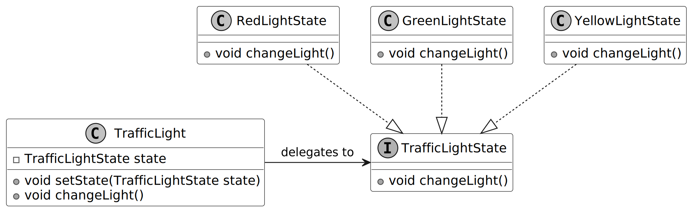
