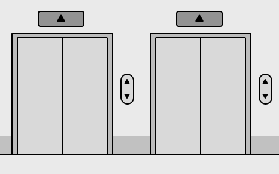
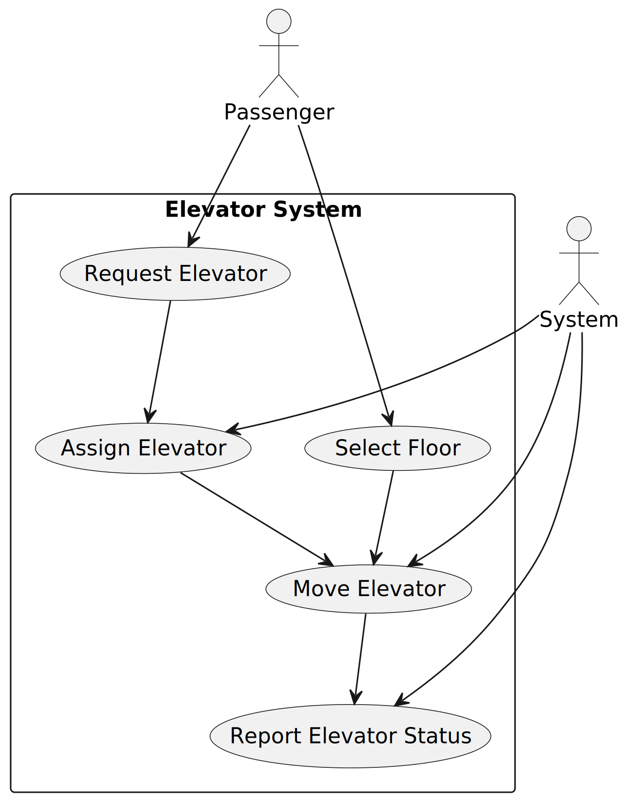
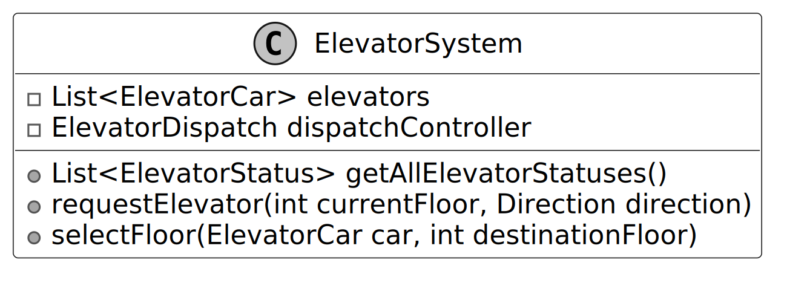
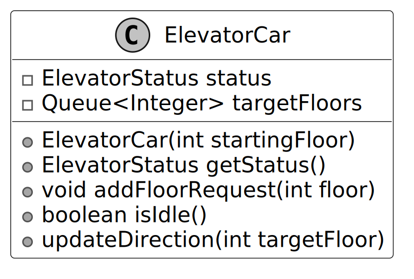
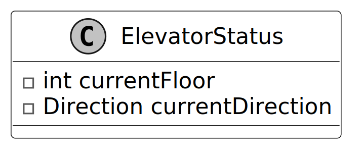
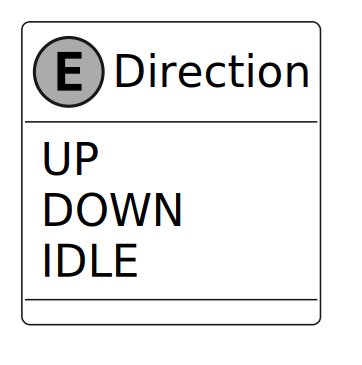
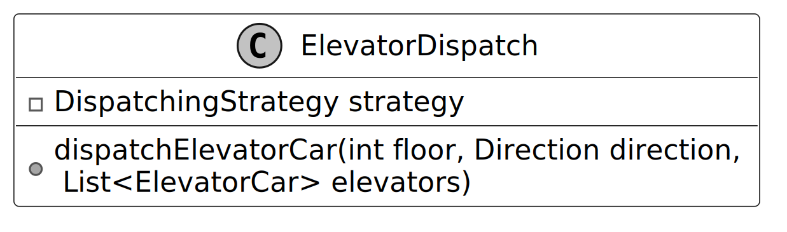
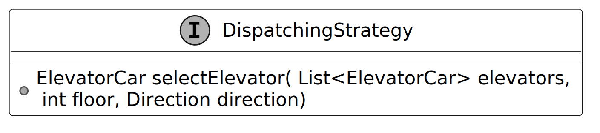
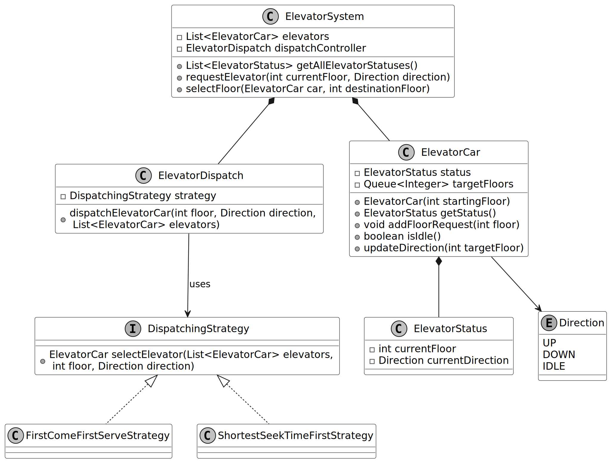
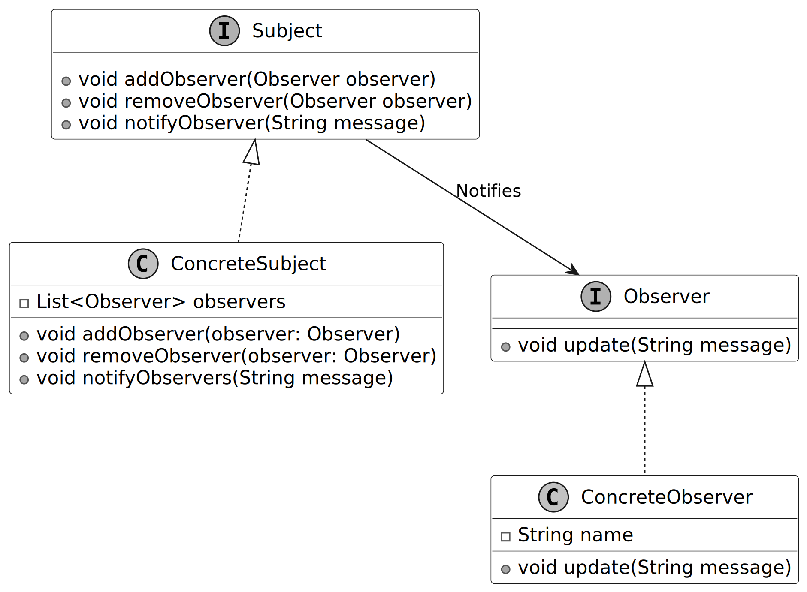

# Design an Elevator System

In this chapter, we will explore the object-oriented design of an Elevator System. Compared to some of the other popular interview problems, this one places a stronger emphasis on modeling behavior, rather than on modeling data. Our approach will focus on designing key components such as how to represent real-world elevators, the elevator's state, incoming hallway call requests, and the algorithm that determines the elevator's movement.

## Requirements Gathering

Here is an example of a typical prompt an interviewer might give:

> “Imagine you are in an office building with a bunch of identical elevator cars, and they all go to the same set of floors. You press the “up” or “down” button on your floor, and an elevator arrives promptly. Inside, you select your desired floor from a panel of buttons, and the elevator takes you there. Behind the scenes, the system efficiently manages elevator assignments and ignores requests in the wrong direction. Now, let’s design an elevator system that handles all of this.”

### Requirements clarification

Here is an example of how a conversation between a candidate and an interviewer might unfold:

**Candidate:** Are we designing an elevator system for an office building, or do we need to consider other types of elevators as well, such as industrial elevators for factories or freight elevators for heavy goods?  
**Interviewer:** Only for office buildings.

**Candidate:** Do all elevator cars serve the same set of floors?  
**Interviewer:** Yes, all elevator cars can serve every floor.

**Candidate:** When a user presses the "up" or "down" button on a particular floor, what strategy should the system use to determine which elevator to dispatch?  
**Interviewer:** The specific strategy is up to you. Ideally, it could be configurable. We should be able to easily swap strategies to see which one fits best for the building’s traffic. It could be a first-come, first-served strategy for fairness or other strategies.

> **Tip:** The top floor should only have a “down” button, and the bottom floor should only have an “up” button. While it’s great to recognize this detail during design, it’s not critical if it isn’t the primary focus.

### Requirements

Based on the conversation and how elevator systems work in the real world, here are the key functional requirements we’ve identified:

- The system manages multiple elevator cars, all of which serve the same set of floors.
- On each floor, there are “up” and “down” buttons that users press to call an elevator car before getting in.
- Each elevator car should display its current floor and state (e.g., moving up, down, or idle).
- Each elevator car has an internal control panel that includes buttons for every floor. Users inside the car press the button corresponding to the floor they want to go to.
- If a user inside the elevator car presses a floor button in a direction opposite to the elevator's current movement, the request should be ignored.

Below are the non-functional requirements:

- The dispatching algorithm should be configurable, allowing the system to easily switch between different optimization strategies.

Some of the requirements above are based on common sense in elevator systems. It’s a good idea to list them briefly during an interview to ensure everyone is on the same page. This way, the interviewer can step in if they want to adjust or clarify any assumptions. It helps save time and keeps the conversation aligned with the interviewer’s expectations.

### Understanding elevator control panels

Elevator systems typically include two types of buttons, each serving a distinct purpose for controlling elevator operations:

- **Hallway Buttons (Outside the Elevator):** Hallway buttons are located on each floor outside the elevator. Typically, there are two buttons: an "up" button to call the elevator to go up and a "down" button to call the elevator to go down.
- **Floor Buttons (Inside the Elevator):** Floor buttons are located on the control panel inside the elevator car. Each button corresponds to a specific floor.

_Note: From this point onward, we will use the terms "hallway buttons" and "floor buttons" in our discussions._

## Use Case Diagram

A use case diagram shows how actors (users or systems) interact with a system to achieve specific goals. In the elevator system, this will help us clarify key actions, such as requesting an elevator, selecting a floor, and dispatching an elevator.

Below is the use case diagram of the elevator system.

The use cases for the **Passenger** actor are as follows:

- **Request Elevator:** This represents the action of a passenger on a specific floor pressing the hallway button to request an elevator.
- **Select Floor:** After entering the elevator, the passenger selects the destination floor using the floor button.

The use cases for the **System** actor are as follows. Note that actors are not necessarily humans:

- **Assign Elevator:** This represents the system selecting the most appropriate elevator car based on factors like availability and suitability.
- **Move Elevator:** This represents the elevator moving between floors to pick up and drop off users as needed.
- **Report Elevator Status:** This represents the system updating and reporting the elevator’s current status (floor and direction).

## Identify Core Objects

Before diving into the design, it’s important to enumerate the core objects.

- **Elevator System:** This is the facade class that provides the main interface to the elevator system. It coordinates the overall operation by tracking the status of all elevator cars and delegating hallway call requests to the Elevator Dispatch for assignment and movement.
- **Elevator Dispatch:** This class handles hallway calls by assigning the most appropriate elevator. When a user presses a hallway button, the system evaluates the available elevators using the dispatching strategy and selects the most suitable elevator to fulfill the request.
- **Elevator Car:** An elevator car is a single unit that transports passengers between floors in a building. Each car operates independently and contains its internal control panel with buttons for selecting destination floors.

## Design Class Diagram

To choose the right strategy for modeling our system, let's first consider whether the elevator problem is more centered around logic or data. The use cases for the elevator are pretty straightforward. We can easily picture a user calling an elevator, getting inside, and selecting a floor. However, when it comes to the data model, it’s less clear which entities require detailed modeling. For example, do we need to model the doors, individual buttons, or passengers?

Since the use cases are clearer than the underlying data model, we’ll start with the system’s behaviors and user interactions (captured through use cases) and then use them to guide the definition of classes and methods. With the core use cases already defined, we can now directly translate their responsibilities into the key classes that implement the system’s functionality.

### Elevator System

The `ElevatorSystem` class serves as the central controller, providing an API for controlling all the elevator cars, tracking their status, and handling dispatching requests efficiently.

By looking at the use case diagram, we can identify three core responsibilities of the system, each tied to specific APIs:

- **Get status:** Check the current state of each elevator (e.g., which floor it's on, and its direction of movement). This is used in displays both in and out of the elevator.
- **Request elevator:** When a user presses the hallway button on a floor, the system triggers a request to assign an elevator to that floor.
- **Select destination:** Once inside the elevator, users press the floor button on the control panel for their destination floor.

To prevent the `ElevatorSystem` class from becoming overly complex and difficult to maintain, we delegate the task of assigning elevators to a separate `ElevatorDispatch` controller using composition.

Below is the UML diagram for the `ElevatorSystem` class.

> **Tip:** In object-oriented design, naming things correctly is very important, even more so than in typical coding interviews. Clear names help avoid confusion. For example, it’s important to clearly tell the difference between a single elevator car and the whole elevator system. In this design, we’ll use simple suffixes like System, Dispatch, or Strategy to make things clear. Good names save time explaining and help you move faster in an interview.

### Elevator Car

The `ElevatorCar` class models the behaviors of an elevator car within the system. It maintains a queue of target floors to track requested stops and delegates state management to the `ElevatorStatus` class for modularity.

This delegation allows the `ElevatorStatus` class to encapsulate dynamic attributes, such as the elevator’s current floor and movement direction. The `Direction` enum further simplifies this by defining movement as UP, DOWN, or IDLE.

The UML diagram below illustrates this structure.

> **Design Choice:** We chose to separate the elevator car’s state (e.g., current floor, direction) into a dedicated `ElevatorStatus` class to promote reusability and clarity, allowing status-related logic to be managed independently. This separation also supports future extensions, such as adding more state attributes (e.g., door status) without modifying the `ElevatorCar` itself.

### Elevator Status

The `ElevatorStatus` class provides a snapshot of the current state of an elevator car, encapsulating its `currentFloor` and `currentDirection` in a single object. It is a simple class but crucial for tracking the elevator’s real-time state.

The status is updated dynamically as the elevator moves between floors, providing real-time information to the system.

> **Alternative approach:** We could have used a generic data structure, such as a key-value collection, to store elevator state attributes like floor and direction. However, a dedicated `ElevatorStatus` class was chosen for its type safety and its extensibility, allowing new attributes (e.g., maintenance status) to be added without affecting other system components.

### Direction

The `Direction` enum provides a type-safe way to represent an elevator’s movement direction. It includes three possible values:

- **UP:** The elevator is moving upwards.
- **DOWN:** The elevator is moving downwards.
- **IDLE:** The elevator is stationary.

By using an enum instead of arbitrary values, the system minimizes ambiguity and ensures consistent, predictable behavior across all elevator cars. It plays a key role in optimizing elevator operation, helping prevent unnecessary direction changes, and minimizing wait times for users. For example:
- The system can prevent assigning requests in the opposite direction of an elevator’s current movement, avoiding unnecessary reversals that cause delays.
- The system can prioritize elevators already moving toward the requested floor, reducing passenger wait times.

The UML diagram for the `Direction` enum is shown below:

### Elevator Dispatch and Dispatching Strategy

The `ElevatorDispatch` class plays a critical role in managing user requests from hallway buttons and floor buttons, determining and selecting the appropriate elevator car to handle each request efficiently. To clarify what “dispatch” means in this context, it refers to assigning an elevator to handle a hallway call request and directing it to make a stop. From the perspective of an elevator car, both picking up and dropping off users are treated as stops along its path.

The dispatch logic relies on the **Strategy Pattern**, which enables the system to dynamically select and swap between different algorithms for optimizing elevator allocation.

> _Note: To learn more about the Strategy Pattern and its common use cases, refer to the Parking Lot chapter of the book._

The general dispatching process follows three main steps:
1. **Review the Request and Elevator Status:** The system evaluates the incoming request, which includes details like the floor from which the request has been made, the direction of travel, and the status of all elevator cars (e.g., idle, moving, at a specific floor).
2. **Select the Best Elevator Car:** Based on the selected `DispatchingStrategy`, the system determines which elevator car is most suited to fulfill the request. Strategies may prioritize factors such as:
   - *Proximity:* Assign an elevator based on its closeness to the requested floor. If multiple elevators are available, the closer one may be prioritized.
   - *Direction of travel:* If the elevator is already moving in the requested direction, it may be prioritized.
   - *Minimizing wait time:* Selecting the car that reduces the overall waiting time for passengers.
3. **Update Next Stops:** Once the correct elevator car is selected, the requested floor is added to that car’s list of upcoming stops. The elevator car adjusts its path to accommodate the request, ensuring it serves the user efficiently.

Below is the representation of this class.

- `dispatchElevatorCar(int floor, Direction direction, List<ElevatorCar> elevators)`: Processes the request from a hallway button by evaluating the current state of all elevators and assigning the most suitable one to respond.

**DispatchingStrategy interface:**

The `DispatchingStrategy` defines the specific rules for selecting an elevator car when a hallway button is pressed.

By abstracting the selection logic, the system is adaptable to various strategies, allowing flexibility in optimizing the dispatch process.

**Common dispatching strategies:**
- **First Come, First Serve (FCFS):** The system assigns the request to the next available elevator in the system’s dispatch queue, regardless of its direction or proximity to the request. This strategy is simple but might not always be the most efficient in a busy system.
- **Shortest Seek Time First (SSTF):** The system assigns the request to the elevator that can reach the requested floor the fastest by evaluating two key factors. It first checks whether the elevator is either idle or moving in the direction of the request. Among these elevators, it then selects the elevator closest to the requested floor, minimizing the user’s wait time.
- **Dynamic Strategies:** The dispatch strategy of the system can be dynamically configurable based on traffic patterns. For example, a “high throughput” strategy may optimize for speed during busy periods, while a “first-come, first-served” strategy can be used during quieter hours.

### Complete Class Diagram

Below is the complete class diagram of the elevator system:

## Code - Elevator System

In this section, we’ll implement the core functionalities of the elevator system, focusing on key areas such as tracking elevator status, dispatching elevators efficiently, and simulating elevator movement.

- **ElevatorSystem:** Manages multiple elevator cars, tracks their statuses, and handles requests from hallway buttons (to call an elevator) and floor buttons (to select a destination floor).
- **ElevatorCar:** Represents an individual elevator car.
- **ElevatorDispatch:** Manages requests from hallway buttons and ensures the right elevator is assigned. It uses the dispatching strategy to evaluate all available elevators and select the best one to respond to the request.
- **DispatchingStrategy interface and implementations:** Defines the contract for elevator selection and provides implementations such as First-Come-First-Serve and Shortest-Seek-Time-First strategies.

### System Data Flow

The flow of requests in the Elevator System operates as follows:

1. **User Interaction (Hallway Call):** A user on a specific floor presses a hallway button (UP/DOWN). This either:
   - Calls `ElevatorSystem.requestElevator(floor, direction)` directly.
   - Or, when using the Observer Pattern, fires `HallwayButtonPanel.pressButton(direction)` which automatically notifies the `ElevatorDispatchController`.
2. **Strategy Evaluation:** The request reaches `ElevatorDispatch.dispatchElevatorCar()`, which consults its configured `DispatchingStrategy` (like `ShortestSeekTimeFirstStrategy`). The strategy iterates through the `List<ElevatorCar>`, evaluates their current floor, direction, and accessible floors, and returns the best `ElevatorCar`.
3. **Queue Assignment:** The dispatch assigns the requested floor to the chosen elevator using `selectedElevator.addFloorRequest(floor)`. The `ElevatorCar` adds this to its `targetFloors` queue and updates its target direction.
4. **Movement Execution:** The system calls `ElevatorSystem.step()`, which iterates over all elevators, invoking `car.move()`. This logic sequentially shifts the elevator's current floor up or down until it matches the `nextFloor` at the top of its queue. 
5. **Arrival:** Once `currentFloor == nextFloor`, the elevator removes the floor from the queue, drops off/picks up the user, and if empty, reverts back to `Direction.IDLE`.

*(Implementation details are available in the Java files in the `src/elevator` directory)*

## Deep Dive Topics

In the current design, both hallway button requests and floor button requests are added to the same queue of pending stops within the elevator car. When a user presses a hallway button, the dispatch controller assigns the most suitable elevator and adds the request to that elevator’s queue. Similarly, when a user selects a destination floor using the floor buttons inside the elevator, the request is directly added to the same queue.

While this design works, it has some limitations:
- **Tightly coupled components:** Button presses, whether from the hallway or inside the elevator, add requests directly to a queue processed by the dispatch controller. Since the button logic and controller processing are interconnected through this queue, modifying one component requires changes to the other, making the system harder to maintain or extend.
- **Potential delays under heavy load:** In periods of high traffic, processing requests sequentially can introduce slight delays before an elevator is assigned.

### Event-driven elevator request handling

To address these limitations, we introduce an event-driven approach using the **Observer Pattern**. This approach decouples the hallway buttons from the dispatch controller, allowing them to interact through event-driven notifications instead of relying on the sequential processing of a queue.

**How it works:**
- **Observable Subject:** The hallway buttons act as subjects. When an “up” or a “down” button is pressed, it triggers an observer event that automatically notifies the dispatch controller.
- **Observer:** The dispatch controller listens to these button-press events and responds by allocating an appropriate elevator car.

> _Note: To learn more about the Observer Pattern and its common use cases, refer to the Further Reading section at the end of this chapter._

**Why it’s better:**
- **Decoupled architecture:** The Observer Pattern separates the hallway buttons and dispatch logic, making it easier to maintain, test, and extend the system.
- **Faster response time during rush hours:** By treating hallway button presses as discrete events, the system bypasses any queue buildup during rush hours, ensuring that requests are handled without noticeable delays.

### Handling elevators serving different floor sets

In the existing design, all elevators can stop at every floor. What if the building has certain elevators that only stop at specific floors?

In order to fulfill such a requirement, the design should allow each elevator car to be assigned a defined set of accessible floors and ensure the system assigns hallway button requests only to elevators that can stop at the requested floor.

**How It Works:**
- **Defining accessible floors:** Each elevator car will have a list of floors it can serve. This can be set during the system initialization.
- **Validating hallway call requests:** Before an elevator is assigned or a hallway call request is added to its queue, the system checks whether the requested floor is accessible by the elevator.
- **Updating dispatching logic:** The dispatching strategy must ensure that only elevators that can reach the requested floor are considered for assignment.

**Example Scenario:** Suppose the building has 20 floors. Elevator 1 serves only floors 1, 5, 10, 15, and 20. Elevator 2 serves all the floors. When a user on the 3rd floor presses the "up" button, the system avoids assigning Elevator 1 since it cannot stop at floor 3. Elevator 2 will be chosen instead.

## Wrap Up

In this chapter, we designed an Elevator System by following a structured approach, similar to how a candidate would solve this problem during an OOD interview. We began by gathering and clarifying requirements through a series of questions and answers with the interviewer. This was followed by identifying the core objects involved, designing the class diagram, and implementing key components of the system.

A key takeaway from this design is the importance of modularity and clear separation of concerns. Each component, such as `ElevatorSystem`, `ElevatorCar`, `ElevatorDispatch`, and `DispatchingStrategy`, focuses on a specific responsibility, ensuring that the system is maintainable, scalable, and flexible. This modular design allows the system to easily adapt to different dispatching strategies and optimize performance for various building traffic conditions.

In the deep dive section, we explored advanced topics, including using the Observer Pattern for event-driven hallway call requests, where pressing the hallway buttons instantly notifies the dispatch controller, enabling faster elevator assignments. We also discussed handling elevators that serve different sets of floors.

Congratulations on getting this far! Now give yourself a pat on the back. Good job!

## Further Reading: Observer Design Pattern

This section gives a quick overview of the design patterns used in this chapter. It’s helpful if you’re new to these patterns or need a refresher to better understand the design choices.

### Observer design pattern

The Observer is a behavioral pattern that lets you define a subscription mechanism, allowing multiple objects to receive notifications and updates automatically whenever the object they are observing changes state.

In the elevator system design, we use the Observer pattern to decouple hallway button presses from the dispatch controller, enabling efficient event-driven request handling. To illustrate the Observer pattern in another domain, the following example uses a news application.

**Problem**
Imagine you're developing a news application that delivers real-time updates to its users. Whenever a breaking news story is published, all users who have subscribed to that category should receive immediate notifications. Implementing this functionality can be challenging as directly linking the news publisher to each user would result in a tightly coupled design, making the system rigid and difficult to maintain. Additionally, as the user base grows, the system must efficiently manage the distribution of updates without becoming a bottleneck.

**Solution**
The Observer design pattern offers an elegant solution to this problem by establishing a one-to-many relationship between the publisher (news provider) and subscribers (users).

In this pattern:
- The “subject” (or "publisher") is the news application, which holds the core business logic and the breaking news content.
- The “observers” (or "subscribers") are the users who have subscribed to specific news categories and need to be notified when new content is published in those categories.
- The news application (subject) maintains a list of subscribed users (observers), and when a new breaking news story is published (state change), it notifies all subscribed users (observers) by calling an update method on each.

**When to use**
The Observer design pattern is particularly useful in scenarios where:
- Changes in one object require notifying other objects, especially when the set of objects that need to be notified isn’t known in advance or can change dynamically.
- When objects in your application need to observe other objects (subjects), but only under specific conditions or for a limited time.
