# Design a Grocery Store System

In this chapter, we will explore the design of a grocery store system. This system is tailored for grocery store workers to streamline operations like managing the item catalog, configuring pricing, and applying discounts.

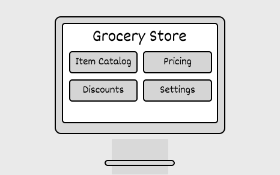

## Requirements Gathering

Here is an example of a typical prompt an interviewer might give:

> “Imagine you’re at a grocery store, filling your cart with fresh produce, snacks, and household essentials. At the checkout, the cashier scans each item, and the system instantly tracks the order, applies any discounts, and displays the final total. Behind the scenes, the system is seamlessly managing the item catalog, updating inventory as stock arrives or sells, and ensuring every transaction is smooth and accurate. Now, let’s design a grocery store system that does all this.”

### Requirements clarification

Here is an example of how a conversation between a candidate and an interviewer might unfold:

**Candidate:** What are the primary operations the grocery store system needs to support?
**Interviewer:** The system should support store workers, including shipment handlers and cashiers, in managing the item catalog, tracking inventory, and processing customer checkouts with applicable discounts.

**Candidate:** I’d like to confirm my understanding of the checkout process. The cashier scans or enters a code for each item, and the system keeps track of the order. It calculates the subtotal, applies any discounts, and updates the total. Once all items are entered, the cashier sees the final amount, accepts payment, and provides change if needed. A receipt is then generated. Does this sound correct?
**Interviewer:** Yes, that’s an accurate understanding of the system.

**Candidate:** How should the system handle inventory management?
**Interviewer:** The system should track inventory for all items, increasing inventory when new stock arrives and automatically decreasing inventory during checkout for items sold.

**Candidate:** Should the system categorize items into different categories, such as food, beverages, etc.?
**Interviewer:** Yes, that’s a good idea.

**Candidate:** For discounts, can I assume it works this way? The system should track discount campaigns, which can apply to specific items or categories. If multiple discounts apply to the same item, the system should automatically apply the highest discount.
**Interviewer:** That sounds great.

### Requirements

This question has multiple requirements, so grouping similar ones makes it easier to manage and track. The requirements can be broken down into four groups.

**Catalog management**
- Admins can add, update, and remove items from the catalog.
- The catalog tracks item details, including name, category, price, and barcode.

**Inventory management**
- Shipment handlers can update inventory when shipments arrive.
- The system should automatically decrease inventory when items are sold.

**Checkout process**
- Cashiers can scan barcodes or manually enter item codes to build an order.
- Cashiers can view details of the active order, including items, discounts, and the subtotal.
- The system calculates and applies relevant discounts automatically.
- Cashiers can finalize an order, calculate the total, handle payments, and calculate change.
- A detailed receipt is generated.

**Discount campaigns**
- Admins can define discount campaigns for specific items or categories.
- If multiple discounts apply to an item, the system selects the highest discount.

Below are the non-functional requirements:
- The system should provide clear, user-friendly error messages (e.g., for invalid barcodes or insufficient inventory) to the cashier.
- The system’s components (catalog, inventory, checkout, discounts) must be modular to allow updates or replacements of individual modules without affecting the entire system.

## Identify Core Objects

Before diving into the design, it’s important to enumerate the core objects.

- **Item:** Represents an individual product in the grocery store, encapsulating details such as name, barcode, category, and price.
- **Catalog:** Acts as the central repository for all items, managing the collection of products and supporting operations like adding, updating, and removing items.
- **Inventory:** Tracks the stock levels for each item. It updates the count of available items when new stock arrives (via shipments) or when items are sold during the checkout process.
- **Order:** This object tracks the ongoing checkout process. It manages details such as the items in the order, active discounts, and the calculation of subtotals and total prices. This data is used to generate a receipt once the order is finalized.
- **DiscountCampaign:** The DiscountCampaign object defines promotional rules for applying discounts.

## Design Class Diagram

Now that we know the core objects and their roles, the next step is to create classes and methods that turn the requirements into an easy-to-maintain system. Let’s take a closer look.

### Item

The first component in our class diagram is the `Item` class, which represents individual products in the store. It encapsulates attributes like name, barcode, category, and price.

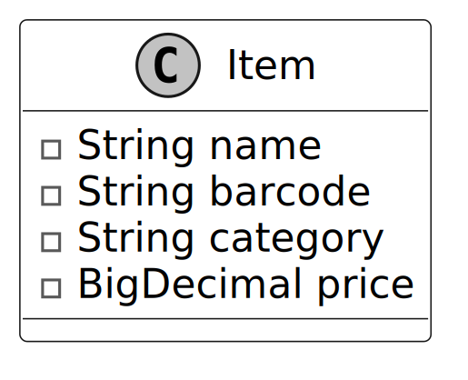

### Catalog

The `Catalog` class is responsible for maintaining a structured list of all available products, each uniquely identified by a barcode. It provides methods to add, update, remove, and retrieve items.

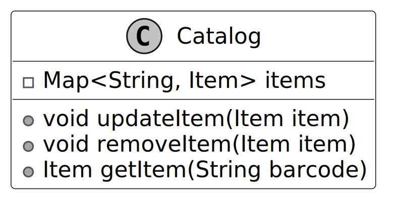

### Inventory

Building on the `Catalog` class, the `Inventory` class is a critical component of the grocery store system, responsible for managing stock levels of items. It maintains a mapping between each item's barcode and its corresponding stock quantity.

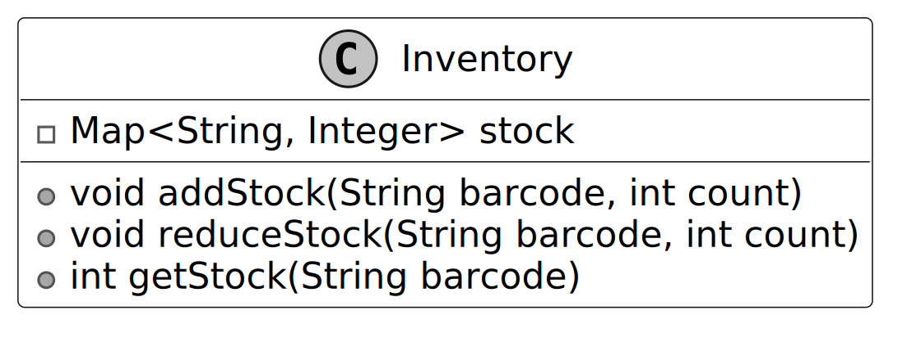

> **Design Choice:** To ensure modularity and maintainability, we have deliberately separated static product details from dynamic stock levels: Static Data (Catalog): Product metadata, such as name, category, and price, is managed by the `Catalog` class. This allows consistent, centralized handling of product information that does not change frequently. Dynamic Data (Inventory): Stock levels, which change frequently due to operations like sales and shipments, are managed independently in the `Inventory` class. This separation simplifies both classes and adheres to the Single Responsibility Principle, ensuring each class focuses on a distinct aspect of the system.

### DiscountCriteria

The `DiscountCriteria` interface encapsulates the logic to determine whether a discount applies to an item. It provides a flexible, extensible framework for defining applicability checks, such as item-based and category-based criteria, allowing the system to support diverse discount rules without modifying existing code.

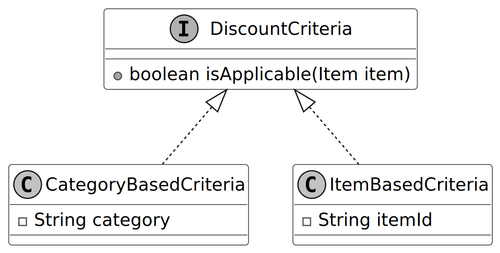

- **CategoryBasedCriteria:** The `CategoryBasedCriteria` determines whether a discount is applicable by verifying if an item belongs to a specific category. For example, if the discount targets the "Beverages" category and the item's category is "Beverages," the discount is applicable. This approach is ideal for campaigns that focus on broad groups of products, such as category-wide promotions.
- **ItemBasedCriteria:** The `ItemBasedCriteria` checks whether a discount applies to a specific item by matching its unique identifier. For instance, if the discount applies to an item with ID 12345 and the item's ID is 12345, the discount is considered applicable. This criterion is particularly useful for campaigns targeting specific products, such as special promotions or clearance discounts for individual items.

### DiscountCalculationStrategy

The `DiscountCalculationStrategy` interface encapsulates the logic for calculating discounts. It uses the Strategy Pattern to provide flexibility in applying a variety of discount types, such as fixed amount-based or percentage-based discounts.

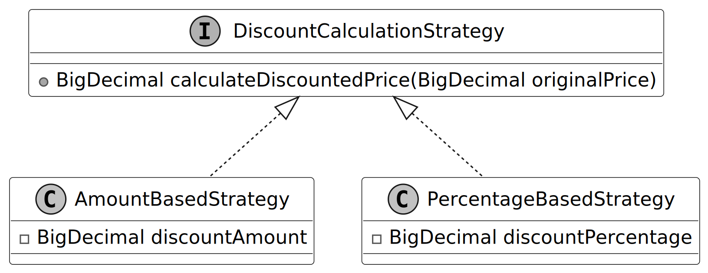

- **AmountBasedStrategy:** This strategy applies a fixed discount amount to the original price. For example, if the original price is $100 and the discount amount is $20, the resulting price after the discount will be $80. This approach is straightforward and is ideal for campaigns offering a constant monetary reduction.
- **PercentageBasedStrategy:** This strategy applies a percentage-based discount to the original price. For instance, if the original price is $100 and the discount percentage is 20%, the price after the discount will be $80. This strategy is particularly useful for campaigns offering proportional reductions, such as seasonal or category-based discounts.

> **Design Choice:** This design is highly extensible, as new discount strategies, such as tiered discounts or "Buy X Get Y Free," can be added seamlessly without modifying the existing implementation, adhering to the Open/Closed Principle.

### DiscountCampaign

Now, we design the `DiscountCampaign` class, which models active discount campaigns and is a key component for applying discounts. It leverages the Strategy Pattern to encapsulate different calculation strategies (e.g., percentage-based or fixed-amount discounts), ensuring flexibility in how discounts are computed. The class uses a `DiscountCriteria` interface to specify which items qualify for a discount, such as those in a particular category or with a specific barcode, allowing precise targeting of promotions while maintaining extensibility for new applicability rules.

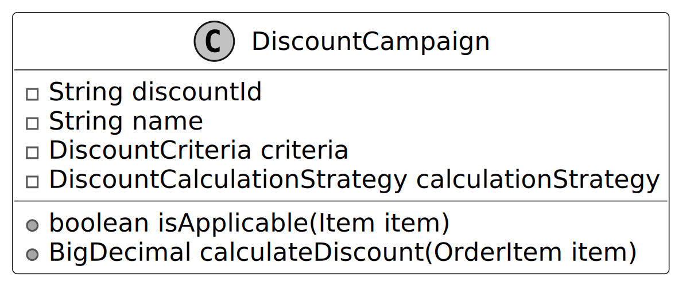

> **Design Choice:** By separating the applicability logic (criteria) from the calculation strategy, the class is more modular and easier to extend. New criteria types or calculation strategies can be added without modifying the existing implementation.

### OrderItem

The next component is the `OrderItem` class, which represents a specific item in an order, along with its quantity. It encapsulates methods to calculate the total price for the item, based on its unit price and quantity.

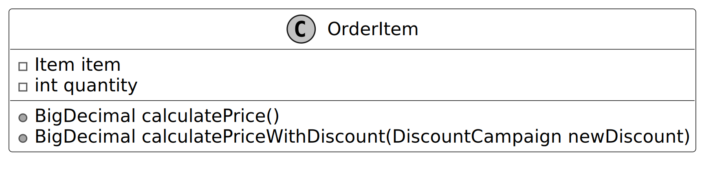

> **Design Choice:** The `OrderItem` class separates item-level details from the higher-level order. This ensures that each item's quantity and price logic are encapsulated, making the design modular and easier to maintain.

### Order

The `Order` class represents an active transaction during the checkout process. It tracks the list of items in order, along with any applied discounts. The class provides methods to calculate the subtotal (before discounts) and the total amount (after discounts).

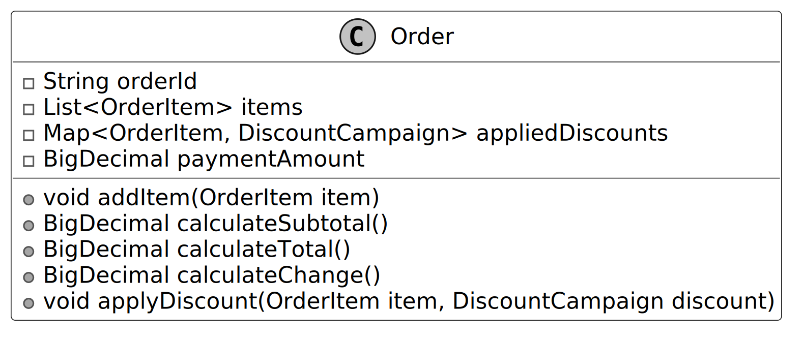

> **Design Choice:** The `Order` class focuses on managing transactional data for the checkout process. It delegates the handling of individual item quantities to the `OrderItem` class, ensuring a clean separation of responsibilities.

### Receipt

The `Receipt` class acts as the final record of a completed transaction, consolidating all relevant details into a formatted output for the customer. It includes essential transaction information such as the order summary, payment details, and any changes to be given to the customer.

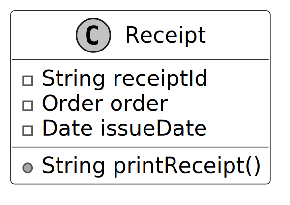

> **Design Choice:** The `Receipt` class focuses solely on presenting transaction data in a customer-friendly format. It delegates all business logic, such as order calculations and discount handling, to the `Order` and `OrderItem` classes. This ensures the receipt remains lightweight and dedicated to its role as a transaction summary.

### Checkout

Moving on to the `Checkout` class, which encapsulates the logic for handling the checkout process within the grocery store system. It maintains an active `Order` object to track the transaction details. Additionally, it applies active discount campaigns by determining their applicability and performing calculations.

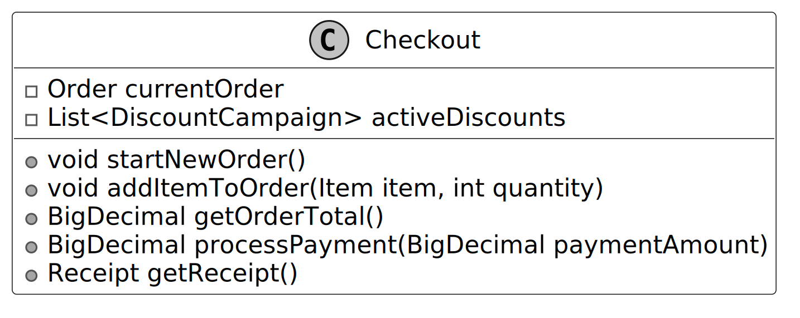

> **Design Choice:** Despite its central role, the `Checkout` class remains lightweight because the responsibilities for managing items, discounts, and calculations are delegated to well-separated components such as `Order`, `DiscountCampaign`, and the underlying strategy classes. This modular design ensures a clean separation of concerns and keeps the checkout logic manageable.

### GroceryStoreSystem

Finally, we design the `GroceryStoreSystem` class, which serves as a facade that simplifies interaction with the components of the system, such as the `Catalog`, `Inventory`, and `Checkout`. By providing a unified interface, it abstracts away the underlying complexity, making the system easier for clients to use. In an interview, this facade also allows us to validate that we have addressed the requirements by mapping them to the facade methods.

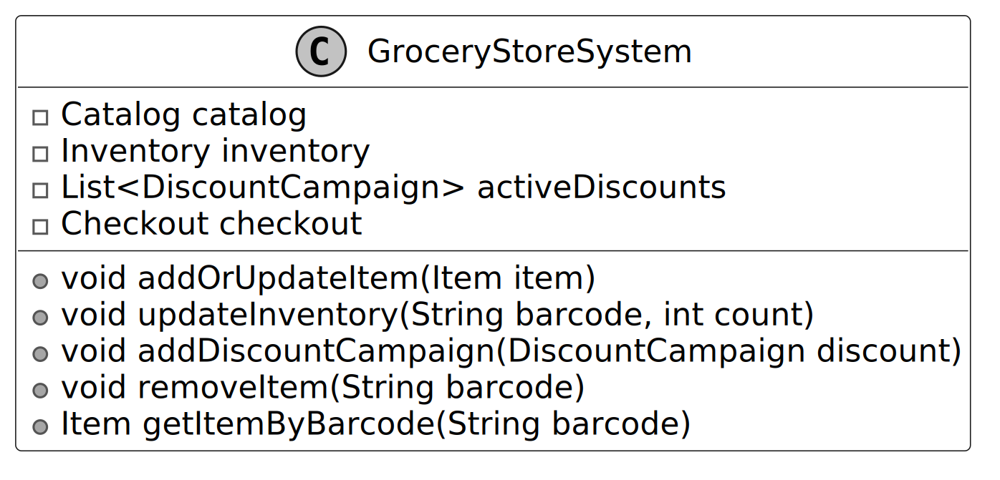

### Complete Class Diagram

Below is the complete class diagram of our grocery store system. The detailed methods and attributes are skipped to make the diagram more readable.

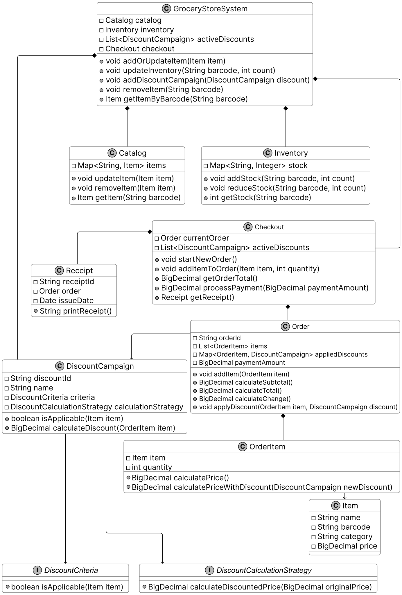

## Code - Grocery Store System

In this section, we’ll implement the core functionality of the grocery store system, focusing on key areas such as managing products and inventory, and streamlining the checkout process, including discount handling.

### System Data Flow

The operations of the system revolve around the checkout process driven by `GroceryStoreSystem` facade and its `Checkout` engine:

1. **Setup & Initialization:** `GroceryStoreSystem` initializes empty `Catalog`, `Inventory`, and `Checkout` instances. Admins populate the system by calling `addOrUpdateItem()`, `updateInventory()`, and `addDiscountCampaign()`.
2. **Checkout Start:** A cashier starts a new customer transaction by calling `Checkout.startNewOrder()`, which creates an empty `Order` object.
3. **Item Scanning:** As items are scanned, the cashier calls `addItemToOrder(item, quantity)`.
   - An `OrderItem` is created containing the unit cost and total un-discounted price.
   - The system iterates over `activeDiscounts` checking applicability using the Strategy Pattern (`isApplicable(item)` via `CategoryBasedCriteria` or `ItemBasedCriteria`).
   - If multiple discounts apply, it compares them via `calculatePriceWithDiscount(discount)` and registers the best one to the `Order.appliedDiscounts` map.
4. **Calculations:** Calling `getOrderTotal()` calculates the subtotal by streaming `items` and checking `appliedDiscounts`. The total gets returned for the cashier.
5. **Finalization:** The cashier accepts payment via `processPayment(paymentAmount)`, which subtracts the total and registers the change returned. `getReceipt().printReceipt()` formats all objects into the customer receipt string.

*(Implementation details are available in the Java files in the `src/grocery` directory)*

## Deep Dive Topics

In this section, we’ll explore some common follow-up topics interviewers may ask about the grocery store system.

### Flexible Discount Criteria

The current design encapsulates discount logic into two components:
- **Criteria:** Determines whether an item qualifies for a discount.
- **Price Calculation Strategy:** Computes the discounted price for eligible items.

This design provides reusability by allowing different combinations of discount policies to be expressed without duplicating code. However, what if the interviewer asks you to implement more complex composite discounts, such as:

- "If total electronics purchases exceed $100, apply a 10% discount; if they exceed $200, apply a 20% discount."
- "Buy at least 3 units of the same item in the food category for a special price."

These scenarios require combining multiple criteria and calculations. We can handle such complexity by enhancing the design using the **Composite Pattern** for criteria and the **Decorator Pattern** for sequential calculations.

> _Note: To learn more about the Composite Pattern and its common use cases, refer to the Unix File Search chapter of the book._

### Combining Multiple Criteria

To address nested or combined criteria, we will use the **Composite Pattern**, which is particularly well-suited for scenarios where hierarchical structures or combinations of logic are required. Composite criteria allow us to combine multiple rules (e.g., category-based, item-based) using logical operators like AND and OR, without hardcoding the logic. For example, it can check if an item belongs to a specific category and meets a minimum price threshold.

**Design changes:**
Add a `CompositeCriteria` class to support combining criteria.

### Layering Discount Calculations

To manage sequential discount calculations, we can use the **Decorator Pattern**. By wrapping multiple calculation strategies, we can apply discounts in a specific order without modifying the underlying strategy logic. For example:
- Apply a fixed discount first.
- Then apply a percentage-based discount to the remaining price.

> _Note: To learn more about the Decorator Pattern and its common use cases, refer to the Further Reading section at the end of this chapter._

**Design changes:**
Introduce decorators like `FixedDiscountDecorator` and `PercentageDiscountDecorator` to wrap existing strategies.

By combining nested criteria and sequential calculation strategies, we can design a highly flexible discount system capable of handling even the most complex scenarios. This design approach not only simplifies implementation but also demonstrates a deep understanding of abstraction and extensibility principles, which are crucial in object-oriented design interviews.

## Wrap Up

In this chapter, we designed a grocery store system. We tried to solve the grocery store problem in a step-by-step manner, just like a candidate would do in an actual object-oriented design interview. We started off by listing down the requirements through a series of question/answer formats between the candidate and the interviewer. We then identified the core objects, followed by the class diagram of the grocery store, and presented the implementation code.

The most important takeaway is the clear separation of concerns, where each component, such as `Catalog`, `Inventory`, `Order`, and `DiscountCampaign`, focuses on a specific responsibility. This modularity not only simplifies individual components but also ensures they integrate seamlessly.

In the deep dive section, we explored advanced topics like implementing composite discounts and layering multiple calculation strategies. These enhancements showcase how abstraction and extensibility can handle complex real-world scenarios, such as applying tiered discounts or combining fixed and percentage-based discounts.

Congratulations on getting this far! Now give yourself a pat on the back. Good job!

## Further Reading: Decorator Design Pattern

This section gives a quick overview of the design patterns used in this chapter. It’s helpful if you’re new to these patterns or need a refresher to better understand the design choices.

### Decorator design pattern

Decorator is a structural design pattern that allows you to add new behaviors to an object by wrapping it in another object that provides the additional functionality, without modifying the original object’s code.

In the grocery store system design, we have used the Decorator pattern to layer multiple discount calculations by wrapping a `DiscountCalculationStrategy` object in decorator classes like `FixedDiscountDecorator` and `PercentageDiscountDecorator`. This allows the system to apply discounts sequentially, such as a fixed amount followed by a percentage reduction, during checkout without altering the core discount strategy.

To illustrate the Decorator pattern in another domain, consider a text formatting system where a document editor applies styles like bold or italic to text content to enhance its appearance.

**Problem**
Imagine you’re developing a text editor where users can format text with styles like bold, italic, or underline. Initially, you might handle these by modifying the `Text` class with conditional logic or creating subclasses for each style combination (e.g., BoldText, BoldItalicText). However, this leads to complex code or an explosion of subclasses, making it difficult to add new styles (e.g., strikethrough) or combine multiple styles (e.g., bold and italic).

**Solution**
The Decorator Pattern addresses this by creating decorator classes that implement the same interface as the `Text` class and wrap a `Text` object to add new behaviors. For example, a `BoldDecorator` wraps a `Text` object to add bold formatting to its display, while an `ItalicDecorator` adds italic formatting. The editor interacts with the decorated text through the same interface, enabling seamless style application. Decorators can be stacked to combine styles (e.g., bold and italic), providing flexibility without altering the `Text` class.

Here’s a simple diagram showing the Decorator pattern for text formatting:

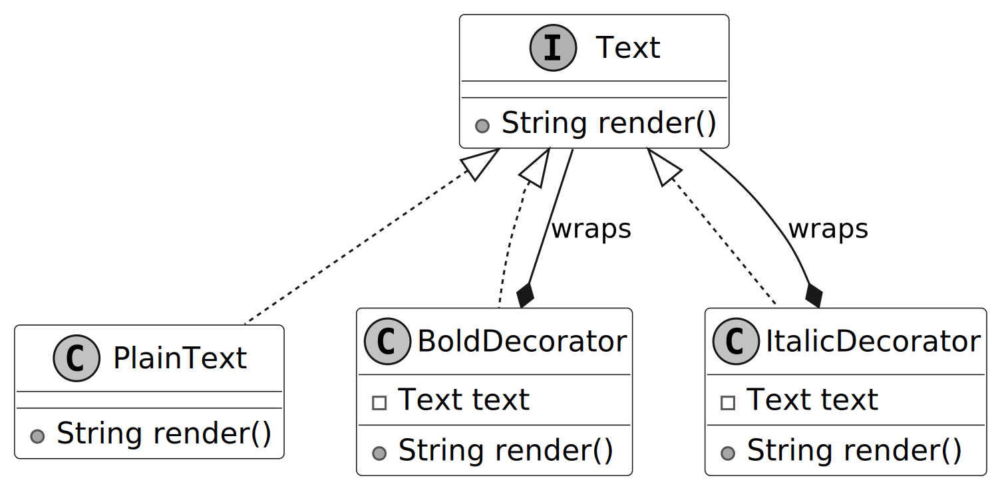

`Text` is the common interface that `PlainText`, `BoldDecorator`, and `ItalicDecorator` implement. The advantage is that we can treat all objects uniformly through the `Text` interface, allowing decorators to wrap and enhance text formatting, like bold or italic, without knowing the underlying object’s type.

**When to use**
The Decorator design pattern is useful in scenarios:
- When you need to add features or behaviors to objects dynamically at runtime without modifying their code.
- When subclassing results in too many combinations of features (e.g., BoldItalicText), composition is a simpler alternative.
