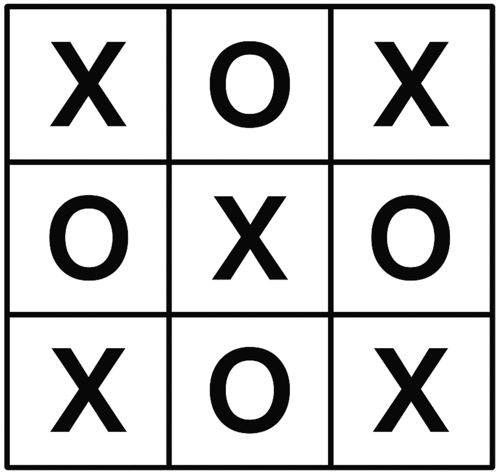
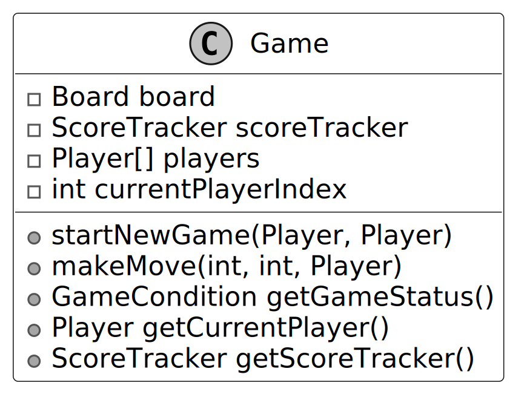
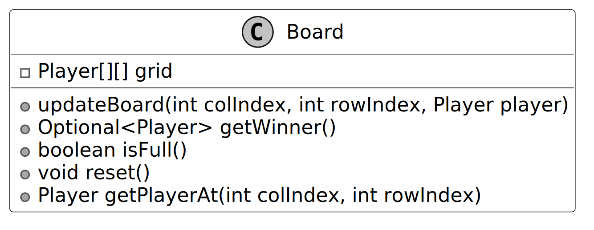
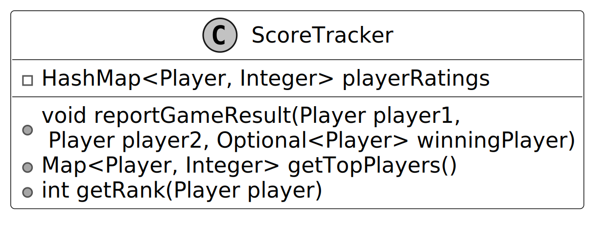
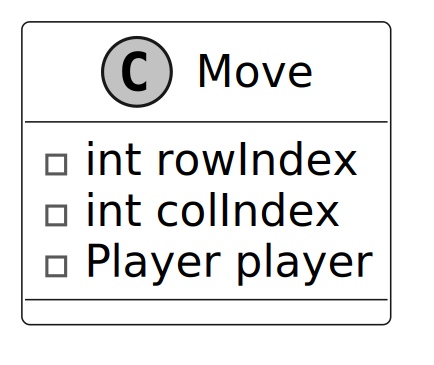
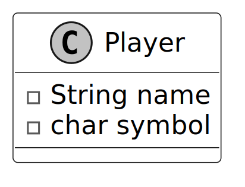
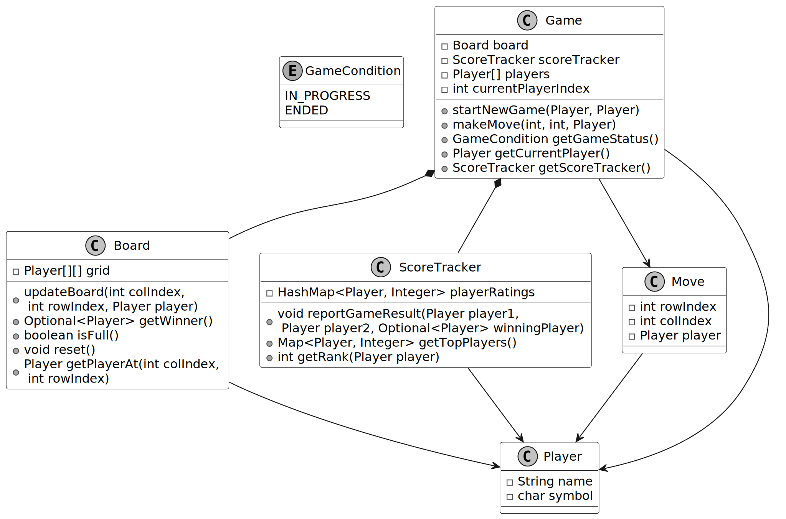
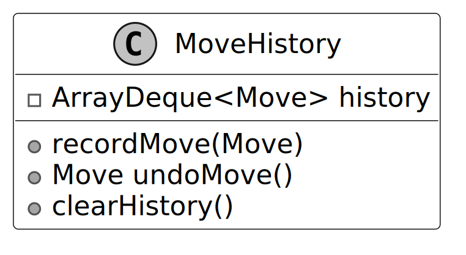
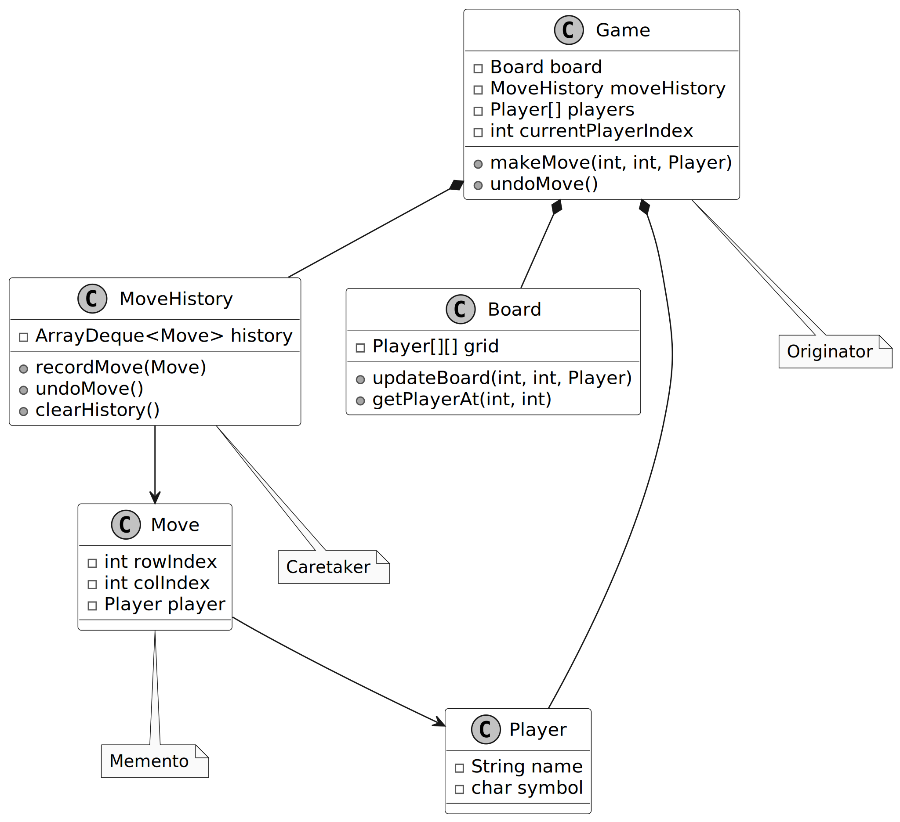

# Design a Tic Tac Toe Game

In this chapter, we will explore the object-oriented design of a Tic-Tac-Toe game. We aim to create an interactive platform where two players alternate turns, placing their symbols on a virtual board. We’ll design key components such as the game board, player move tracking, outcome determination, and a score tracker for managing player ratings.

How Tic-Tac-Toe Works: Tic-Tac-Toe is a classic two-player game played on a 3x3 grid. Each player selects a symbol ("X" or "O") and takes turns placing it in an empty cell. The goal is to align three identical symbols horizontally, vertically, or diagonally. The game concludes with a win if a player achieves this alignment, or a draw if all nine cells are filled without a winner.

Let’s gather the key requirements through a mock interview scenario.

## Requirements Gathering

Here’s an example of a typical prompt an interviewer might present:

> “Imagine you and a friend are sitting down for a quick game of Tic-Tac-Toe. You each choose a symbol (e.g., “X” or “O”) and take turns placing your symbol on a board. After each move, the game checks if someone has won or if the board is full, signaling a draw. Behind the scenes, the game tracks your moves, updates a scoreboard to reflect wins, and maintains player rankings for future matches. Let’s design a Tic-Tac-Toe game system that handles all this.”

### Requirements clarification

Here is an example of how a conversation between a candidate and an interviewer might unfold:

**Candidate:** Does the game support different board sizes?
**Interviewer:** No, let’s stick to the standard 3x3 board for simplicity.

**Candidate:** How should the game handle outcomes like wins, losses, and draws?
**Interviewer:** The system must detect winning patterns and notify players of the result: win, draw, or ongoing.

**Candidate:** Should the game track player ratings?
**Interviewer:** Yes, the game should maintain a score tracker that updates player ratings based on game outcomes (win, loss, or draw).

**Candidate:** How does the game handle invalid moves?
**Interviewer:** If a player attempts a move in an occupied or invalid position, notify them and prompt them for a new move.

Based on this discussion, let’s nail down the key functional requirements.

### Requirements

Here are the key functional requirements we’ve identified:

- The game is played on a 3x3 board.
- The system determines the game’s status:
  - a win (three identical symbols aligned in a row, column, or diagonal)
  - a draw (a full board with no winner)
  - In progress.
- A score tracker records player performance, updates ratings based on wins, and supports queries like rankings or top players.
- Invalid moves (e.g., placing a symbol in an occupied cell) are rejected with feedback to the player.

Below are the non-functional requirements:

- The user interface should be intuitive, providing clear feedback for invalid moves and game outcomes, with easily accessible gameplay instructions.
- The system should support future enhancements, such as different board sizes or game modes, without major architectural changes.

## Identify Core Objects

Before diving into the design, it’s important to identify the core objects.

- **Board:** The `Board` class models the 3x3 game grid where players place their symbols (e.g., "X" or "O"). It handles updates to the grid, checks for a winner by examining rows, columns, and diagonals, and determines if the board is full.
- **Player:** This class represents an individual playing the game.
- **Game:** The central entity of the Tic-Tac-Toe game is the `Game` class. It coordinates turn-taking between players, validates moves (e.g., ensuring a cell isn’t occupied), and tracks the game’s status, whether it’s in progress or ended with a winner or draw.
- **ScoreTracker:** Tracks player ratings across games, updating them based on outcomes.

> **Design Choice:** The `Game` class can become overloaded because it handles multiple operations. To keep it manageable, we delegate the `Board` to manage the grid and `ScoreTracker` to handle player ratings. This modularity enhances maintainability and scalability.

Now that we’ve identified the core objects, let’s design their relationships in a class diagram.

## Design Class Diagram

In this section, we’ll define the class structure for a Tic-Tac-Toe game. The goal is to create a cohesive design that adheres to OOD principles, such as the Single Responsibility Principle (SRP), while remaining flexible for future extensions. We’ll also explain the reasoning behind design choices and consider alternatives to provide insight into the decision-making process.

### Game

The `Game` class is the central coordinator of the Tic-Tac-Toe game. It manages the flow of gameplay, including initializing components, handling turns, and determining the outcome. To keep the design modular and manageable, certain responsibilities are delegated to other classes.

For instance, the `ScoreTracker` class is solely responsible for tracking player performance, updating win counts based on game outcomes. The `Board` class manages the game grid, ensuring moves are valid by checking for empty spaces and staying within bounds. The `Player` class remains stateless. It does not store win counts directly. This separation allows the centralized `ScoreTracker` to monitor player performance across multiple games, setting the stage for a scalable ranking system, which we’ll explore in more depth later.

### Board

The `Board` class represents the 3x3 game grid, which is modeled as a two-dimensional array of `Player` objects. It is responsible for enforcing game rules at the board level, ensuring that moves are made within valid positions. It determines if a player has won by checking for three matching symbols in a row, column, or diagonal. Additionally, it provides functionality to reset the grid for a new game and allows retrieval of player symbols at specific grid positions.

> **Design Choice:** The choice to include win-checking logic within the `Board` class, rather than the `Game` class, aligns with Single Responsibility Principle (SRP), as the `Board` is the owner of grid-related rules.

### ScoreTracker

The `ScoreTracker` class is designed to monitor player performance across multiple games by maintaining a centralized scoreboard for a group of players. While real-world systems often employ complex methods that dynamically adjust scores based on performance distributions and other factors, a more straightforward approach suits an interview setting. Here, we can rate players based solely on their number of wins, keeping the logic straightforward yet effective.

Instead of embedding ratings as an attribute within the `Player` class, we delegate this responsibility to `ScoreTracker`. This design choice stems from the nature of ratings: unlike a player’s name (an inherent trait), ratings are contextual, reflecting performance relative to others in a group. They shift as games are played, impacting multiple players simultaneously, and in advanced systems, they may even evolve over time. By isolating this logic in `ScoreTracker`, we also open the door to future enhancements, such as supporting players in multiple leagues with distinct ratings.

To achieve this, `ScoreTracker` employs a `HashMap<Player, Integer>` named `playerRatings` to store win counts for all players. This centralized structure enables efficient management of the population’s ratings and supports key operations: updating scores after the game ends, identifying the top-ranked player, and determining any player’s rank. This modular approach not only encapsulates rating logic but also enhances maintainability and scalability.

When a game ends, the `reportGameResult` method determines the winner and updates the score tracker. If the game results in a draw, no score changes are made.

### Move

The `Move` class acts as a straightforward data structure designed to capture a player's move in the game. It stores the row and column indices where the player placed their symbol, along with a reference to the player who made the move. By bundling these details (row, column, and player) into a single `Move` object, rather than passing them as separate parameters across various methods, the code becomes more readable and easier to maintain.

### Player

The `Player` class encapsulates the core attributes of a player in the game: their name and assigned symbol (such as "X" or "O"). These attributes make it simple to identify which player is responsible for a given move.

While it might seem intuitive to include real-world actions like making moves or updating ratings within the `Player` class, this would violate the Single Responsibility Principle (SRP). In a well-designed system, responsibilities are clearly divided:

- The `Board` class is the sole source of truth for validating and placing moves on the grid.
- The `ScoreTracker` class tracks and updates player ratings, as ratings depend on the broader context of a group of players and require uniform updates across all players.

### Complete Class Diagram

Below is the complete class diagram of the Tic-Tac-Toe game:

## Code - Tic-Tac-Toe Game

In this section, we’ll implement the core functionalities of the Tic-Tac-Toe game, focusing on key areas such as managing the game board, handling player turns, determining the winner, and tracking player ratings through a score tracker.

_(Implementation details are available in the Java files in the `src/tictactoe` directory)_

## Deep Dive Topic: Implement undo functionality in Tic-Tac-Toe

At this point, you have met the basic requirements of the question. In this section, we will explore some potential extensions in more detail.

Imagine you’re playing Tic-Tac-Toe, and you accidentally place your ‘X’ in the wrong spot. Wouldn’t it be great to hit an undo button and try again? Let’s dive into how we can implement undo functionality in a Tic-Tac-Toe game, step by step.

### Step 1: Track move history

Every time a player makes a move, we store that move so it can be undone later. The `Move` class (which we've already designed as part of the main game logic) serves this purpose by capturing details such as `rowIndex`, `colIndex`, and the player.

### Step 2: Store Moves with a Stack

Since moves occur in a last-in, first-out (LIFO) order (i.e., the last move is undone first), we can use a stack (`ArrayDeque<Move>`).

- When a move is made, we push it onto the stack.
- When undo is requested, we pop the most recent move from the stack and revert the board to its previous state.

### Step 3: Reverse the Board State

The final step is to clear that spot on the board, and switch the current player back to whoever’s turn it was before. This is implemented via the `undoMove()` method inside the `Game` class.

What we discussed above is the essence of a well-known software design pattern called the **Memento Pattern**.

### Memento Pattern Definition

**Definition:** The Memento Pattern is a behavioral design pattern that allows an object to save and restore its previous state without exposing the details of its implementation. This pattern is useful in scenarios where undo or rollback functionality is needed, as it maintains a complete event history.

In this pattern:

- The **Memento** is an object that stores the state of another object at a specific point in time, acting as a snapshot. In our design, the `Move` class served as the Memento, capturing the state of a single move in the Tic-Tac-Toe game.
- The **Caretaker** is responsible for storing and managing Memento objects, typically keeping them in a collection and providing mechanisms to save or retrieve them. The `MoveHistory` class played the role of the Caretaker, maintaining a stack of `Move` objects (Mementos) and offering an `undoMove()` method to retrieve the last move for reversal.
- The **Originator** is the object whose state is being captured and restored. It creates Memento objects to save its state and can use them to restore a previous state. The `Game` class acted as the Originator, creating `Move` objects during each `makeMove()` call to capture the move’s state and using the `undoMove()` method to restore the game state by clearing the board position of the last move.

However, one potential challenge of using the Memento Pattern is memory overhead. Every time a move is made, we store the entire move in the history. In Tic-Tac-Toe, this isn't much of a problem because the board is small, but in more complex games with larger states, the memory required to store each memento could become a bottleneck.

## Wrap Up

In this chapter, we designed the Tic-Tac-Toe game. We started by gathering and clarifying the requirements through a series of questions and answers. Next, we identified the core objects involved, designed the class diagram, and implemented the key components of the game.

A key takeaway from this design is the importance of modularity and clear separation of concerns. Each component, such as the `Board`, `Game`, `Player`, and `ScoreTracker` classes, focuses on a specific responsibility, ensuring the system is maintainable and easy to extend.

In the deep dive section, we explored advanced topics, including using the Memento Pattern to handle undo functionality, enabling players to revert their moves while maintaining the integrity of the game state.

Congratulations on getting this far! Now give yourself a pat on the back. Good job!
