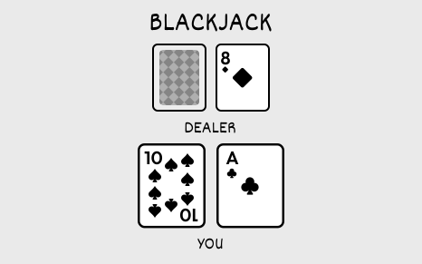
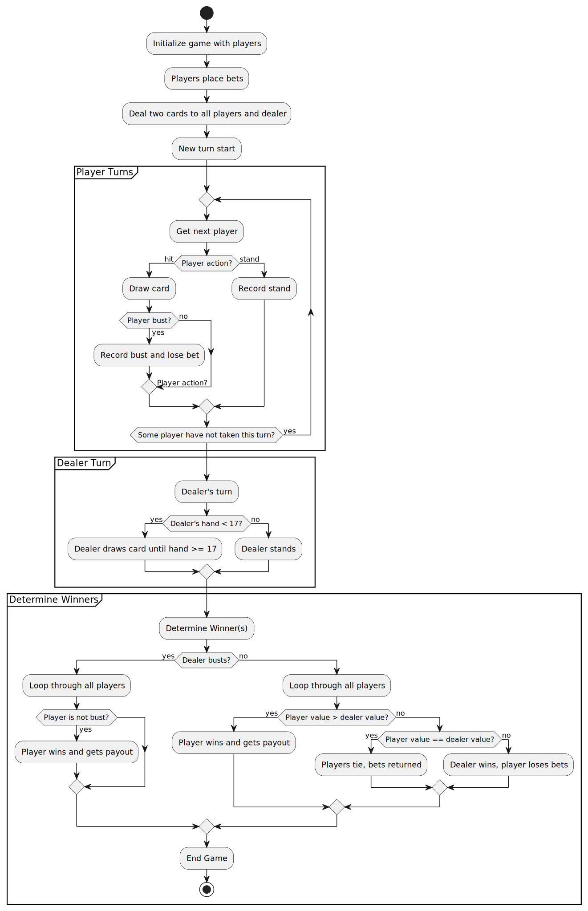
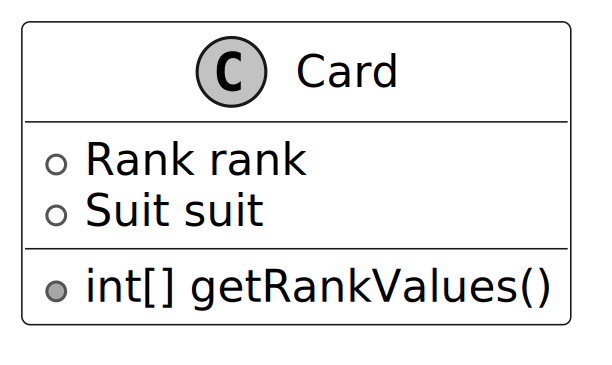
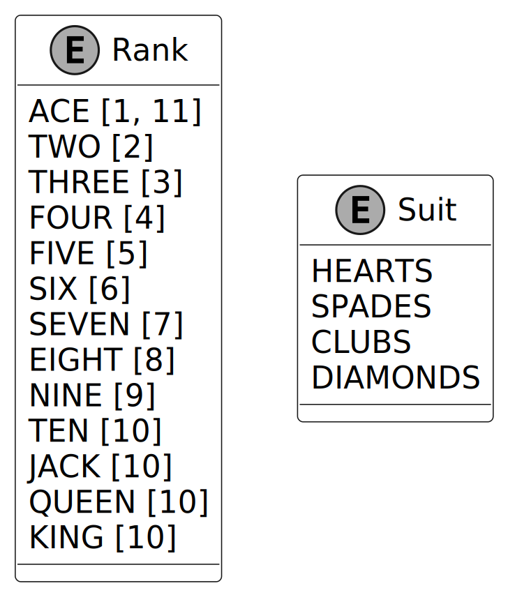
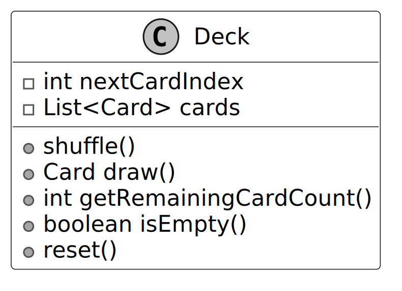
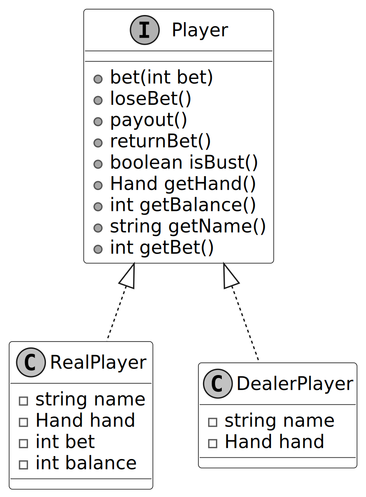
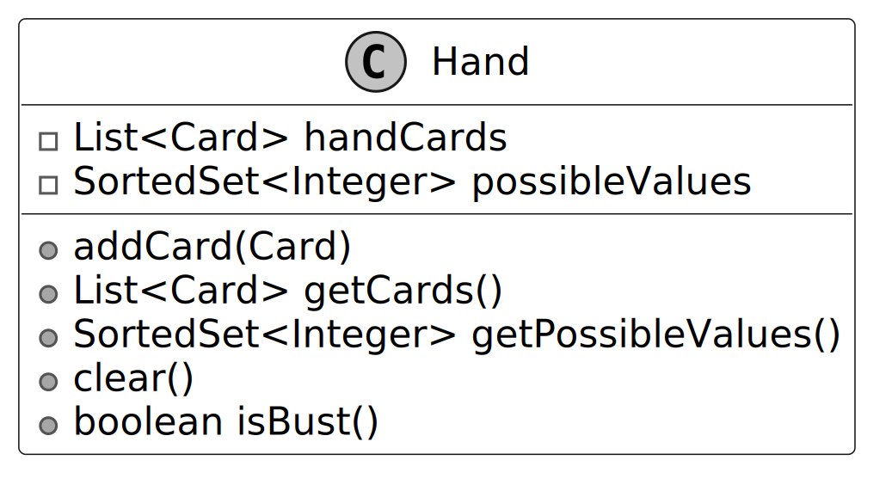
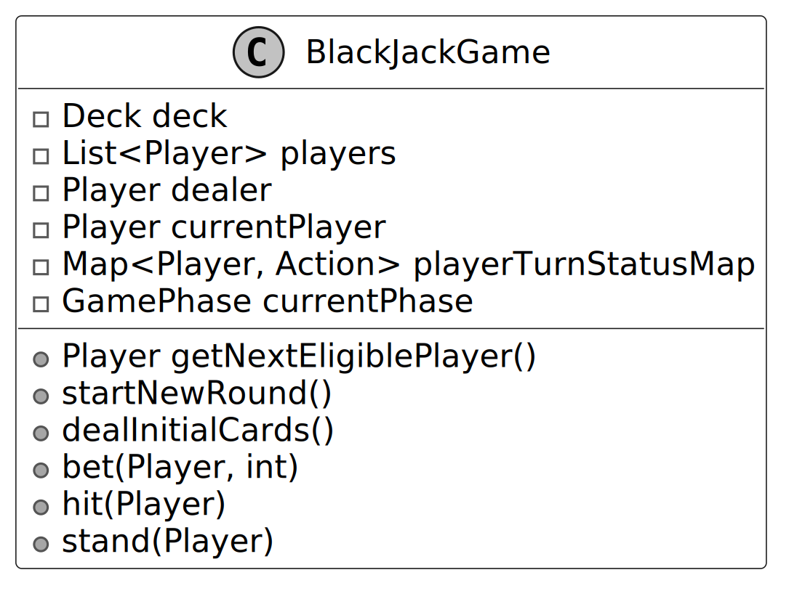
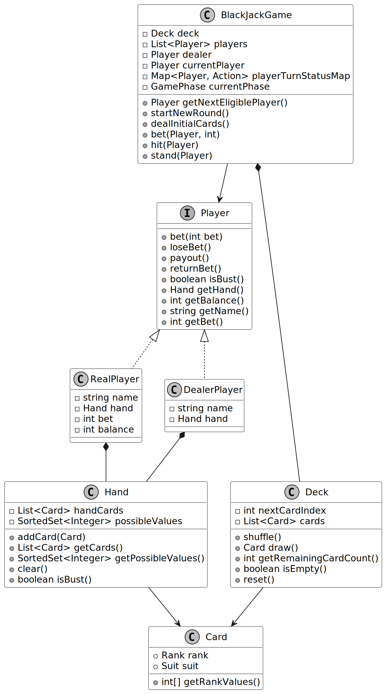

# Design a Blackjack Game

In this chapter, we will discuss the object-oriented design of the Blackjack game (also called “21”). Blackjack is a popular card game where the goal is to get a hand of cards that adds up to 21, or as close as possible, without going over. The game is a mix of strategy (deciding when to hit or stand) and luck (the cards you get), making it a captivating and iconic casino game.

Let’s gather the game’s requirements through a typical interview-style conversation.

## Requirements Gathering

Here’s an example of a typical prompt an interviewer might present:

> “Picture yourself at a casino table, ready to play a round of Blackjack, also known as ‘21.’ At the start, you and other players place bets, and the dealer distributes two cards to each player, including themselves. You evaluate your hand, aiming to get as close to 21 as possible without going over, and decide whether to hit or stand. After all players make their moves, the dealer reveals their hand and hits until reaching at least 17, then stands. Behind the scenes, the game manages a deck of cards, tracks player actions, ensures fair dealing, and updates balances. Let’s design a Blackjack game system that handles all this.”

*Note: Blackjack has various rules (e.g., soft 17, double down, splitting). This document focuses on the technical design and object-oriented implementation of a simplified standard Blackjack game.*

### Requirements clarification

Here is an example of how a conversation between a candidate and an interviewer might unfold:

**Candidate:** Should I design the game to support multiple players or just one player competing against the dealer?
**Interviewer:** The game should support multiple players.

**Candidate:** What happens after a player takes their turn?
**Interviewer:** After each player takes their turn (“hit” or “stand”), the game should check if all players have either stood or busted (hand value exceeding 21). When this happens, the game should determine the winner by comparing each player's hand value and settle the bets.

**Candidate:** Should the dealer follow any specific rules for when to hit or stand?
**Interviewer:** Yes, the dealer should continue to "hit" until their hand totals at least 17. Once they reach 17 or higher, they must "stand."

**Candidate:** How are bets handled in the game, and how are players paid?
**Interviewer:** Players place their bets before the initial cards are dealt. Players who win receive a payout equal to their bet (e.g., a $10 bet wins $10, plus their original bet returned), while players who bust lose their bet.

### Requirements

Based on the conversation, here are the key functional requirements we’ve identified.

- The game should support multiple players and a dealer.
- Players should be dealt two cards at the beginning of the game.
- Players should have the option to "hit" (request an additional card) or "stand" (keep their current hand).
- Aces should be valued as 1 or 11, with the value chosen to optimize the player’s hand.
- After each player’s turn, the game checks if all players have stood or busted. Once all players have completed their turns, the dealer takes their turn, hitting until their hand totals at least 17, then standing. The game then determines the winner and settles the bets.
- Players who win receive a payout equal to their bet (1:1), while players who bust lose their bet.

Below are the non-functional requirements:

- The user interface must be intuitive, with clear prompts and visual feedback on game state to accommodate users with minimal Blackjack experience.

With these requirements in hand, let’s map out the game’s flow using an activity diagram to visualize how it all comes together.

## Activity Diagram

Understanding the flow of a game like Blackjack is crucial when designing its object-oriented structure, especially given the game’s mix of sequential steps and decision points. This is where an activity diagram comes into play. An activity diagram visually maps out the workflow of the game, capturing each action, decision, and transition in a clear, step-by-step manner.

In the context of Blackjack, this means outlining everything from dealing cards to determining winners, ensuring we account for all possible paths, such as a player busting or the dealer hitting until 17. Let’s look at the activity diagram for Blackjack, which captures this process in detail.

Now that we’ve got a clear picture of the game’s flow, let’s break down the core objects we’ll need to bring this design to life.

## Identify Core Objects

As we have done in earlier chapters, let’s enumerate the core objects.

- **BlackJackGame:** The `BlackJackGame` class acts as the central entity of the game, managing the overall flow from start to finish. It is responsible for dealing cards, tracking player actions (“hit”, or “stand”), and determining the winner.
- **Player:** The `Player` interface represents each participant in the game, with concrete implementations as `RealPlayer` for humans tracking bets and balance, and `DealerPlayer` for the dealer, who does not place bets and must hit until reaching a hand value of 17 or higher, as per Blackjack rules.
- **Hand:** Each player is associated with a `Hand` class, which manages the cards they receive during the game. This class calculates all possible hand values based on the cards held. This is especially important when handling Aces, which can count to 1 or 11, depending on which value keeps the player’s hand value closer to 21 without exceeding it.
- **Deck:** The `Deck` class is responsible for managing the collection of cards used in the game. It shuffles the cards when a new round begins and provides a new card when a player requests a hit.
- **Card:** Each individual card is represented by the `Card` class, which is defined by its `Rank` and `Suit` enums. The `Rank` determines the card’s value in the game, while the `Suit` provides its identity, such as “Hearts” or “Spades”.

## Design Class Diagram

Now that we know the core objects and their roles, the next step is to create classes and methods to build the Blackjack game.

### Card

The `Card` class is a straightforward, immutable building block that holds a rank and a suit. It acts as a data-only entity with no behavior. This ensures immutability to prevent accidental changes and maintain game consistency.

> Note: Immutability means that once a card is created, its rank and suit cannot be changed.

The `Card` class is kept simple, it uses `getRankValues()` to fetch values from `Rank`. It leaves the heavy lifting of value calculations to the `Hand` class, sticking to a clean separation of duties. Note that the return value is a list of integers rather than a single value because Ace has two possible values (1 or 11).

> **Design Choice:** The `Card` class is designed as a standalone entity to represent individual cards, enabling reuse across multiple decks or game variants.

Since `Card` relies on `Rank` and `Suit` to define its value and identity, let’s explore those next.

### Rank and Suit enumerations

When modeling `Rank` and `Suit`, enums are the ideal choice as they’re type-safe, readable, and easy to maintain.

- `Rank` captures card values: numbers 2 through 10 are worth face value, Jack, Queen, and King are each worth 10, and an Ace can be either 1 or 11, depending on what benefits the hand most.
- `Suit` lists the standard four options: Hearts, Diamonds, Clubs, and Spades.

> **Design Choice:** Why enums over other approaches? Consider using strings instead. You’d have a lot of flexibility, but that comes at a cost: extra validation to avoid invalid inputs, messy conversions when calculating hand values, and potentially higher memory usage. Integers might seem like a better alternative because they allow simple numeric representation (e.g., 1 for Ace, 10 for Jack), but they’re error-prone, developers might accidentally assign invalid values like 0 or 15, and their lack of inherent meaning requires additional checks, reducing the clarity that enums provide with named constants. For a card game like Blackjack, where precise values and clear representations are key, enums make the design both robust and easy to follow.

### Deck

The `Deck` class serves as the backbone of Blackjack’s card management, handling a standard 52-card deck. It uses a `List<Card>` to mimic a physical deck’s order, providing essential methods like shuffling to randomize the cards, drawing cards for players, counting the remaining cards, checking if the deck is empty, and resetting for a new round. This reset process shuffles the deck to ensure fair dealing.

Now that we’ve got a deck to draw from, let’s define the players who’ll use it.

### Player

The `Player` interface serves as the blueprint for all participants in Blackjack, laying the foundation for both human players and the dealer. For human players, the `RealPlayer` class tracks essential details like a player’s name, hand, current bet, and balance, while providing methods for placing bets, receiving payouts, and retrieving key information. `DealerPlayer`, on the other hand, represents the house (no betting or balance here), just hitting until reaching 17 or higher, per Blackjack rules.

> **Design Choice:** An interface-based design for `Player` is chosen to abstract common behaviors across human players and the dealer, promoting extensibility.

Now that our players are set, let’s look at how they’ll manage their cards with the `Hand` class.

### Hand

The `Hand` class manages the cards for a player or dealer in Blackjack, keeping track of a list of cards and calculating all possible hand values. It smartly handles Aces as either 1 or 11 to keep the hand as close to 21 as possible without going over. To support this, the class offers methods to add cards, access the card list, retrieve the possible values (stored as a sorted set to avoid duplicates), clear the hand for a new round, and determine if the hand is bust using `isBust()`.

> **Design Choice:** Keeping `Hand` separate from `Player` keeps the design clean and modular by splitting responsibilities: `Hand` focuses solely on managing the cards and their values, while `Player` handles other player-specific details like bets and balance.

### BlackJackGame

The `BlackJackGame` class is the central entity in our Blackjack game, orchestrating the action from the initial card dealing to the end of each round. It oversees the game’s deck, the players, and the dealer, handling card distribution, tracking turns, and wrapping up rounds by deciding winners and settling bets. To keep things fair, it ensures the dealer keeps hitting until reaching 17, then holds, while players get to choose whether to hit or stand.

### Complete Class Diagram

Below is the complete class diagram of the Blackjack game:

## Code - Blackjack

*(Implementation details are available in the Java files in the `src/blackjack` directory)*

## Deep Dive Topic: Decoupling player and dealer decision logic

In the current design, `BlackJackGame` directly controls player actions, calling `hit()` or `stand()` based on predefined conditions in the game logic. Similarly, the dealer’s "hit until 17" rule is hardcoded into `dealerTurn()`. This approach tightly couples decision-making with the game class, leaving little room for custom moves. Any rule modification, such as allowing a cautious player to stand at 12 or adjusting the dealer’s hit threshold, requires modifying `BlackJackGame`, leading to complex maintenance and potential bugs.

To resolve this, we introduce a decision-making abstraction that shifts control to individual players. This keeps `BlackJackGame` focused on coordinating turns, while each player determines their moves independently.

### Step 1: Define a decision-making interface

To give each player control over their moves, we create a `PlayerDecisionLogic` interface with one method, `decideAction(Hand)`, that picks ‘Hit’ or ‘Stand’ based on the hand.

### Step 2: Tailor decisions for humans and dealers

With the interface in place, we implement two concrete decision classes:
- `RealPlayerDecisionLogic`: This captures a human player’s approach, say, hitting if the hand’s below 16.
- `DealerDecisionLogic`: This locks in the dealer’s rule, hit if under 17.

### Step 3: Integrate decisions into players

We update the `Player` interface with a `getDecisionLogic()` method, letting each player define its decision style. `RealPlayer` defaults to `RealPlayerDecisionLogic`, while `DealerPlayer` uses `DealerDecisionLogic`.

### Step 4: Adjust the game flow

In this step, we refactor the `BlackJackGame` code to use decision logic for both players and the dealer, streamlining the turn sequence. We introduce the `performPlayerAction()` method, which queries each player’s decision logic (`RealPlayerDecisionLogic` or `DealerDecisionLogic`) to decide whether to hit or stand. This replaces the hardcoded `dealerTurn()` method, integrating the dealer into the same flow as the players.

This design shifts decision-making to the players, letting `BlackJackGame` coordinate turns while each player’s logic lives separately. If you’ve heard of the **Strategy Pattern**, you might notice this follows it, defining a set of decision rules that can swap in and out. Here:
- `PlayerDecisionLogic` sets the decision contract.
- `RealPlayerDecisionLogic` and `DealerDecisionLogic` are the specific behaviors.
- `BlackJackGame` uses them without needing to handle decisions internally.

## Wrap Up

In this chapter, we have built a solid Blackjack game from the ground up, with the key takeaway being how we structured responsibilities across `Card`, `Deck`, `Hand`, `Player`, and `BlackJackGame` into a clear, well-organized design. Each piece does its job, for instance, `Card` holds the essentials, `Deck` shuffles and deals, `Hand` tracks totals, and `BlackJackGame` runs the show. This approach keeps the game logical, easy to follow, and scalable.

We also took things further by decoupling decision-making with `PlayerDecisionLogic`, making it easy to swap strategies for players and the dealer. If you’re familiar with the Strategy pattern, you’ll recognize how it is applied here, giving the game flexibility without rewrites.

Congratulations on getting this far! Now give yourself a pat on the back. Good job!
