# Design a Shipping Locker System

In this chapter, we will design a Shipping Locker system similar to UPS, FedEx, or Amazon Locker. It offers customers a convenient and secure way to pick up their online orders. The system manages locker availability, assigns incoming packages to appropriate lockers, and ensures a smooth package retrieval process for customers.

To realize this vision of a convenient and secure locker system, let’s explore what it needs to do.

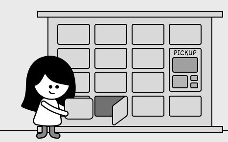

## Requirements Gathering

The first step in designing a shipping locker system is to clarify the requirements and narrow down the scope. Here is an example of a typical prompt an interviewer might give:

> “Imagine you’ve just received a notification that your online order has been delivered to a shipping locker near you. You head to the locker, enter a secure access code, and instantly, the door pops open, revealing your package. Behind the scenes, the system has already managed locker availability, assigned an appropriately sized compartment, and ensured a seamless pickup experience. Now, let’s design a shipping locker system that can do all of this.”

### Requirements clarification

Here is an example of how a conversation between a candidate and an interviewer might unfold:

**Candidate:** Does the system support multiple locker sizes?
**Interviewer:** Yes, the system has lockers of different sizes. The design should ensure packages are assigned to the smallest available locker that fits, optimizing space use.

**Candidate:** So, what happens when a package gets to the locker, and how does the customer end up picking it up?
**Interviewer:** When a package arrives, the system finds an open locker that’s the right size and assigns it there. Once the package is tucked inside, the customer gets a notification with the locker’s location and a unique access code. They just punch in the code to pop the locker open, grab their package, and that frees up the locker for the next delivery.

**Candidate:** Is there a time limit or any fees for using the locker?
**Interviewer:** Good question. That’s actually a big part of how the system works. We’ve got a locker policy that gives customers a ‘Free Period’, a set number of days during which they can use the locker for free. Once that’s up, we start charging a daily fee based on the locker’s size. And if the package sits there past a ‘Maximum Period,’ which is also predefined, one of our staff members steps in, pulls it out, and clears the locker for someone else.

**Candidate:** Since the system tracks locker usage costs through the locker policy, does it handle payments too?
**Interviewer:** For simplicity’s sake, we let an external service take care of the actual payment processing. That’s not something the system itself has to worry about.

### Requirements

Here are the key functional requirements we’ve identified:

- The system should keep track of all lockers and support different locker sizes.
- The system should smartly assign lockers by matching package size to the smallest available option that fits, keeping things efficient.
- Customers should be able to pop open their assigned locker with a unique access code.
- The system should monitor storage costs based on the customer’s locker policy, factoring in the daily rate tied to that specific locker size.

Below are the non-functional requirements:

- The system should handle a high volume of locker operations per site without performance degradation, accommodating busy locations.
- The system must maintain high availability, ensuring lockers are accessible to customers and staff at all times.

## Identify Core Objects

Before diving into the design, it’s important to identify the core objects.

- **Locker:** This class represents an individual locker.
- **Site:** This class represents a locker facility that consists of multiple lockers of various sizes. It is responsible for managing the collection of lockers and organizing them by size.
- **ShippingPackage:** An interface defining the standard for packages, with `BasicShippingPackage` as its concrete implementation, tracking details like order ID, dimensions, and status.
- **Account:** This class represents customers and their associated accounts. Customers own packages stored in lockers, and their accounts store policy information for free and maximum storage periods, along with their current balance.

## Design Class Diagram

Now that we know the core objects and their roles, the next step is to create classes and methods that turn the requirements into an easy-to-maintain system. Let’s take a closer look.

### Locker

The `Locker` class represents a physical storage unit for holding packages. It includes the following attributes:

- `LockerSize size`: Represents the size of the locker.
- `ShippingPackage currentPackage`: Stores the package currently assigned to the locker.
- `Date assignmentDate`: Tracks the date when the package was placed in the locker.
- `String accessCode`: A unique security code required for package retrieval.

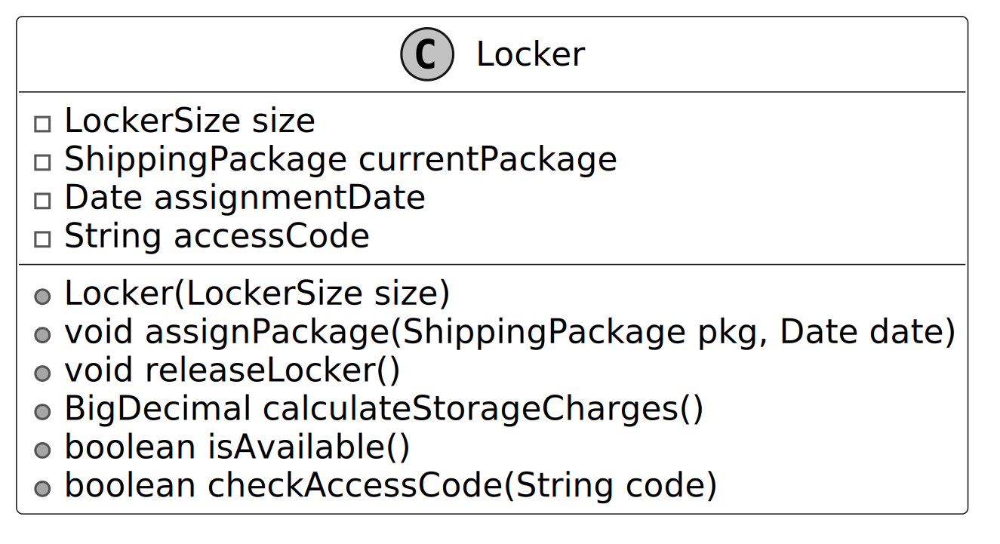

It provides functionalities such as assigning a package to the locker, releasing the locker upon package retrieval, calculating storage charges based on usage duration, determining locker availability, and ensuring secure access through code verification.

> **Design Choice:** The `Locker` class is designed as a standalone entity to encapsulate the state and behavior of an individual locker, ensuring modularity and ease of maintenance.

### LockerSize

The `LockerSize` enum represents the predefined sizes of lockers available in the system. Each size is associated with specific attributes that define its dimensions and daily usage charge.

- `String sizeName`: A label identifying the locker size (e.g., 'Small,' 'Medium,' 'Large').
- `BigDecimal dailyCharge`: The cost per day for using a locker of a specific size (“Small,” “Medium,” or “Large”).
- `BigDecimal width, height, depth`: The physical dimensions of the locker, determining its capacity to accommodate different package sizes.

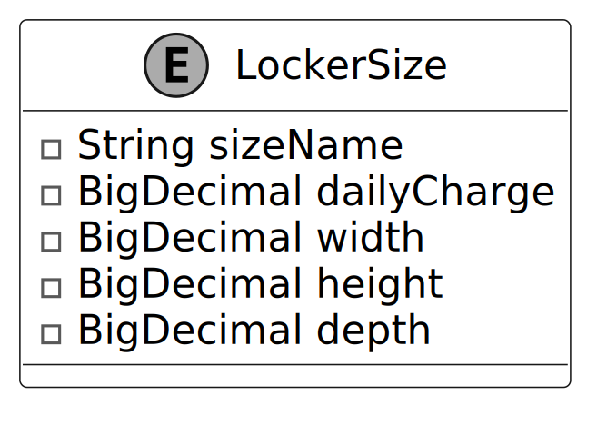

> **Design Choice:** We use an enum here because locker sizes, such as Small, Medium, and Large, are a fixed set of options that don’t change during runtime, ensuring type safety and simplicity.

### Site

The `Site` class models a physical location containing a collection of lockers, organized by their size.

Key functionalities include:

- `Locker findAvailableLocker(LockerSize size)`: This method searches for an empty locker that matches the exact size you need, like "small," "medium," or "large."
- `Locker placePackage(ShippingPackage pkg, Date date)`: This method takes a package, finds it a locker that fits, and locks it inside. It also keeps track of when the package was placed there and updates the package’s status.

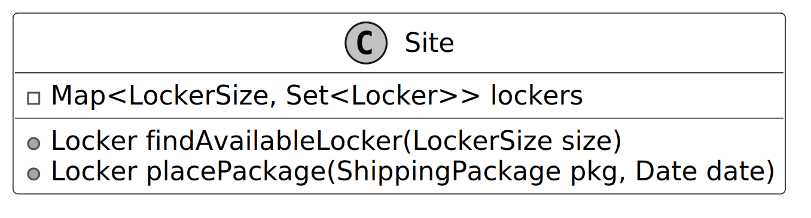

The lockers at each site are managed using a map-based structure, where the key is a `LockerSize` and the value is a set of lockers for that size. This structure allows quick access to available lockers based on their size.

### ShippingPackage

We have modeled `ShippingPackage` as an interface to establish a standard for all package types within the locker system. It defines key methods that any package type must implement to ensure compatibility with locker storage and retrieval processes. The `BasicShippingPackage` class is a concrete implementation of the `ShippingPackage` interface. It represents a standard package intended for storage in a locker.

The `ShippingStatus` enum defines a fixed set of valid states for a package’s lifecycle in the locker system, such as `PENDING`, `STORED`, and `RETRIEVED`. This enum ensures that package status updates are consistent and restricted to predefined values, enhancing type safety.

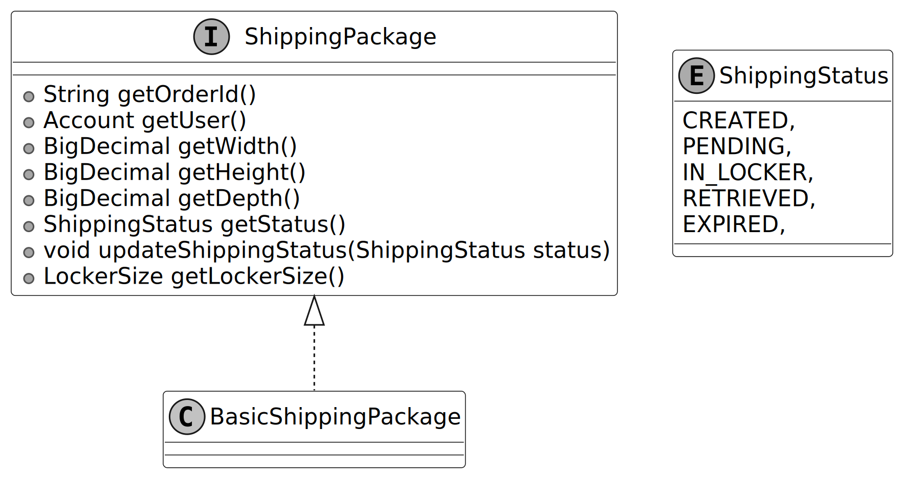

> **Design Choice:** Modeling `ShippingPackage` as an interface allows for extensibility, enabling the system to support diverse package types (e.g., fragile or perishable) without modifying core logic.

### Account

The `Account` class represents a customer using the locker system. It maintains the customer’s balance for locker-related charges and is associated with an `AccountLockerPolicy`, which defines terms for free usage limits and maximum storage duration. This ensures that charges are applied in accordance with the policy.

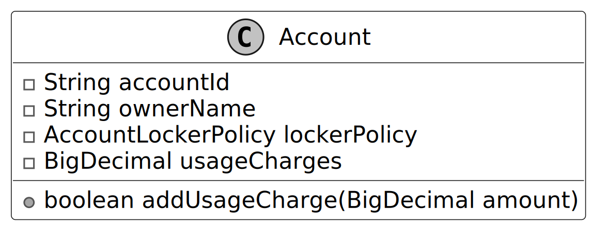

The class provides functionality to add funds to the account.

> **Design Choice:** By associating an `AccountLockerPolicy`, it supports flexible billing rules based on customer policies. This separation of customer and policy data enhances maintainability and allows for personalized locker usage terms.

### AccountLockerPolicy

This class defines the rules and policies for locker usage associated with an account. It includes the number of days during which locker usage is free (`freePeriodDays`) and the maximum number of days a package can remain in the locker before it must be cleared (`maximumPeriodDays`).

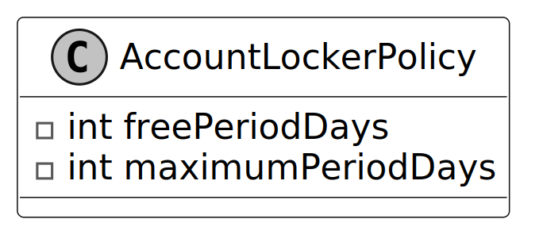

### NotificationInterface

Defines the contract for sending notifications. It includes a single method, `sendNotification`, which takes a message and an account as parameters.

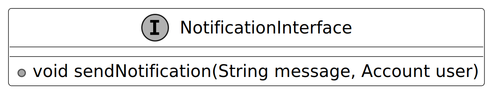

Implementations of this interface manage user notifications, such as alerts for package pickup availability and locker usage fees.

> **Best Practices:** In OOD interviews, external systems like notifications are often represented as interfaces to keep the design flexible and scalable while avoiding unnecessary complexity.

### LockerManager

The `LockerManager` class is responsible for managing package storage and retrieval at a specific site, ensuring that packages are assigned to suitable lockers based on size availability. It works with the following components:

- `Site site`: Represents the physical location of the lockers.
- `NotificationInterface notificationService`: Sends notifications to customers when their packages are assigned to a locker or ready for pick-up.
- `Map<String, Account> accounts`: Maintains a mapping of account IDs to user accounts for managing locker usage and charges.
- `Map<String, Locker> accessCodeMap`: Maintains a mapping of access codes to lockers, allowing for quick retrieval during package pick-up.

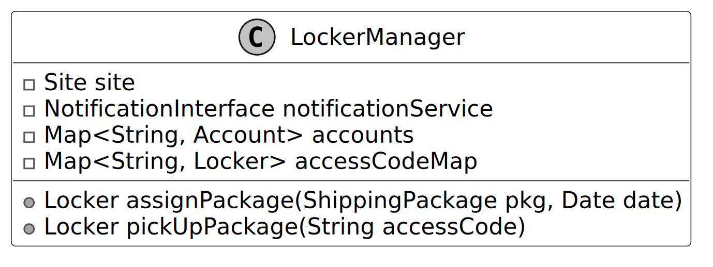

> **Design Choice:** The `LockerManager` class is designed as a facade to simplify interactions between core objects, providing a single point of control for package assignment and retrieval.

### Complete Class Diagram

Below is the complete class diagram of the shipping locker service:

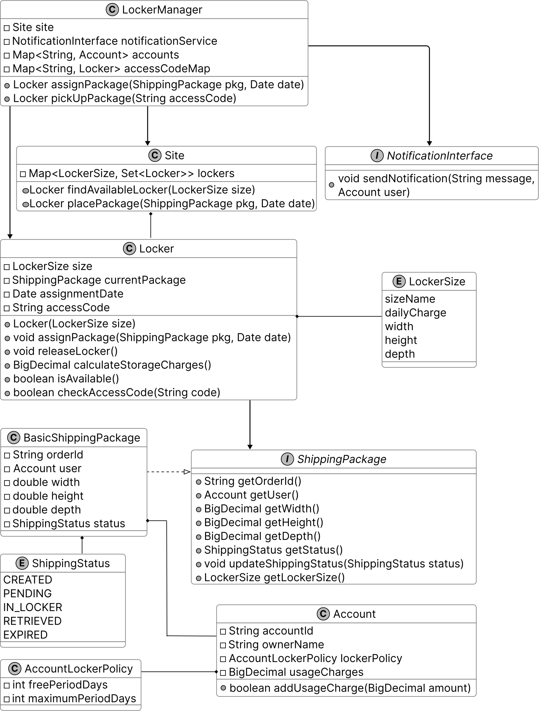

## System Data Flow

The operations of the system revolve around package drop-offs, assignment tracking, and pickups driven by the `LockerManager` facade and its underlying components. Here is how data flows through each core object:

1. **Initialization (`Site`, `LockerSize`, `LockerFactory`):**
   - A `Site` is instantiated with a configuration map denoting how many `Locker` instances to create for each `LockerSize`.
   - The `Site` dynamically asks `LockerFactory.createLocker(LockerSize)` to generate each `Locker` instance and categorizes them in its internal hash map.
   - Customers are modeled via `Account` and their rules are dictated by `AccountLockerPolicy`.

2. **Package Delivery (`LockerManager` & `BasicShippingPackage`):**
   - Delivery personnel trigger `LockerManager.assignPackage(pkg, date)`.
   - A `BasicShippingPackage` is analyzed through `getLockerSize()` to find the absolute minimum bounding box that matches the package dimensions.
   - The `LockerManager` requests `site.placePackage(pkg)`, which looks into the map for an available `Locker`.
   - The `Locker` is assigned the package, marked occupied, and it generates a secure UUID substring as the `accessCode`.

3. **Notification Orchestration (`LockerManagerChange`):**
   - Utilizing the **Observer Pattern**, the `LockerManager` doesn't directly text the user. Instead, it delegates to `LockerManagerChange.notifyObservers()`.
   - Subscribed systems (like `EmailNotification` implementing `LockerEventObserver`) receive the notification and securely email the user their location and access code.

4. **Package Pickup (`LockerManager`, `Locker`):**
   - A customer arrives and provides an access code to `LockerManager.pickUpPackage(accessCode)`.
   - `LockerManager` queries the `accessCodeMap`. If found, it checks `Locker.checkAccessCode()`.
   - The `Locker` analyzes its usage through `calculateStorageCharges()` by comparing the `assignmentDate` to the customer's `AccountLockerPolicy`.
   - Free periods are respected. Storage past the limits is billed and charged to `Account.addUsageCharge()`.
   - If the package is past the max limits, it throws a `MaximumStoragePeriodExceededException`.
   - The `Locker` calls `releaseLocker()` cleaning its variables, making it available for a new package.

_(Implementation details are available in the Java files in the `src/locker` directory)_

## Deep Dive Topic

### Designing an extensible locker creation system

Currently, lockers are created directly based on predefined sizes, which makes the system rigid and difficult to extend. For example, if we need to introduce a new locker size (e.g., XLARGE) or a specialized locker type (e.g., temperature-controlled lockers), we would have to modify multiple parts of the codebase where lockers are instantiated manually. This increases maintenance overhead and reduces flexibility.

To address this, we can use the **Factory design pattern** to centralize the creation logic for different types of lockers, making the system more modular and extensible.

Here’s how a `LockerFactory` class enhances the locker system:

- **Centralized object creation**: The `LockerFactory` encapsulates the locker instantiation process, so any changes to locker creation (e.g., adding new sizes or types) are localized to this class.
- **Extensibility**: If we need to add new locker sizes or types in the future, the factory class can be easily updated, without modifying core business logic in other parts of the system.
- **Improved readability and maintainability**: Using a factory method to create lockers allows us to separate locker creation from locker usage logic, aligning with the Single Responsibility Principle.

### Decoupling event handling with an event-driven approach

Currently, the `LockerManager` directly invokes `NotificationInterface.sendNotification()` to notify customers when key events occur, such as package assignment or locker expiration. While this approach works, it tightly couples `LockerManager` with the notification system, meaning any changes to how notifications are sent require modifying `LockerManager` itself.

To decouple event handling from `LockerManager`, we can use an event-driven approach where multiple components can subscribe to and respond to system events dynamically. Instead of directly calling `sendNotification()`, `LockerManager` will broadcast events to registered observers, ensuring a more modular and extensible system.

By implementing the **Observer pattern**, we can send notifications to customers or administrative staff when certain events occur, such as when a package is delivered or a locker exceeds its maximum usage period.

Instead of hardcoding the notification logic in the `LockerManager`, the locker system can maintain a list of observers. These observers can be various notification services (e.g., email, SMS) or other systems (e.g., analytics, metrics). When a key event occurs, the `LockerManager` can notify all registered observers, allowing the system to be easily extended without modifying the core logic.

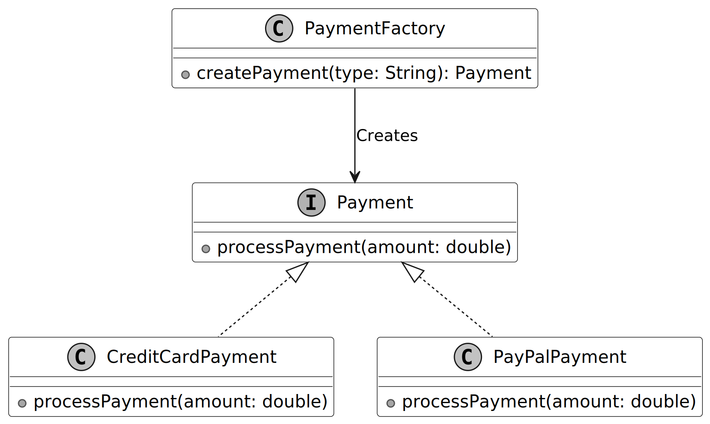

## Wrap Up

In this chapter, we designed a Shipping Locker System. We began by clarifying requirements through a structured Q&A discussion, similar to an interviewer-candidate exchange. From there, we identified core objects and developed a class diagram to represent the system's structure. We implemented the key components of the locker service, bringing the design to life.

In the deep dive section, we explored advanced topics, including how the Factory Pattern simplifies locker instantiation for future scalability and how the Observer Pattern decouples event handling, enabling flexible notifications.

Congratulations on getting this far! Now give yourself a pat on the back. Good job!
