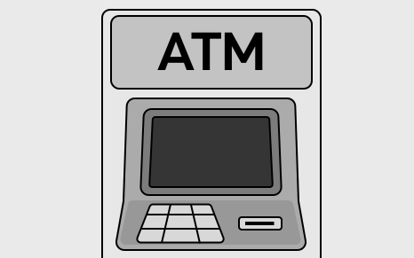
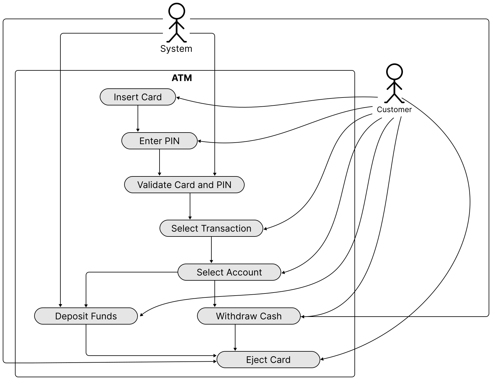
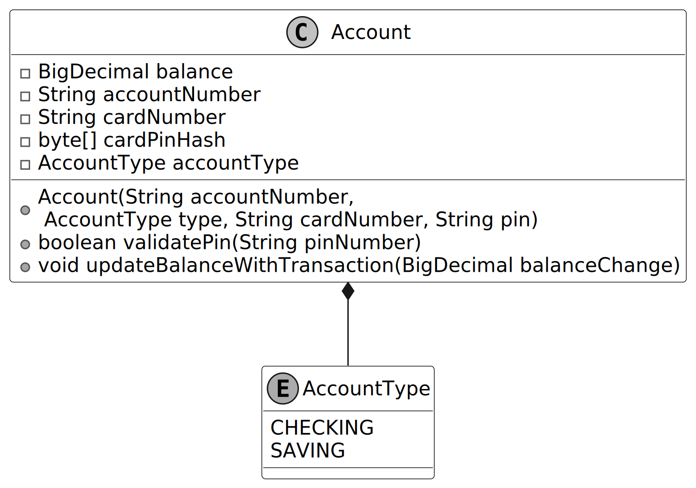
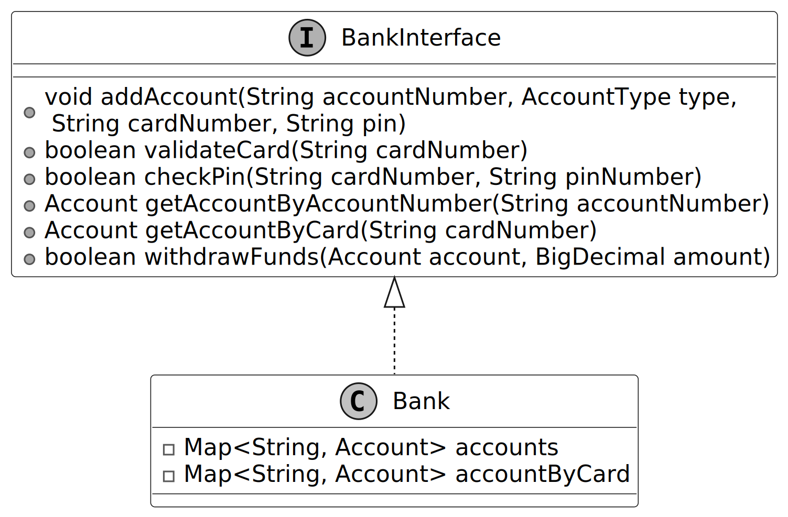
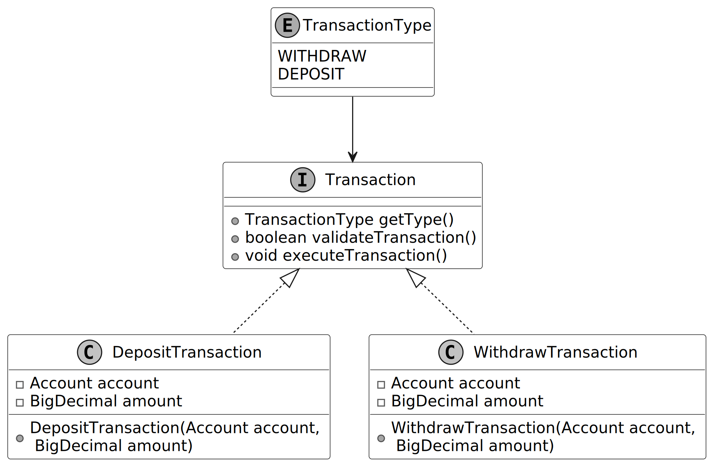
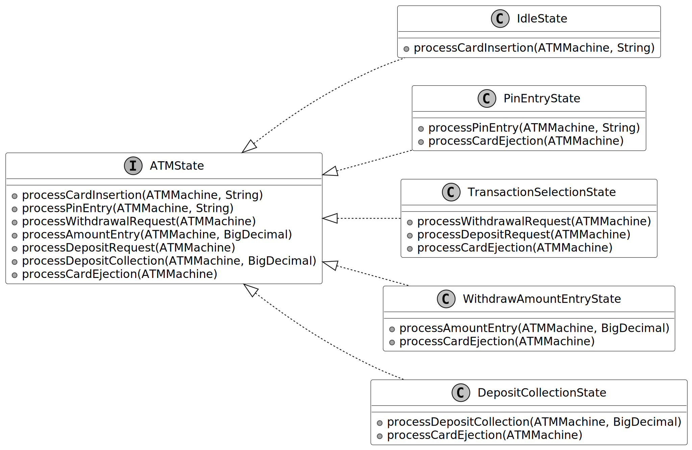
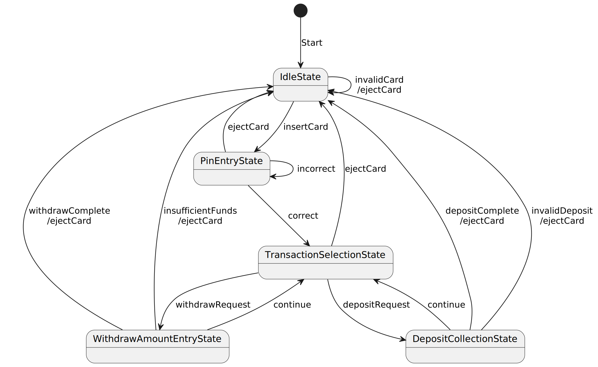
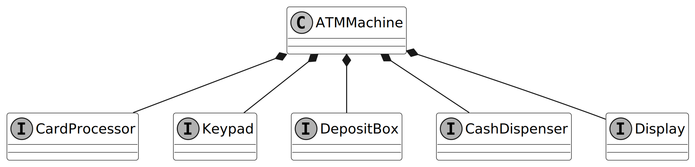
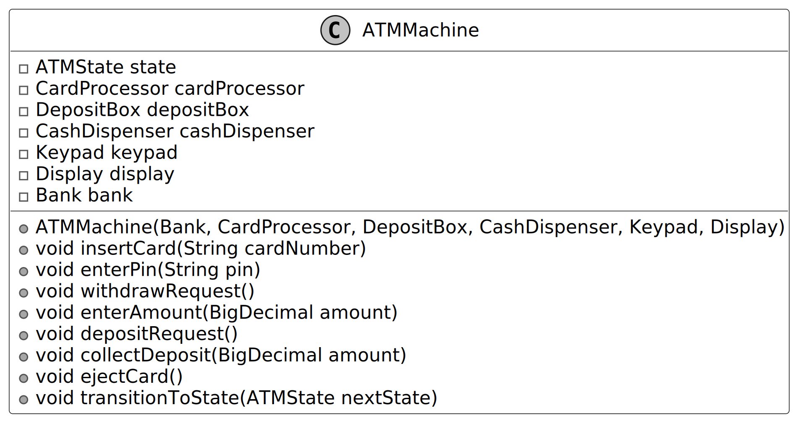
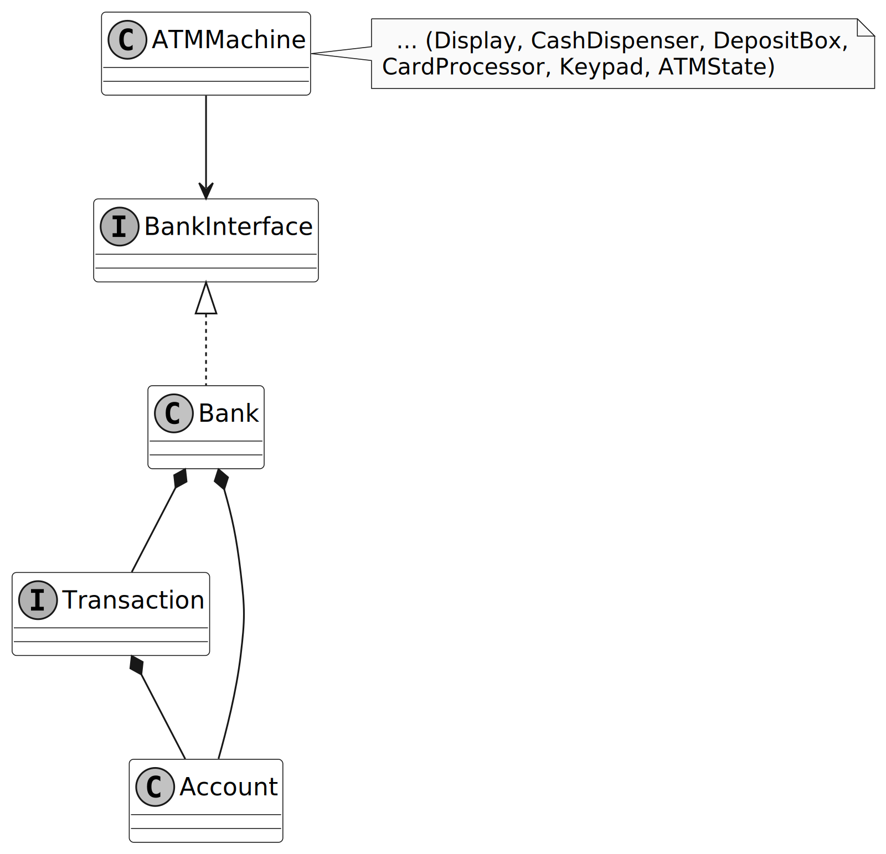

# Design an ATM System

In this chapter, we will explore the object-oriented design of an ATM system. The primary purpose of an ATM is to automate banking tasks for users, allowing them to check balances, withdraw cash, and transfer funds. This design aims to make these operations seamless by designing classes that model key components, such as the ATM machine, bank accounts, hardware interfaces, and transaction states.

## Requirements Gathering

Here is an example of a typical prompt an interviewer might give:

> “Picture yourself approaching an ATM on a busy afternoon to manage your banking needs. You insert your card, enter your PIN, and then choose from options such as checking your balance, withdrawing cash, or depositing funds. Within seconds, the system verifies your credentials and processes your request. Behind the scenes, the ATM coordinates with the bank, manages account transactions, and interacts with hardware like the card reader and cash dispenser. Now, let’s design an ATM system that handles these operations smoothly and reliably.”

### Requirements clarification

The first step in designing the ATM system is to understand precisely what the interviewer wants you to design. Here is an example of how a conversation between a candidate and an interviewer might unfold:

**Candidate:** For user interactions, I think the ATM should have a card reader to process debit cards, a keypad for entering the PIN and selecting options, a screen to display instructions and menus, a cash dispenser for withdrawals, and a deposit slot for accepting cash. Does this cover the main components, or are there additional ones I should consider?
**Interviewer:** That’s a solid list.

**Candidate:** I envision the ATM guiding users through a clear flow: the user inserts their card, enters a PIN for authentication, and then sees a menu with options like checking balance, withdrawing cash, or depositing funds. After completing a task, the ATM offers the choice to continue or exit, ejecting the card at the end. Does this flow align with your vision, or should I adjust any steps?
**Interviewer:** Your flow is accurate. It starts with card insertion, PIN entry, and a menu for tasks. After each task, the user can continue or exit, with the card ejected at the end.

**Candidate:** For authentication, I assume the ATM validates the card and PIN combination. If either is invalid, it displays an error.
**Interviewer:** Yes, the ATM validates the card and PIN, showing an error for invalid inputs. Including a limit of three PIN attempts before locking the card is a good security measure. Let’s keep that in scope.

**Candidate:** Regarding accounts, I propose that the ATM supports multiple accounts per user, such as Checking and Savings, linked to their card. Users can select an account for transactions. Does this match your requirements?
**Interviewer:** That’s correct. The ATM should support Checking and Savings accounts, with users able to select one for transactions. No additional account types are needed for now.

**Candidate:** For transactions, I think the ATM should handle Withdraw and Deposit operations. For example, withdrawals check for sufficient funds, and deposits update the balance. Should we include other transactions like transfers, or focus on these two?
**Interviewer:** Let’s focus on Withdraw and Deposit for simplicity. Transfers are out of scope for now. Ensure withdrawals validate funds and deposits process cash accurately.

**Candidate:** To handle errors, I suggest the ATM displays clear messages for issues like insufficient funds, invalid PINs, or hardware failures.
**Interviewer:** I agree that clear error messages are essential.

### Requirements

Based on the requirements gathering dialogue, the following functional requirements are identified for the ATM system:

- Authenticate users via a debit card and PIN.
- Support multiple accounts per user, including Checking and Savings account types, with the ability to select an account for transactions.
- The machine should include a Card Reader, Keypad, Screen, Cash Dispenser, Deposit Slot, and an optional Printer for receipts.
- Support Withdraw and Deposit transactions, ensuring withdrawals validate sufficient funds and deposits update the account balance.
- Handle exceptions, such as insufficient funds or incorrect inputs, by displaying clear error messages and retaining the card after repeated invalid attempts.

Below are the non-functional requirements:

- The ATM must protect user data with strong security measures and retain cards after repeated invalid PIN attempts to ensure user trust.
- The ATM must operate reliably, minimizing disruptions and safely ejecting cards during failures to maintain user confidence.

## Use Case Diagram

In the ATM system, a use case diagram illustrates how customers interact with the system to perform banking tasks, clarifying essential actions such as card insertion, PIN entry with up to three attempts, account selection, transaction processing, and error handling.

The **Customer** actor has the following main use cases:

- **Insert Card:** The customer initiates a session by inserting their card into the ATM.
- **Enter PIN:** After inserting the card, the customer then enters their PIN for authentication.
- **Select Transaction:** The customer chooses a transaction type, such as withdrawing cash or depositing funds, from the menu.
- **Select Account:** The customer selects an account (e.g., Checking or Savings) for the transaction.
- **Withdraw Cash:** The customer requests a cash withdrawal and specifies the desired amount.
- **Deposit Funds:** The customer deposits cash into the ATM.
- **Eject Card:** The customer requests card ejection (e.g., by canceling or ending the session), the ATM ejects the card, and the session terminates.

The **System** actor's use cases are listed below. Note that actors may not always be human.

- **Validate Card and PIN:** The system verifies the customer’s card and PIN to grant access to banking options.
- **Withdraw Cash:** The system processes the withdrawal request, confirms sufficient funds, and dispenses cash.
- **Deposit Funds:** The system accepts the deposited cash and updates the customer’s account balance accordingly.
- **Eject Card:** The ATM ejects the card, and the session ends.

## Identify Core Objects

To design a modular and maintainable ATM system, we identify core objects that encapsulate distinct responsibilities, aligning with the functional requirements and user flow. These objects model the system’s key entities and interactions, ensuring clear separation of concerns and extensibility.

- **Bank:** Stores and manages accounts.
- **Account:** Represents a customer’s bank account. Manages a customer’s account details, including balance, account number, card number, PIN (hashed for security), and account type (Checking or Savings).
- **ATMMachine:** Acts as the main coordinator, managing user interaction and connecting with hardware elements like the card reader, keypad, screen, cash dispenser, and deposit slot.

> **Design Choice:** We consolidate hardware access and management within the `ATMMachine` object to ensure consistent behavior across components, enabling a seamless user flow from card insertion to transaction completion.

- **Transaction:** Manages financial transactions like cash withdrawals and deposits, including validation checks (e.g., sufficient balance for withdrawals) and transaction execution.

## Design Class Diagram

With the core objects and their roles defined, we now design their classes, attributes, and methods to construct a modular and extensible ATM system that meets the specified requirements.

### Account

This class represents a customer’s bank account as a distinct entity within the ATM system, encapsulating the essential data and operations needed to support user authentication and financial transactions.

The `Account` class manages critical information, including the account balance, account number, associated card number, and PIN, while using an `AccountType` enum to distinguish between account types like Checking and Savings. It enables authentication by validating the PIN and supports transactions by updating the balance for withdrawals and deposits, ensuring the account’s state reflects the user’s financial activities accurately and efficiently.

> **Important Discussion:** Rather than maintaining a transaction ledger for auditability and deriving the balance from it, as is typical in real-world banking, we simplify the system by directly updating the account balance during each transaction. This approach prioritizes the ATM’s core functionality and effective scope management.

### Bank

In object-oriented design questions, systems are usually self-contained and don't use real databases or web service API calls. The `Bank` class is designed to be a separate component that handles the main data and operations needed for the ATM to work.

The `Bank` class stores `Account` objects and links them to cards for fast retrieval, enabling efficient card and PIN validation for authentication, account access for transactions, and funds availability checks for withdrawals.

To ensure flexibility and scalability, we define a `BankInterface` to decouple the `Bank` implementation from the ATM. This allows the local `Bank` object to be easily replaced with a networked implementation, such as an API client adapter, if the system were to be extended for production use, without modifying the ATM’s core logic.

> **Alternative Approach:** We could integrate the `Bank`’s functionality directly into the `ATMMachine`. However, this would tightly couple account management with the ATM’s operations, reducing modularity and making it harder to adapt the system for networked banking or other extensions in the future.

### Transaction

The purpose of designing the `Transaction` class is to provide a unified framework for handling financial operations in the ATM system, enabling the system to process withdrawals and deposits consistently and reliably.

The `Transaction` class, as an interface, defines a contract for all transaction types, supported by a `TransactionType` enum that specifies Withdraw and Deposit operations. It validates transactions, such as checking funds for withdrawals, and updates the account balance, using concrete classes like `WithdrawTransaction` and `DepositTransaction` for reliable processing.

> **Design Choice:** By abstracting `Transaction` as a separate object, we can represent different transaction types (e.g., Withdraw, Deposit) with shared behavior, making it easier to introduce new types in the future without modifying the core logic.

### ATMState

The purpose of designing the `ATMState` interface is to provide a framework for handling the distinct stages of the ATM’s interaction process, ensuring the `ATMMachine` can manage each user step systematically.

The `ATMState` interface defines the operations for each stage of the ATM’s flow, such as card insertion, PIN entry, transaction selection, and cash handling. Concrete state classes like `IdleState`, `PinEntryState`, `TransactionSelectionState`, `WithdrawAmountEntryState`, and `DepositCollectionState` implement the specific behavior for each stage.

The following state transition diagram visualizes this design.

- **IdleState:** Awaits card insertion, transitions to `PinEntryState` on valid card.
- **PinEntryState:** Processes PIN entry, transitions to `TransactionSelectionState` on valid PIN.
- **TransactionSelectionState:** Processes transaction selection, transitions to `WithdrawAmountEntryState` or `DepositCollectionState`.
- **WithdrawAmountEntryState:** Handles withdrawal amount entry, executes transaction, returns to `TransactionSelectionState` or `IdleState`.
- **DepositCollectionState:** Processes deposit amount, executes transaction, returns to `TransactionSelectionState` or `IdleState`.

> **Note:** To learn more about the State pattern and its everyday use cases, refer to the Vending Machine chapter.

### Hardware component interfaces

The purpose of designing the hardware component interfaces is to provide a set of interfaces that handle user interactions and physical operations within the ATM system, ensuring the `ATMMachine` can operate independently of specific hardware implementations.

The hardware components, including `CardProcessor`, `Keypad`, `Display`, `CashDispenser`, and `DepositBox`, define the operations needed for interacting with the user and managing physical tasks, such as reading cards, accepting PIN entries, displaying messages, dispensing cash, and collecting deposits. They enable the `ATMMachine` to perform these tasks through well-defined interfaces, ensuring flexibility and ease of testing with simulated implementations.

- **CardProcessor:** Enables the ATM to read a card during insertion and release it after the user’s session.
- **Keypad:** Captures user inputs such as PINs, transaction choices, and amounts.
- **DepositBox:** Collects the deposited amount during a deposit transaction.
- **CashDispenser:** Delivers the requested cash to the user during a withdrawal transaction.
- **Display:** Shows messages and prompts to guide the user.

### ATMMachine

The `ATMMachine` class acts as a facade for the ATM system, orchestrating user interactions, coordinating hardware components while relying on a `Bank` instance to access `Account` data and process `Transactions`. It uses the `ATMState` class to manage the sequence of steps in a user’s session, ensuring a clear and reliable experience from card insertion to session end.

> **Design Choice:** We employ the **State pattern** with `ATMState` classes to manage the ATM’s sequential workflow, such as transitioning from card insertion to PIN entry, ensuring each stage is encapsulated and clearly defined. Additionally, we use interface-based hardware components (e.g., `CardProcessor`, `Keypad`) to abstract physical interactions. This separation of concerns enhances modularity, simplifies maintenance, and enables testing with mock hardware implementations.

### Complete Class Diagram

Below is the summarized class diagram of the ATM System.

## System Data Flow

The operations of the system revolve around state machine iterations handled by `ATMMachine` delegating to `ATMState` derivatives, routing financial logic to the `BankInterface` component. Here is how data flows through each object:

1. **Initialization (`Main`, `Bank`, `Account`, `ATMMachine`):**
   - A `Bank` is instantiated internally populating `accounts` hashes.
   - External hardware components (`Display`, `Keypad`, etc) are instantiated and wired into the `ATMMachine` instance. The initial state is `IdleState`.

2. **Session Start (`IdleState`, `PinEntryState`):**
   - The user triggers `insertCard()`. The `ATMMachine` passes the call to its internal state (`IdleState`).
   - The `IdleState` validates the `cardNumber` via the `BankInterface`. If successful, it switches the state to `PinEntryState` and prompts for PIN.
   - User inputs PIN via `enterPin()`. `PinEntryState` checks `bank.checkPin()`. On success, proceeds to `TransactionSelectionState`.

3. **Transaction Execution (`WithdrawAmountEntryState`, `WithdrawTransaction`):**
   - The user requests to withdraw cash via `withdrawRequest()`. The state becomes `WithdrawAmountEntryState`.
   - The user enters an amount. The state retrieves the account via `bank.getAccountByCard(cardNumber)`.
   - The state queries `bank.withdrawFunds()`, which validates the balance. If valid, the balance is decremented safely utilizing `BigDecimal` arithmetic.
   - The `CashDispenser` is invoked to dispense the physical equivalent.

4. **Session Termination (`ATMMachine`, `CardProcessor`):**
   - User calls `ejectCard()`.
   - The State cleans up any hardware resources via `CardProcessor.ejectCard()` and resets back to `IdleState`.

*(Implementation details are available in the Java files in the `src/atm` directory)*

## Wrap Up

With the ATM system fully implemented, it’s time to step back and consider what we’ve achieved. This chapter began by gathering requirements through a structured dialogue, then progressed to defining core objects like accounts and transactions, designing their class structure, and coding the essential components, including the state machine and hardware interactions.

The system's maintainability and extensibility are ensured by the clear division of responsibilities among the classes: `Account` and `Bank` manage account data and banking operations, `Transaction` handles financial operations, `ATMState` and its state classes (`IdleState`, `PinEntryState`, etc.) manage the user flow stages, hardware interfaces (`Keypad`, `CardProcessor`, etc.) handle user interactions, and `ATMMachine` orchestrates the entire flow as a facade. Our choices, such as using the **State pattern** with `ATMState` and separating hardware interactions into interfaces, improve modularity and allow future extensions, like adding new transaction types or hardware components.

Congratulations on getting this far! Now give yourself a pat on the back. Good job!
