# Design a Restaurant Management System

In this chapter, we will explore the design of a Restaurant Management System. The goal is to create classes that represent the system’s essential components, such as menus, reservations, and tables. We will develop a system that supports critical functions like booking reservations, managing orders, and assigning tables, ensuring the design is both straightforward and flexible for future enhancements.

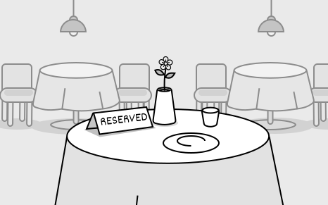

## Requirements Gathering

The first step in designing a Restaurant Management System is to clarify the requirements and define the scope. Here’s an example of a typical prompt an interviewer might present:

> “Picture yourself planning a dinner outing on a Friday night. You call the restaurant to reserve a table for your group, check available times, and secure a spot. When you arrive, the staff assigns your party to the reserved table, takes your order, and later presents the bill. Behind the scenes, the system is smoothly handling table reservations, tracking orders, and calculating costs. Now, let’s design a Restaurant Management System that manages all of this.”

### Requirements clarification

Here is an example of how a conversation between a candidate and an interviewer might unfold:

**Candidate:** Let’s start by setting the scope. I assume the system manages reservations, menu, order tracking, and payments. For now, I focus on reservations and order management. Does that work?
**Interviewer:** That’s a reasonable starting point

**Candidate:** Does the system allow customers to make and manage their reservations?
**Interviewer:** Yes, customers can book tables for a future date and time based on availability.

**Candidate:** How does the system determine if a table is available for a reservation?
**Interviewer:** It checks for a table that fits the party size and is free at the requested time. Each reservation reserves a table for exactly one hour, so it’s available if no other booking overlaps with that hour.

**Candidate:** Does the system let customers cancel a reservation after making it?
**Interviewer:** Yes, customers can cancel reservations.

**Candidate:** When a party with a reservation arrives, do they automatically get their reserved table?
**Interviewer:** Yes, they do. They arrive with their name, and the system uses it to find their reservation, which already has a table assigned to it.

**Candidate:** What happens when a walk-in party arrives for dine-in without prior reservation?
**Interviewer:** The system should assign walk-in parties to tables based on current availability and their party size.

**Candidate:** Does the system allow orders to be altered or removed after they’re placed?
**Interviewer:** Yes, you can remove items or adjust their quantities.

**Candidate:** Does the system track the status of orders?
**Interviewer:** Yes, it keeps track of their progress.

**Candidate:** Are there rules for splitting the bill at checkout?
**Interviewer:** For now, just present a single total bill amount.

### Requirements

Based on the questions and answers, we can now list the functional requirements for our restaurant management system.

**Reservations**
- Customers can book tables for a future date and time based on availability.
- Each reservation reserves a table for exactly one hour.
- The system checks if a table is free at the requested time with no overlapping bookings.
- The system assigns a table to a reservation, and customers get it when they arrive using their name.
- Customers can cancel reservations.

**Walk-in seating**
- The system assigns walk-in parties to tables based on current availability and party size.

**Order management**
- The system allows orders to be altered or removed after they’re placed.
- The system tracks the progress of orders.

**Billing**
- The system presents a single total bill amount at checkout.

Below are the non-functional requirements:
- The system should handle increased traffic during busy periods (e.g., weekend evenings) without performance degradation, supporting concurrent users seamlessly.

With these requirements, we are ready to model the objects for the core system.

## Identify Core Objects

Let’s identify the core objects of the restaurant management system.

- **Menu:** Represents the restaurant’s menu, storing a collection of available items for ordering.
- **MenuItem:** This object models an individual item on the menu, encapsulating details such as its name and price. Each `MenuItem` is a building block of the `Menu`, used when staff place orders for a table.
- **Layout:** This object represents the restaurant’s physical arrangement, organizing all tables efficiently to support quick and effective assignment for both walk-ins and reservations.
- **Table:** This object models an individual table in the restaurant, holding details such as its capacity, current reservations, and active orders.
- **Reservation:** This object represents a single reservation, storing details like the party name, party size, and reserved time, along with the assigned table.
- **ReservationManager:** This object oversees all restaurant reservations, managing their creation, lookup, and cancellation to ensure accurate and efficient booking. It checks table availability for free time slots and works with `Layout` to assign tables, keeping reservations well-scheduled and tracked.
- **Restaurant:** This acts as a facade, providing a central interface to manage the system’s key functionalities: reservations, table assignments, orders, and bill calculations. We keep its logic lightweight by delegating tasks like scheduling reservations to `ReservationManager`, assigning tables to `Layout`, and managing orders to `Table`, ensuring it coordinates actions without performing the underlying operations itself.

## Design Class Diagram

You’re set to dive into the heart of the object-oriented design interview: crafting classes and interfaces, shaping data and state through attributes, wrapping logic in methods, and linking your classes with clear relationships.

Below, we detail each class, its purpose, and its responsibilities, ensuring a clear separation of concerns.

### Menu

The `Menu` class represents the restaurant’s menu, storing menu items in a map with names as keys to quickly retrieve them for ordering. It separates menu data from the `Restaurant` and `Table` classes, enabling `Table` to order items by holding a collection of `MenuItem` objects that list all available choices.

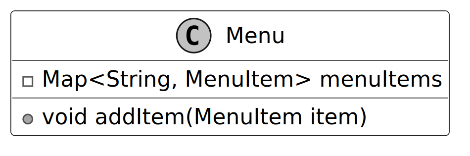

### MenuItem

The `MenuItem` defines each item on the menu, holding its name, description, price, and category for use in orders. The `Menu` class uses these items to provide the list of choices, and the `Table` class records them as ordered items for order management and updates. The `Category` enum assigns each item a type, such as main course, appetizer, or dessert, to group them on the menu.

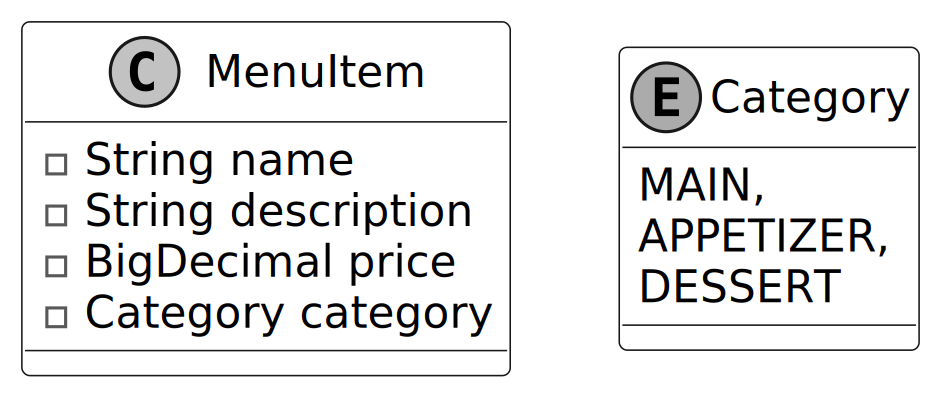

### Table

The `Table` class models restaurant tables. Some of the attributes, like capacity and tableId, rarely change. But other attributes, like reservations and orderedItems, associated with the table represent current-state data that changes over time.

Its purpose is to oversee a table’s current use, tying into the `Layout` class for availability checks and the `OrderItem` class to handle what’s being served. It includes methods to add or remove orders, tally up bills, and check availability at specific times.

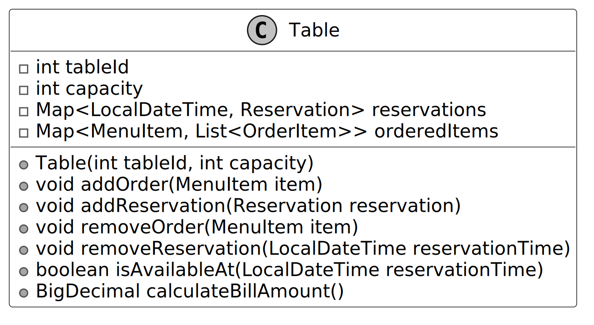

### Layout

The `Layout` class oversees all restaurant tables, organizing them by ID and capacity to pinpoint the right one for each booking. Its purpose is to streamline table assignments, working with `ReservationManager` to match parties to available tables and relying on `Table` to confirm free slots. It handles this by finding a table that fits the party size and is available at the requested time, keeping the process efficient.

> **Design Choice:** We isolate table organization in the `Layout` class to optimize assignment efficiency and separate it from menu and order logic managed by the `Menu` and `Table` classes. Alternatively, integrating table assignment into the `Restaurant` class could simplify the design but would overburden its facade role, mixing high-level coordination with low-level table management.

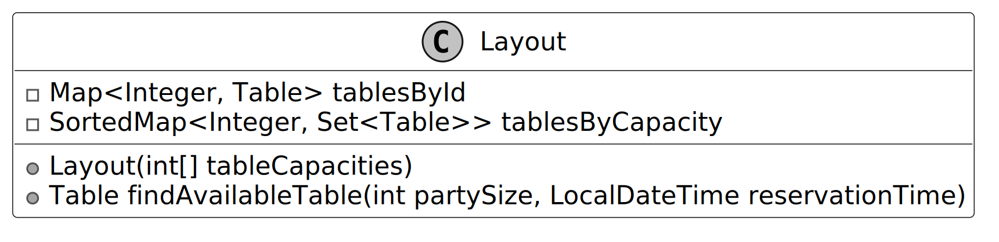

### OrderItem

The `OrderItem` class represents each item a customer orders, linking it to a specific `MenuItem` to provide details like price for the `Table` class. Its purpose is to track the status of ordered items, allowing the `Table` class to calculate costs accurately and add or remove items as requested. The class is created when customers place orders, using the `Status` enum, set to values like pending or delivered, to indicate the item’s current state.

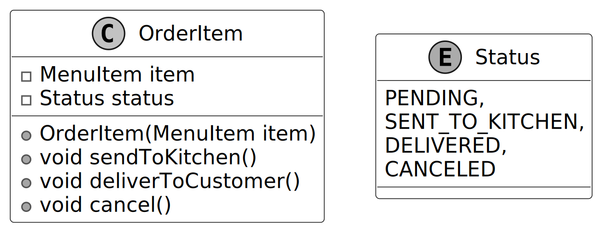

### ReservationManager

The `ReservationManager` class handles reservation scheduling by finding available times, creating reservations, and processing cancellations. It stores all `Reservation` objects and uses a reference to the `Layout` class to manage table assignments. This reference enables the class to verify table availability and assign suitable tables for each reservation based on party size and time.

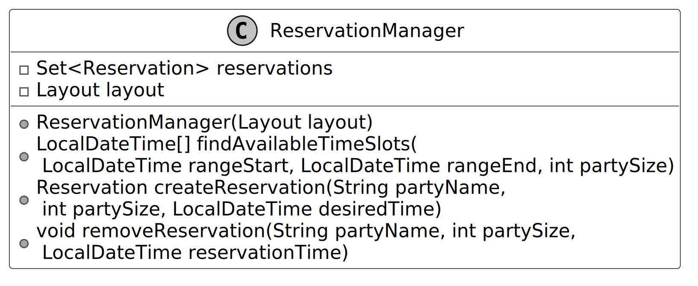

### Reservation

The `Reservation` class represents a single booking managed by the `ReservationManager` class, storing the party name, number of people, reservation time, and assigned table. It serves to hold all details of a reservation, enabling the `ReservationManager` class to schedule and cancel bookings effectively.

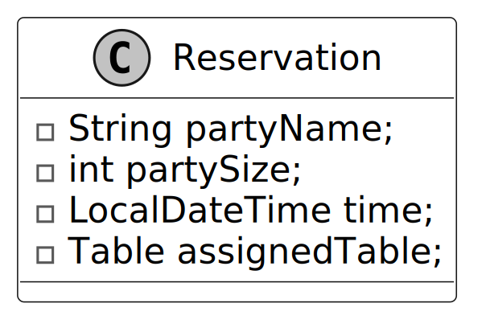

### Restaurant

The `Restaurant` class serves as the primary interface and facade for the restaurant management system. It coordinates core user-facing operations, such as managing reservations, assigning tables, processing orders, and handling checkout.

It simplifies access to these features by delegating tasks to other classes:
- The class relies on `ReservationManager` to schedule and cancel reservations.
- The class uses `Layout` through `ReservationManager` to identify available tables for assignments.
- The class depends on `Menu` to supply items for orders.
- The class directs order and billing actions to the `Table` for processing.

This delegation keeps the `Restaurant` class focused and manageable, organizing the system into distinct components that ensure clarity and ease of maintenance through a structured use of composition.

> **Design Choice:** We structure the `Restaurant` as a facade to unify system operations, delegating tasks to maintain a clean interface and modularity. We can design the `Restaurant` class as a central controller managing all logic internally, but that would increase its complexity and reduce scalability by centralizing responsibilities.

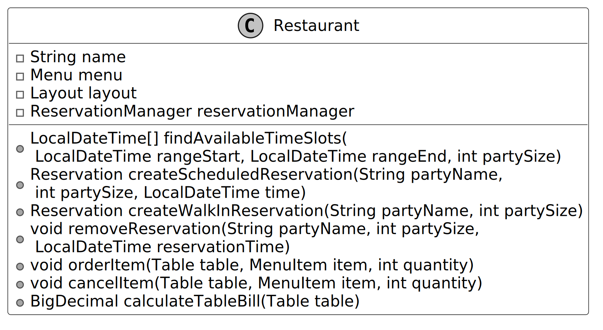

### Complete Class Diagram

Below is the complete class diagram of our restaurant management system.

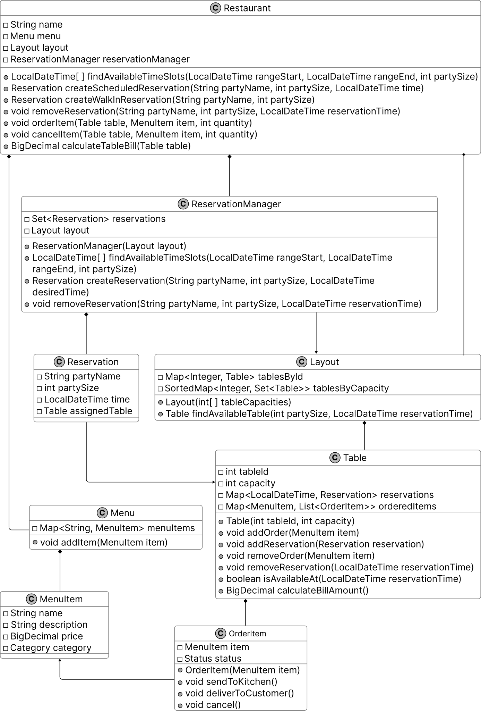

## Deep Dive Topic

In this section, we’ll explore an enhancement to the Restaurant Management System by improving order handling during peak times. We’ll focus on adding a centralized order queue tracking mechanism to streamline kitchen coordination, ensure scalability, and maintain consistency with the system’s modular design.

### Order queue tracking

Consider a high-traffic scenario, such as a busy Friday evening at the restaurant, where a significant volume of orders is received, staff work diligently to communicate these to the kitchen, and cancellations accumulate. In the existing system, the `Table` class directly governs the status of `OrderItem` instances (e.g., through methods like `sendToKitchen()` and `deliverToCustomer()`). However, this decentralized structure lacks a cohesive overview of order progression across all tables. Consequently, staff face challenges in prioritizing time-sensitive orders, monitoring kitchen delays, or verifying cancellations without individually inspecting each table’s state. This approach introduces risks of inconsistency and undermines effective coordination during periods of elevated demand.

To address these limitations, we propose an enhancement by introducing a centralized `OrderManager` class responsible for queuing and processing order-related actions. Let’s take a closer look.

To implement this enhancement effectively, we implement the **Command Pattern**:

1. **Define a Command Interface**: `OrderCommand` with a single method `execute()`.
2. **Implement Concrete Classes**: `SendToKitchenCommand`, `DeliverCommand`, and `CancelCommand`.
3. **Introduce OrderManager**: Maintains a queue of `OrderCommand` objects and processes them via `executeCommands()`.
4. **Integrate with Restaurant**: Modifying the `Restaurant` facade to dispatch and immediately execute commands utilizing `OrderManager`.

> **Definition:** The **Command Pattern** is a behavioral design pattern that encapsulates a request as an independent object, containing all the details needed to carry it out. This encapsulation allows you to treat requests as parameters for methods, delay or schedule their execution.

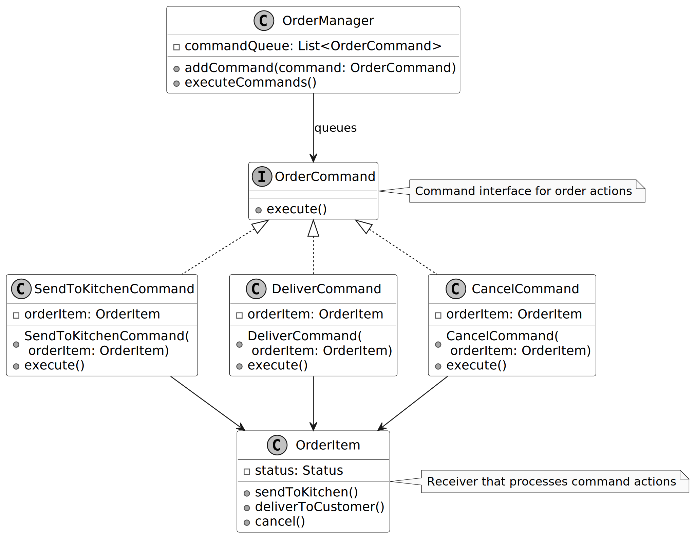

## Wrap Up

In this chapter, we gathered requirements for the Restaurant Management System through a series of detailed questions and answers. We then identified the core objects involved, designed the class structure, and implemented the key components of the system.

A key takeaway from this design is the importance of modularity and adherence to the single responsibility principle. Each component, such as the `Menu`, `ReservationManager`, `Layout`, and `Table` classes, manages a distinct responsibility, ensuring the system remains maintainable and adaptable for future enhancements.

Our design choices, such as delegating operations in the `Restaurant` to act as a facade or using immutable `MenuItem` objects, prioritize flexibility and consistency. An alternative, like implementing reservation and order logic directly in the `Restaurant` class, may simplify the design but could increase complexity and reduce scalability by centralizing responsibilities. In an interview, revisiting these decisions and explaining their rationale demonstrates your ability to think critically about system design.

Congratulations on getting this far! Now give yourself a pat on the back. Good job!
